- EasyLake 用户手册

  # 产品简介

  Arctic 是网易杭州研究院数据科学中心研发的一套实时数据湖解决方案，它具有完全兼容Hive，流批一体、湖仓一体等功能特性。 能够帮助企业从传统基于 Hive 的离线数仓快速完成实时数仓的建设，降低大数据系统的数据延迟，提升数据处理效率。

  ## 功能特性

  ### 完全兼容 Hive

  大数据发展多年，大多数公司已经具备一整套大数据处理方案，其中 [Apache Hadoop](https://hadoop.apache.org/) 仍然是最为主流的开源大数据处理系统，其上一般搭配 [Apache Hive](https://hive.apache.org/) 进行离线数仓的建设。 兼容已有的离线数仓，并在其之上快速构建出流批一体的实时数据湖是 Arctic 最重要的目标之一。 Arctic 从设计之处就朝着完全兼容 Hive 的方向发展，具体表现在：

  - 兼容已经存在的 Hive 表及其中的数据：已经存在的 Hive 表可以通过一个表升级的流程转换为一张 Arctic 表，升级后Hive 表将完全具备 Arctic 表流批一体、湖仓一体的能力，升级过程也非常快，无需对已经存在的数据进行重写或迁移。

  - 兼容以往 Hive 表的读写方式：升级后的 Hive 表仍然可以按照以往的方式进行读写，这意味着基于已有 Hive 表的所有数据开发任务或数据服务接口都可以接续正常使用。

  - 兼容已经存在的基于 Hive 搭建的整套数据中台体系：数据中台在企业的大数据处理体系中扮演着越来越重要的角色，无疑 Hive 仍然是数据中台集成得最好的数仓之一，升级为 Arctic 后数据中台基于 Hive 构建得数据血缘、数据质量等服务可以无缝得适配到 Arctic 表上。

  ### 流批一体

  随着离线数仓 T+1 的数据时效性越来越无法满足业务的发展需求，实时计算、实时数仓逐渐崛起，它们解决了数据时效性的问题，但同时也带来了实时、离线重复建设、口径不一致等问题。 针对这些问题业界提出了流批一体的解决方案，旨在整合大数据开发中的实时与离线链路，做到在提升数据时效性的同时能保证高效的数据开发效率和较高的数据质量。 为了达到这个目标，Arctic 在流批一体方面具有如下特性：

  - 兼顾流批读写模式：与传统 Hive 表只适用于离线开发、批量查询不同，Arctic 表具备流批两种读写模式，它即可以作为 Flink 这样的流计算引擎的源与目标，也可以作为 Spark 这样的批计算引擎的源与目标。

  - 统一流批存储：以往流与批由于其数据生产和数据使用上的差异，一般是存储在不同的存储系统之上，Arctic 将流数据与批数据都存储在数据湖之上，统一了流与批的存储。

  - 流自动合并入批：流是数据的变化，批是数据的最终状态，Arctic 支持将接入的流数据自动合并入批数据。

  - 统一流批开发模式：流批一体的开发模式下，基于流的实时计算能产出更实时的数据，将作为主要的开发链路，而基于批的离线计算则具备更高吞吐率的特点，更适合数据回补的场景。Arctic 能够配合计算引擎使用同一套代码同时完成流与批的开发。

  ### 湖仓一体

  基于分布式文件系统（如 HDFS）或对象存储（如 Amazon S3）构建出的数据湖系统具备读写灵活、易于扩展等特点，但是在数据治理能力上却表现不佳，最终导致数据湖中的数据难以被高效得利用起来。 湖仓一体的目标即为在原有的数据湖系统上增强其数据治理的能力，使得用户能同时享受到数据湖的灵活性与数据仓库的高效数据治理能力。 Arctic 的存储层兼容 HDFS 与 OSS，在此之上具备如下特性以提高其数据治理能力：

  - 事务ACID：Arctic 表支持在其上并发地进行读写操作，且能保证在并发读写场景下的一致性。

  - 支持表结构变更：Arctic 的表结构能够随着业务需求变更，且老数据不会存在兼容性问题。

  - 实时更新/删除：Arctic 表具备实时更新/删除数据的能力，能够以极低的代价快速得完成数据湖中数据的更新/删除操作。

  - 文件治理：Arctic 具备完备的文件治理服务，能够保证数据湖中数据的大小维持在合理水平，保证数据读取效率。

  ## 产品原理简介

  ### 系统架构

  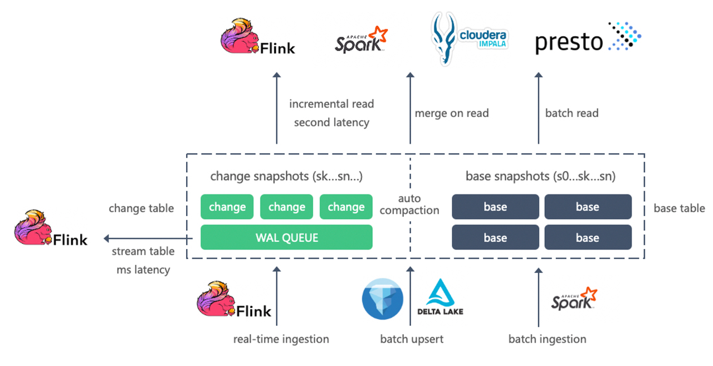

  Arctic 将表分为 Change 与 Base 两个表空间，Change 表存储表的变更历史，类似 MySQL BinLog，Base 表存储表的存量数据。

  Flink 及 Spark Streaming 任务可以将表的变更数据实时得写入 Arctic 的 Change 表，下游的任务也可以从 Change 表读取到表的实时变更数据，以此完成实时链路的数据流转。 依靠数据湖中的文件来完成 Change 数据的流转，Change 数据的延迟取决于文件提交的间隔（一般在分钟级），对延迟要求更高的场景（毫秒级），Arctic 可以额外引入 WAL Queue，负责毫秒级实时变更数据的分发。

  Change 表的数据积攒到一定的量，Arctic 会自动将 Change 表的数据合并入 Base 表以达到数据更新的目的，为了防止过于频繁得合并带来写放大的问题，合并频率一般控制在小时级。 在 Change 数据未合并入 Base 表之前，Arctic 提供了 MergeOnRead 的读取方式，支持在读取时临时合并 Change 数据与 Base 数据，以此提供分钟级的批数据延迟。 当然 Base 表上仍然支持通过 Spark 及 Hive 这样的计算引擎批量得向表中写入或更新一批数据。

  无论是 Change 表还是 Base 表，Arctic 都维护了表的版本元数据，以此支持事务 ACID 及时间旅行等特性。

  # 建表流程

  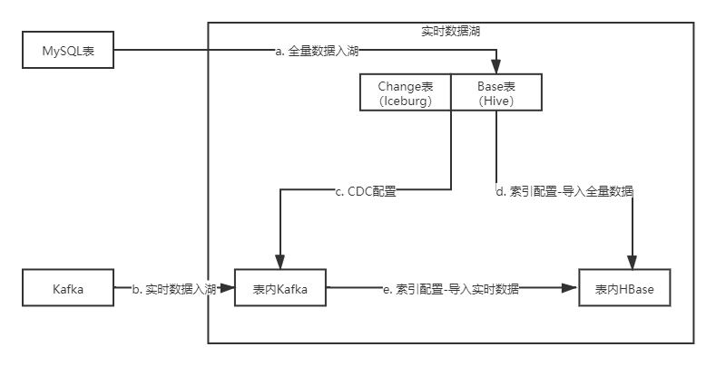

  

  通过新建表流程，可以将一张 Hive 表升级为一张 Arctic 表，或者直接新建一张 Arctic 表。在建表过程中，最多可以配置 5 个任务，分别用于将数据导入 Arctic 表，以及将数据在表内进行同步。

  ## 新建表流程：

  入口：实时数据湖列表页右上方

  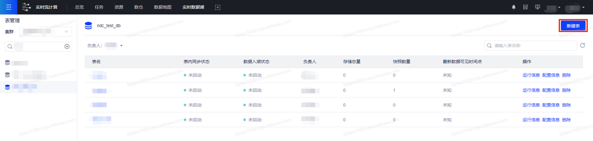

  ### 新建表-基本信息

  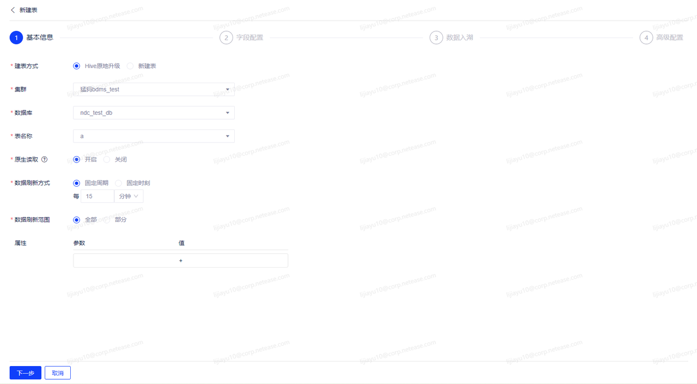

  建表方式：新建表第一步可以选择建表方式，包括Hive原地升级和新建表两种。

  集群、数据库：集群和库为新建的表存储的HDFS集群和库，默认选择页面左侧选中的集群和库，用户可自行更改。

  表名称：如建表方式为Hive原地升级，则此处下拉选择要升级的表的名称；如建表方式为新建表，则此处需要手动输入新建的表的名称。

  原生读取：此处开关如开启，则 Arctic 表内容会定时写入 Hive，之后用户可以使用 Hive 的原生 connector 进行读取，而无需使用 Arctic 的 connector 进行读取。如果关闭此项，则 Acrtic 表新增的数据不会写入 Hive 中。

  数据刷新方式：当原生读取为开启时有此选项，用户可选择 Arctic 表内容写入到 Hive 的时间区间，或选择在某个固定时刻写入。

  数据刷新范围：当原生读取为开启时有此选项，用户可选择将 Arctic 表的全部内容，或最新的任意数量分区的内容写入 Hive。

  属性：

  ### 新建表-字段配置

  当建表方式为 Hive 原地升级时，此页面展示原 Hive 表的字段信息，用户可在此设置主键，未设置主键时，不支持 Update 操作，同时不支持配置索引。

  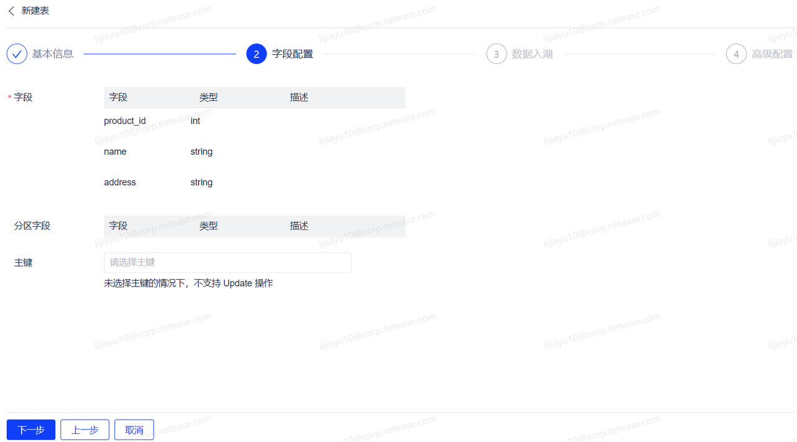

  当建表方式为新建表时，用户需在此页面设置 Arctic 表的字段。字段的配置方式可选择从已有表复制或自定义字段。

  **从已有表复制：**

  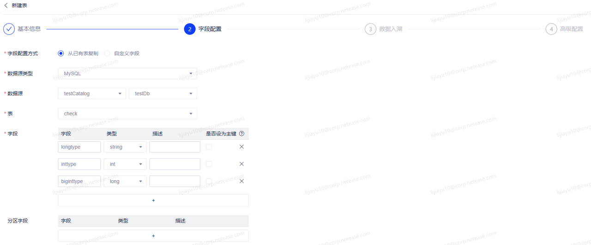

  数据源类型、数据源、表：通过下拉选择要复制的表的位置和表名，目前仅支持复制 MySQL 表。

  字段：列表显示了选中的表的字段信息，用户可以新增、删除、修改或设置主键。

  分区字段：如需建分区表，则需要用户手动新增分区字段。

  **自定义字段：**

  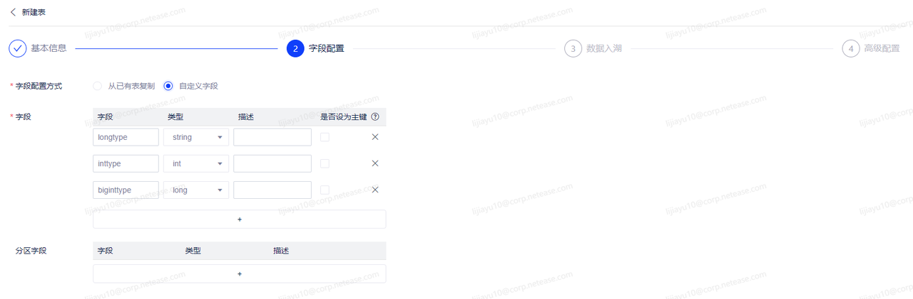

  字段：用户手动输入新表的字段信息，并可设置某个字段为主键。

  分区字段：如需建分区表，则需要用户手动新增分区字段。

  ### 新建表-数据入湖

  新建表的第三步是数据入湖配置，可以配置需要写入到新建的 Arctic 表的全量数据和实时数据的数据源、映射关系、分区字段。如在新建表过程中未对数据入湖任务进行配置，还可以在表-运行信息-数据入湖页面进行入湖任务的创建。

  #### 全量数据入湖

  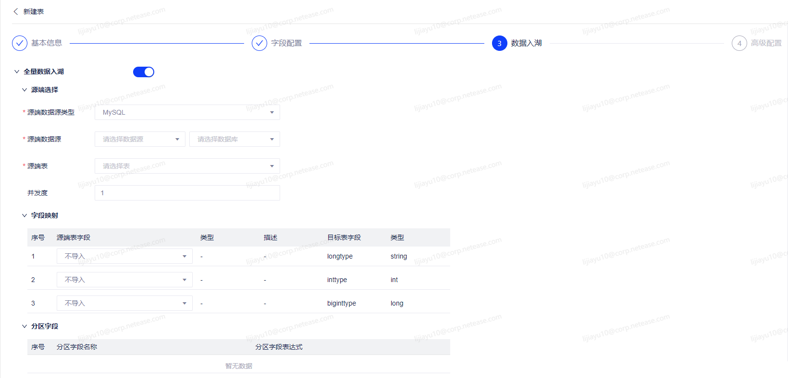

  打开全量数据入湖的开关，即可配置全量入湖任务。（建表流程图中任务a）

  **源端选择**

  源端数据源类型：选择要入湖的全量数据的来源类型，目前仅支持 MySQL。

  源端数据源、库、表：选择要入湖的数据的存储位置，目前仅支持选择单张表。

  并发度：设置入湖任务的并发度，默认值为1。

  **字段映射**

  目标端字段即为在第二步字段配置中配置的新建的表的字段。源端表字段与目标表字段通过字段名匹配，字段名完全相同的字段即可自动映射，未找到与目标端字段同名的则源端字段默认选中不导入，用户可以通过下拉选择要映射的字段，也可以使用自定义表达式自定义要写入的字段内容，自定义表达式需使用 SQL 语法。

  **分区字段**

  分区字段即为在第二步字段配置中配置的新建的表的分区字段。用户需要在分区字段的列表中为入湖数据定义分区表达式。

  #### 实时数据入湖

  打开全量数据入湖的开关，即可配置全量入湖任务。（建表流程图中任务b）

  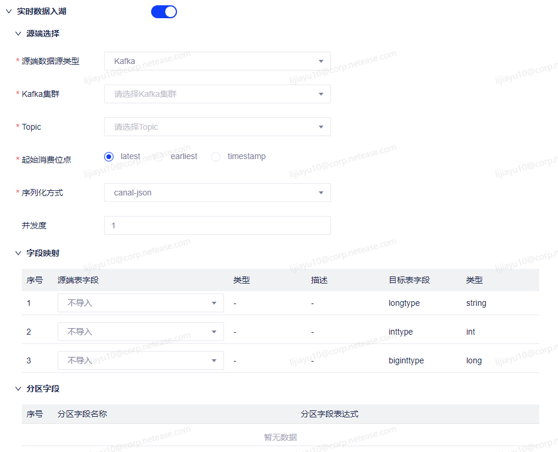

  **源端选择**

  源端数据源类型：选择要入湖的实时数据的来源类型，目前仅支持 Kafka。

  Kafka 集群、Topic：选择要入湖的 Kafka 的集群和 Topic。

  起始消费位点：选择开始消费的 Kafka 位点，可选择最新，最早和指定时间戳。

  序列化方式：选择 Kafka 消息的序列化方式，目前仅支持 canal-json。

  并发度：设置入湖任务的并发度，默认值为1。

  **字段映射&分区字段**

  设置方式与全量入湖任务相同。

  ### 新建表-高级配置

  在高级配置中，用户可以进行 Arctic 表 CDC 配置和索引配置。

  #### CDC 配置

  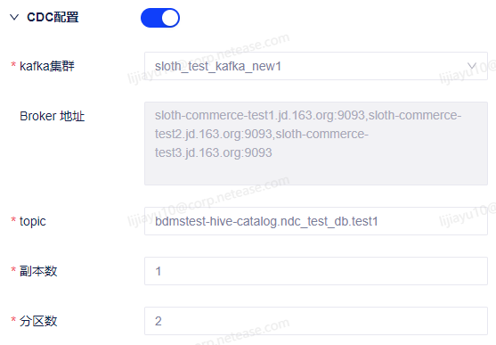

  打开 CDC 配置的开关，即可开始配置 Arctic 表 CDC 数据要写入的 Kafka 集群和 Topic 信息。

  Kafka 集群：选择 CDC 数据要写的集群。

  Broker 地址：展示被选中的集群的地址，以便下游消费时使用。

  Topic：默认填入 Arctic 表的集群.db.表名，用户可以自行修改。

  副本数、分区数：设置要写入 Kafka Topic 的副本数和分区数。

  打开 CDC 配置的开关后，会默认创建一个表内同步（Kafka → Hive）任务（建表流程图中任务c）。任务创建后默认为未启动状态，如有需要，在表-运行信息中的表内同步 tab 页可以对此任务进行启停。

  #### 索引配置

  注意：仅当 Arctic 表有主键时才可以进行索引配置。

  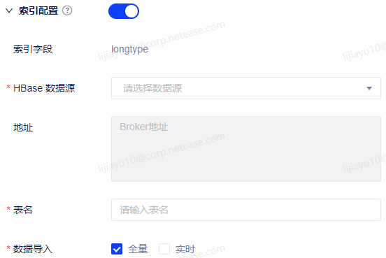

  打开索引配置开关，即可进行索引配置。仅当 Arctic 表有主键时此开关才可打开。

  索引字段：默认填入 Arctic 表主键，不可修改。

  HBase 数据源：选择索引要写入的 HBase 集群。

  地址：展示被选中的集群的地址，以便下游消费时使用。

  表名：输入索引要写入的表名，如此表在 HBase 中不存在，则会自动新建此表。

  数据导入：选择要写入 HBase 表内的数据类型，默认选中全量，可多选，不可不选。

  选择全量时，会新建一个表内同步（Hive → HBase）任务（建表流程图中任务d）。任务创建后默认为未启动状态，如有需要，在表-运行信息中的表内同步 tab 页可以对此任务进行启停。

  选择实时时，会新建一个表内同步（Kafka → HBase）任务（建表流程图中任务e）。任务创建后默认为未启动状态，如有需要，在表-运行信息中的表内同步 tab 页可以对此任务进行启停。

  # 已有表管理

  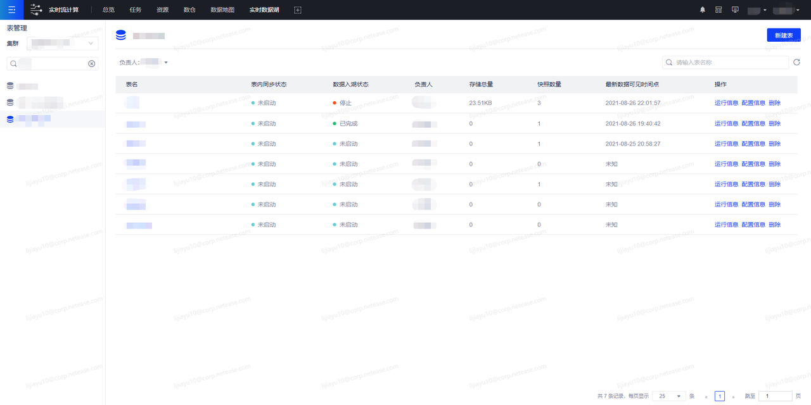

  实时数据湖的首页左侧展示了项目内的 Hive 集群和数据库，选择想查看的集群和库之后，页面右侧展示在该数据库下的 Arctic 表列表。用户可对列表进行按负责人筛选或按表名搜索。

  点击列表中的表名，会打开该表的详情页（数据地图中的表详情页面），用户可以查看表的基本信息、字段信息、血缘信息等表相关信息。

  点击列表的操作栏中的运行信息，即可查看该表关联的所有任务的运行情况，包括表内同步任务、数据合并任务、数据入湖任务。

  点击列表的操作栏中的配置信息，即可查看该表在建表时的配置信息，包括表的基本配置、字段配置、高级配置。

  ## 运行信息

  ### 基本信息

  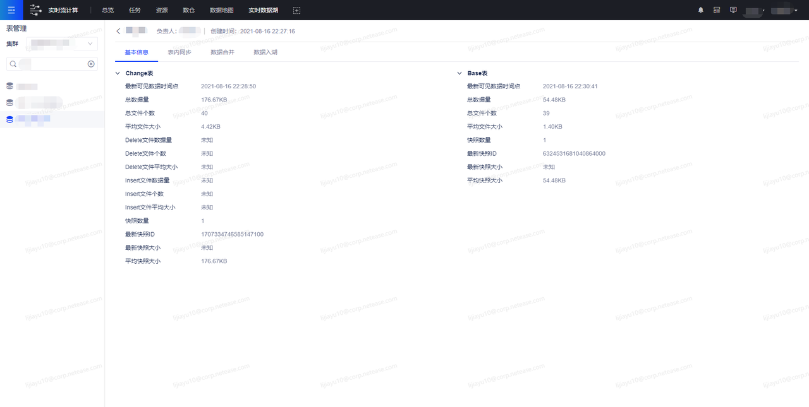

  在运行信息-基本信息页面，展示了 Arctic 表中的 Change 表和 Base 表的数据量、文件个数、快照情况等基本信息。用户可以通过这些基本信息来判断表的情况是否正常。

  ### 表内同步

  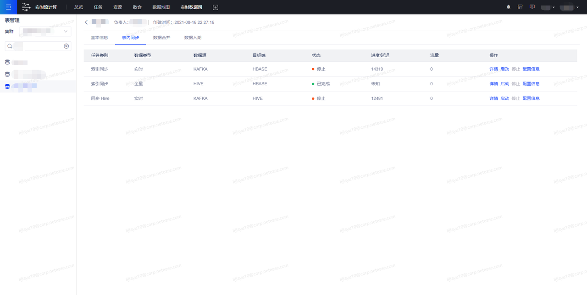

  在新建表-高级配置中进行的 CDC 配置和索引配置相关的任务可以在表内同步页面查看。在新建表过程中创建的任务默认为未启动状态，需要用户在此页面中手动启动。全量同步任务在完成同步后会自动停止，实时同步任务需用户在需要时手动停止。

  点击列表的操作栏中的详情，可以跳转至 Flink UI 页面，查看该 Flink 任务的运行情况。

  点击列表的操作栏中的配置信息，可以查看该任务的配置，并可以对配置项进行修改。

  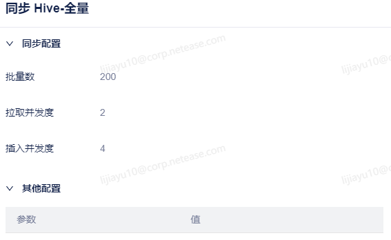

  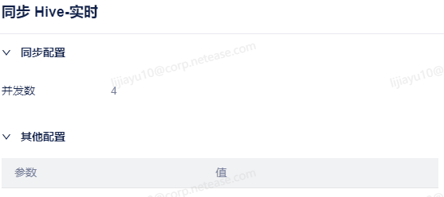

  全量任务的配置项包括批量数、拉取并发度、插入并发度。实时任务的配置项包括并发数。

  ### 数据合并

  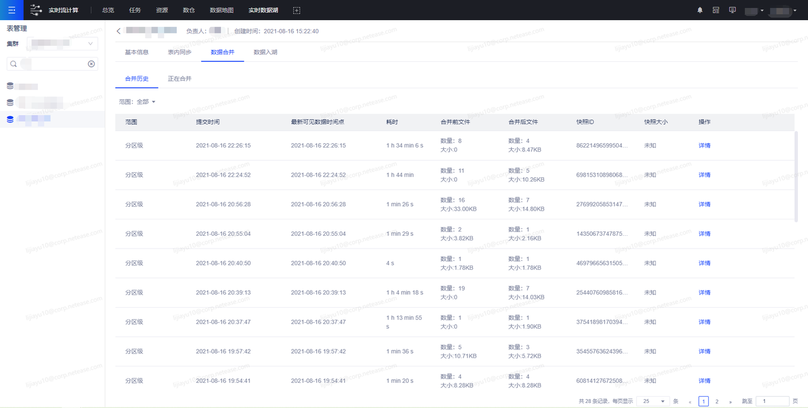

  数据合并用于将 change 表中的数据合并至 base 表，以达到数据更新的目的。数据从 change 表更新至 base 表是一个比较重的操作，因此我们提供了分区级别的配置。在某些业务场景下，业务如果只需要保证某几个分区（比如最近时间的）数据得到定时更新，就可以采用这种方式。

  数据合并展示分词 2 部分：合并历史和正在合并。显示的内容也比较直观，合并历史展示的是合并操作历史列表，包括合并范围、提交时间、数据的最新可见时间点、此处合并的耗时、合并文件变化情况以及快照 ID 等信息，点开详情可以查看更详细的操作细节。正在合并表示的是当前正在进行/排队的合并任务，展示的内容与如上所述一致。

  通过数据合并页面，能比较好的了解到后台数据管理方面信息。

  ### 数据入湖

  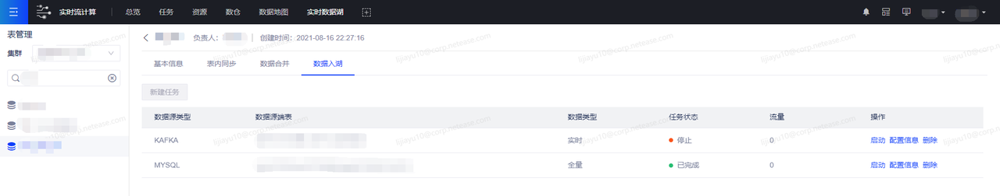

  在新建表-数据入湖步骤或在此页面内创建的数据入湖任务显示在此页列表中。任务创建后为未启动状态，需要用户手动启停。为保证数据一致性，目前仅支持同时运行一个入湖任务。

  在任务为停止或失败状态下，点击操作栏的配置信息，可对入湖任务的配置进行更改，重启任务后变更生效。

  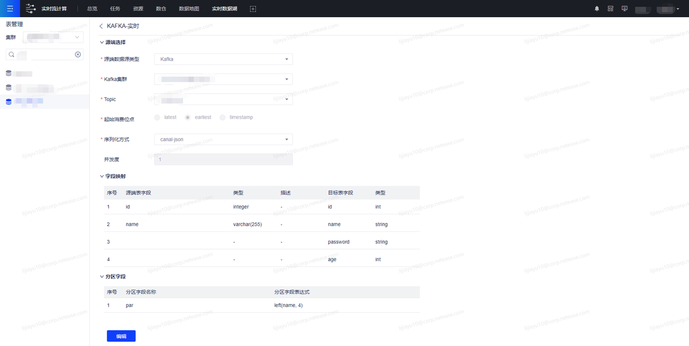

  ## 配置信息

  ### 基本信息

  展示建表时选择的集群、数据库、原生读取等信息。其中原生读取相关配置可以随时更改，其他信息不支持修改。

  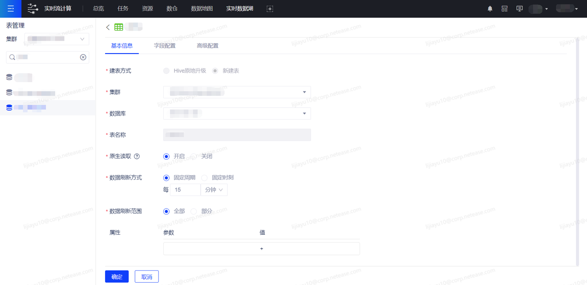

  ### 字段配置

  展示 Arctic 表的字段列表、分区字段列表和主键。目前暂不支持在建表后对字段进行修改。

  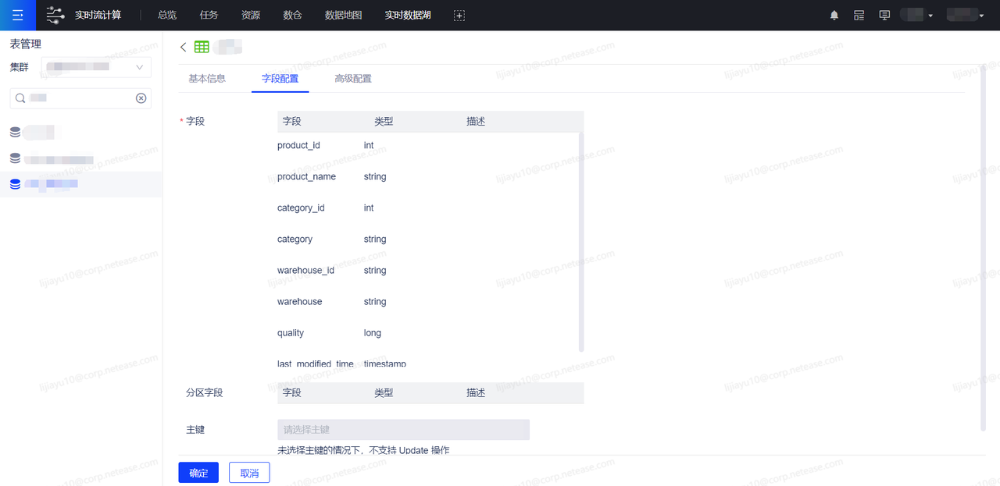

  ### 高级配置

  展示建表时的 CDC 配置和索引配置。目前暂不支持在建表后对高级配置进行修改。

  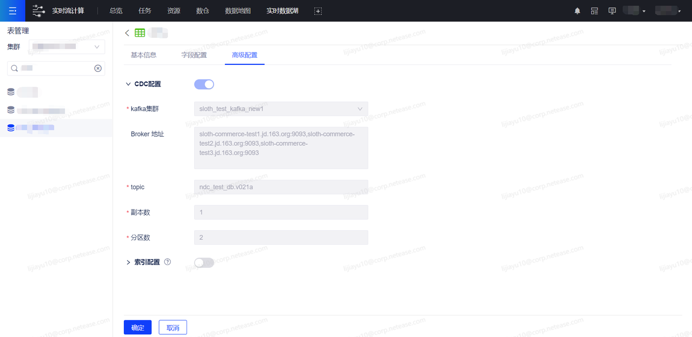

  # 索引关联（维表Join ）

  本节将介绍索引相关功能的基本说明、实现原理以及使用方法。

  ## 功能简介

  Arctic 表可以作为维表，对外提供关联（Join）实时数据的能力。

  在hsit

  ## 实现原理

  Arctic 底层维护了一份数据专门用于支撑快速高效的关联操作，这份数据会加载到内存或者第三方存储中，当前已支持 HBase。后台将 Arctic 表的主键字段作为 HBase 的 RowKey 字段，因此，若要使用 Arctic 维表 Join 的功能，必须是有主键表，且 Join 的条件字段必须等于主键字段（不限制多个主键字段的 join 顺序）。

  下图为数据流向的简单示意图。 

  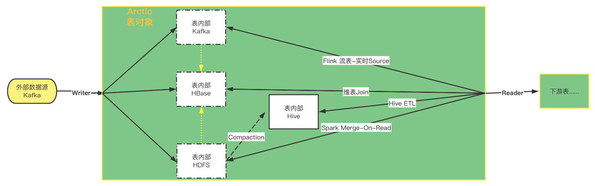

  

  ## 使用说明

  ### 使用限制

  仅支持 HBase 作为索引存储，仅支持 Arctic 表主键字段作为索引条件

  ### 使用步骤

  #### 主键设置

  Arctic 索引功能必须声明主键，可选择多个字段组成，例如：

  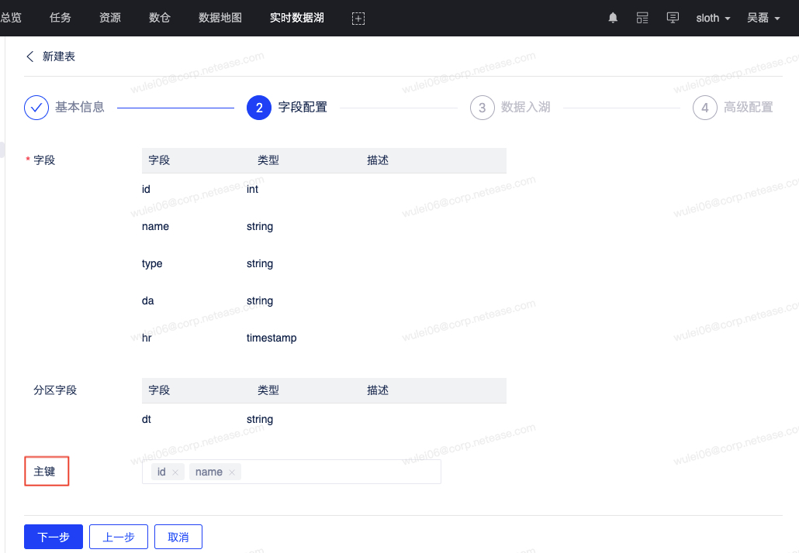

  #### 索引配置

  开启索引配置，选择 HBase 集群，输入存储在 HBase 中对应的表名，该表名在平台使用过程中不常用，仅方便后期问题排查。

  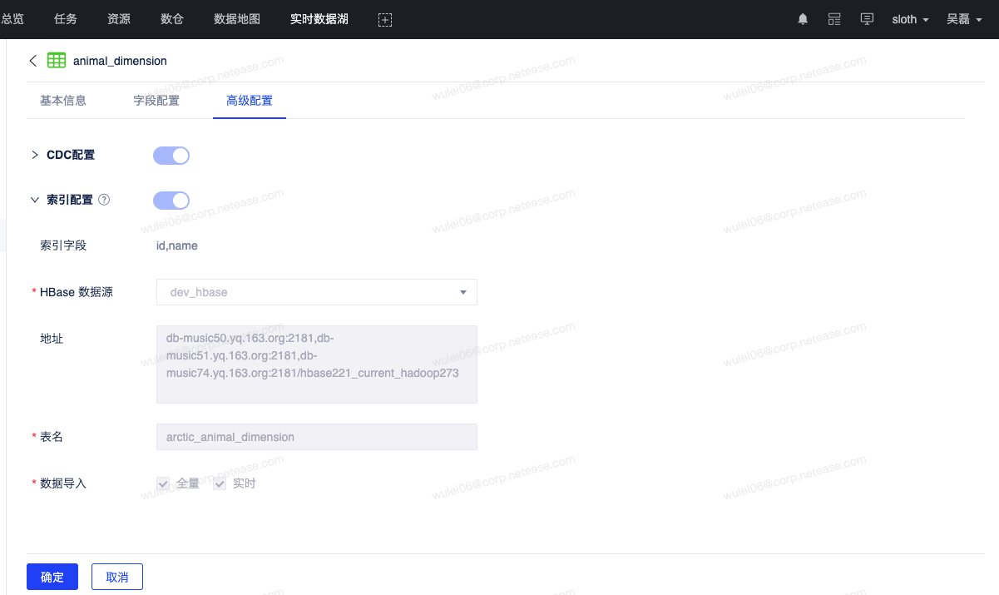

  ##### 索引同步方式一：入湖

  数据导入功能是在 Arctic 表内部将数据从 Kafka 或 HDFS 上导入 HBase 的功能，该功能与表内同步功能配合使用（数据流向示意图黄色虚线部分），若用户直接通过平台 SQL 作业写入 HBase，则不需要使用导入功能。详见表内同步章节。

  ‘全量’ 数据导入以任务的形式将 HDFS 离线数据导入到 HBase ；

  ‘实时’ 数据导入以任务的形式将 Kafka 实时数据导入到 HBase 。

  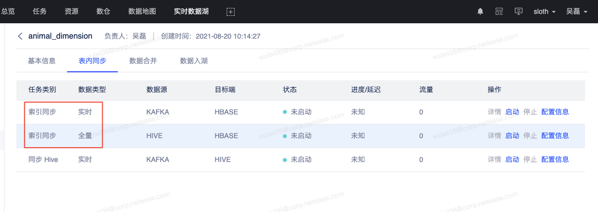

  ##### 索引同步方式二：SQL 作业

  指定 Dynamic Table Options 参数 /*+ OPTIONS('arctic_emit_mode'='hbase') */  即可实现往 Arctic HBase 端中写入数据。

  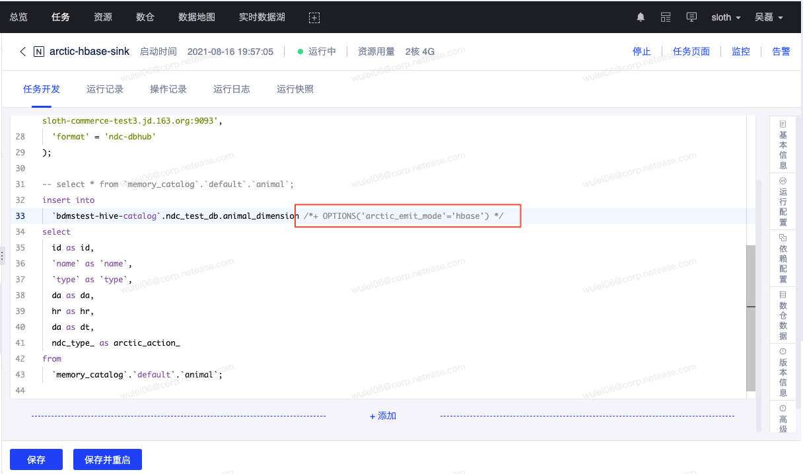

  #### 关联索引

  在 Flink SQL 作业中可直接对 Arctic 进行 Join 关联数据，其中 Join 的字段必须与 Arctic 声明的主键字段相同，多个主键字段顺序不限制。

  ```
  insert into `memory_catalog`.`default`.arctic_result_table 
  
  select
  
   src.id as id,
  
   dim.`name` as `name`,
  
   dim.dt as dt
  
  from
  
   `memory_catalog`.`default`.`source_table` as src
  
   left join `bdmstest-hive-catalog`.ndc_test_db.animal_dimension /*+ OPTIONS('index.read.properties.cache.strategy'='LRU','index.read.properties.cache.size'='108000') */
  
   -- 关联维度表中的数据，必须加上FOR SYSTEM_TIME AS OF ${souce_table_event_time_column}，表示JOIN维表当前时刻所看到的每条数据
  
   FOR SYSTEM_TIME AS OF src.join_time as dim 
  
   ON src.`name` = dim.`name` and src.id = dim.id;
  ```

  通过以上的 SQL 可以从 Arctic 表中读取到维表的数据，实时数据来自于与表绑定的 HBase，可以通过 Flink SQL Hint 语法在 SQL 中注入读取表时的参数，支持的参数包括：

  - index.read.properties.cache.strategy：读取HBase时的缓存策略，默认为None不开启，可选值为LRU

  - index.read.properties.cache.size：当选择了LRU缓存策略，可设置缓存数量，默认为10000

  - index.read.properties.cache.ttl：当选择了LRU缓存策略，可设置缓存过期时间，默认3小时，单位：秒