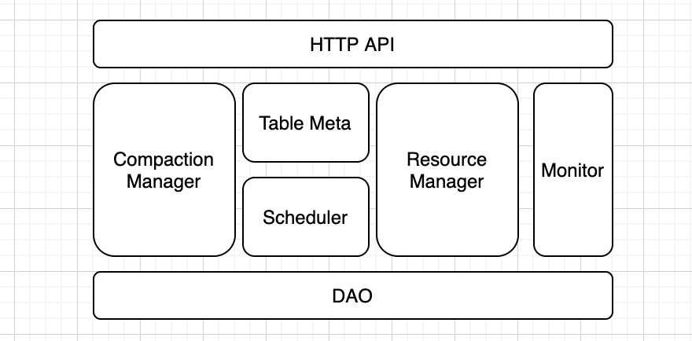

# [2-Arctic-server整体架构设计](http://doc.hz.netease.com/pages/viewpage.action?pageId=278087002)

## [Arctic-server 整体架构设计](http://doc.hz.netease.com/pages/viewpage.action?pageId=278087002#arctic-server-整体架构设计)

### [概述](http://doc.hz.netease.com/pages/viewpage.action?pageId=278087002#概述)

Arctic-server组件的核心诉求是通过对base file和delta files的治理实现：

- ...
- 小文件治理（base/delta files）
- 提高merge on read性能
- ...

治理方式分为如下三类：

- base files 和 delta files的合并（major compaction）
- delta files 和 delta files的合并（minor compaction）
- base files 和 base files的合并，无主键的delta files 和 delta files的合并（小文件合并）

（补充：base files初始化、过期base files的清理）

Arctic-server的特点和优势

- ...
- 分布式处理
- ...

三部分功能设计：

- 模块拆分（支持资源管控的调度模型，调度基于flink on yarn Session-Mode）
- minor compaction调度执行设计（流任务）
- major compaction调度设计（批任务）

### [模块拆分](http://doc.hz.netease.com/pages/viewpage.action?pageId=278087002#模块拆分)

- HTTP API（提供前端接口和对其他组件的接口）
- ResourceManager（管理yarn集群、JobManager等资源）
- Scheduler（触发、调度compaction）
- CompactionManager（管理Compaction Job）
- TableMeta（元数据缓存，定期刷新）
- Monitor（监控和报警）
- DAO（状态持久化）

Compaction Manager 模块功能点：**

- Major Compaction 当前Job状态的维护（一次Major Compaction为一个Job）
- Major Compaction 历史Job信息的维护
- Minor Compaction 当前合并文件的维护
- Minor Compaction 历史合并记录的维护（每次commit一次记录）
- 上述信息在前端的展示，由Compaction Manager直接提供服务

**Resource Manager模块功能点：**

概念

- 集群（对应yarn集群）：每个（yarn）集群的基本配置，以及分配给arctic-server的内存数上限、并发数上限（slot）等
- 执行节点（对应flink JobManager）：包括所属集群、认证文件、执行器配置（内存、并发数等）、引擎类型（flink、spark）、引擎配置参数（flink 的部署方式、flink TaskManager过期时间等）；包含操作：创建、修改、激活、关闭、删除
- 执行器Executor（对应flink TaskManager）：job的实际执行进程，由执行节点启动和关闭

流计算（minor compaction）和批计算（major compaction）的资源可以混部，也可以拆分成不同的执行节点独立部署，Resource Manager不做额外限制。

**Table Meta模块功能点：**

- 缓存作用
- arctic-server额外需要在表上添加的配置或者状态，也会在这里维护（如执行节点）

**Scheduler模块功能点（目前只考虑major/minor compaction）：**

- 发起调度：Scheduler根据Table Meta发起major/minor compaction调度，同时向Compaction Manager注册Job或者合并文件列表
- 请求资源：向Resource Manager请求资源（需要预先知道消耗的资源，而不是下发到JobManager后再计算）
- 排队执行：在资源不足时，Major Compaction可能需要排队执行，这部分功能由Scheduler提供