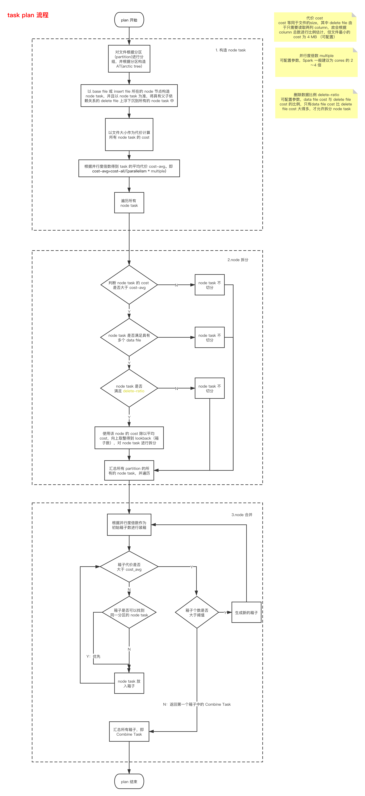
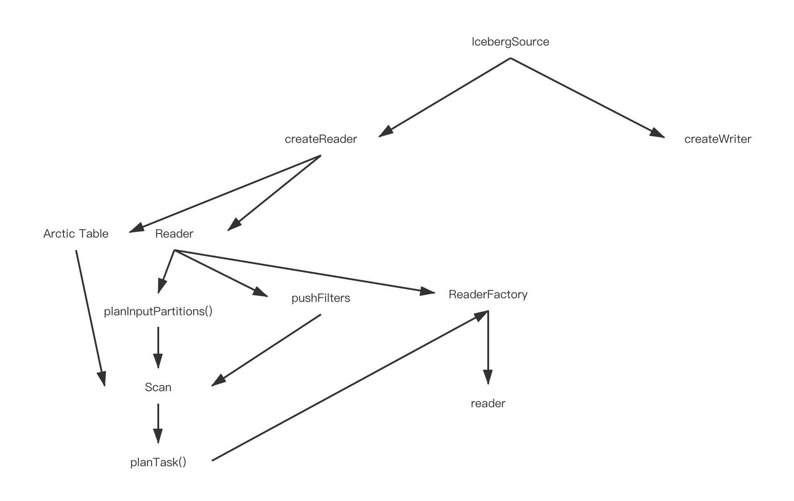

# 背景

Arctic 实时数仓系统，在 Format V1 版本中实现了基于 Hive(Base) + Iceberg(delta) 的数据实时摄取和异步的 Compaction，本质上数据的查询是基于 Copy-On-Write 的，也就是说数据的延迟取决于 Compaction 的效率，但是 Major Compaction 的性能有一定的瓶颈，为解决该问题在 V2 版本中增加两个功能点，Minor Compaction 和 Merge On Read。

Arctic V2 相对于 V1 主要改动点

- delta file 拆分为 insert file 和 delete file
- insert file 和 delete file 均为 parquet 类型，且 delete file 为 equity file + row offset
- base 和 table 分为为两张独立的 iceberg 表，snapshot 独立

# MOR Design

> 整体思路分为先 plan files ，后 plan tasks

## 一、plan files

> 获取所有需要读取的文件

- scan files = current snapshot base files + change files without merge （Merged max seq-num）

1. 前提：根据 partition 和 filter 进行过滤，只读取部分文件 （需和松哥协调，MOR这边抽象Scan，Core 提供根据 filter 过滤 Manifest 中的 File）

2. 获取 arctic table 当前的 base snapshot，因此可以从 snapsht 中获取当前的 basefile list 和 当前已经合并过的最大 change file 的 max-seq-num （不直接获取 delta 版本号，是因为 minor compaction 也会增加change table 的版本号，但是 file seq 还保留着）

3. 根据 max-seq-num 获取未合并的 change files

4. 至此，得到所有需要 scan 的 base files 和 change files

   

## 二、plan tasks

#### task plan 原则

1. 在 arctic tree 中，允许 delete file 进行上浮或者下沉，不允许 insert file 和 base file 上浮或者下沉，原因是 insert file 和 base file 相对于 delete file 为大文件
2. 若需要选择 arctic tree node 作为 task 时，选择 base file 或者 insert file 所在的 node 作为 task node。
3. 考虑拆分单个 tree node，但不拆分 node 中的某个文件，即若 node 中有且仅有一个较大的 base file，也不会将该 node task 进行拆分
4. 拆分单个 node task 需要满足 node task 中 data file （insert + base）与 delete file 的文件权重比例大于一定阈值，此处以参数 **weight-ratio 表示，默认为2.0**
5. task 数量与并发度数量的关系，Spark 官网建议将 task 的数量设置为并发度的 2～4 倍可得到较好的执行性能，此处以参数 **parallel-multiple 表示，默认为2**

#### 整体思路

按照分区 partition 对文件进行分组，并对分区逐个遍历构造 Arctic tree，然后以 data file 所在的 node 节点构造 node task， 以文件的大小作为代价 ，

计算所有 node task 总代价，并根据并行度 (可配置参数-并行度倍数) 得到 task 的平均代价为 cost_avg。

拆：对于所有 node task 进行遍历，将代价大于 cost_avg 且有多个 data file 的 node task 进行拆分，拆分的份数根据 node 代价与平均代价的比例决定

合：对于所有 node task 进行遍历，根据并行度 (可配置参数-并行度倍数) 进行装箱，装箱原则一是根据 cost，二是根据 partition 亲密度，同一个 partition 内部的 node task 优先合并

汇总：汇总所有 node task。 

#### 具体流程

### 总结

- 整体设计的目标是得到数量合适的且个体之间不会过于代价倾斜的一系列 task 集合
- 为保证有合适的 task 数量，这里我们参考spark doc给出的建议，[Typically you want 2-4 partitions for each CPU in your cluster](http://spark.apache.org/docs/latest/programming-guide.html#spark-programming-guide)。因为 task 数量太少会导致资源不能充分利用，例如并发度为16，但是 task 数量仅为8的话，有一半的并发度没利用到；task 太多，资源利用没什么问题，但是会导致 delete 文件重复读，以及 task 的序列化和传输的时间开销增大
- 为保证 task 间代价不会过于倾斜。我们会预先计算出平均代价，并且利用 arctic node 负载均衡和共享 delete 文件的能力
- 按照亲密度同一个分区的 node 会优先尝试作为一个 combine task 去处理

### 代码设计

