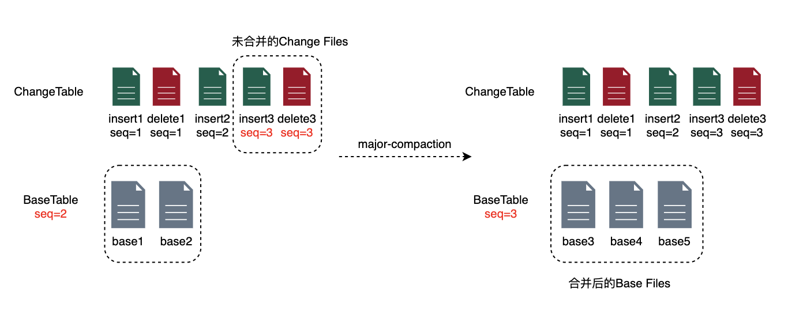
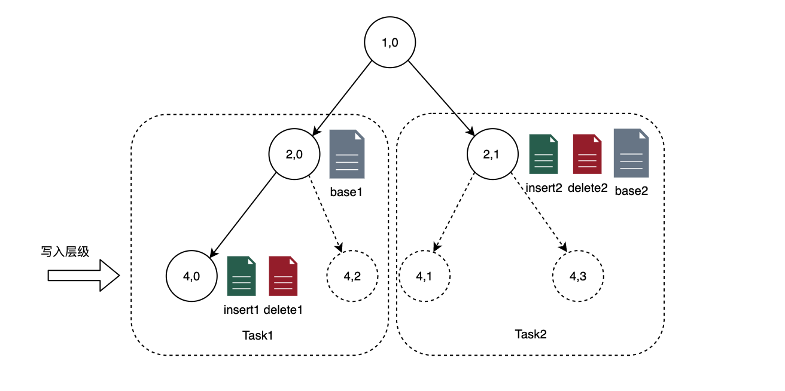

## [Major-compaction详细设计](http://doc.hz.netease.com/pages/viewpage.action?pageId=285783352#major-compaction详细设计)

本文档解决的问题：

- major compaction 方案设计，包括Plan Commit过程

不在本文档解决范围的问题：

- major compaction文件合并的具体方案和读写过程（task Execute）

待确认解决方案的问题：

- 如何兼容Hive表的问题（spark任务的方案）
- arctic table过期/无效文件的清理

## [概述](http://doc.hz.netease.com/pages/viewpage.action?pageId=285783352#概述)

采用流任务的方式执行，将major-compaction拆分成若干个可以独立执行的task，交给flink流任务执行，这些task执行完毕后，由arctic-server进行commit。

## [Major-compaction Plan](http://doc.hz.netease.com/pages/viewpage.action?pageId=285783352#major-compaction-plan)

### [Major compaction Plan的触发机制](http://doc.hz.netease.com/pages/viewpage.action?pageId=285783352#major-compaction-plan的触发机制)

Major compaction Plan的触发由arctic-server调度，基本的方式是根据partition内change files（最新的snapshot）的指标确认判断是否需要执行major-compaction，如果指标满足要求，则执行Plan生成task。

#### [1.指标定义](http://doc.hz.netease.com/pages/viewpage.action?pageId=285783352#1指标定义)

先要明确的一点是指标的统计范畴，比如表级别、partition级别、node级别，这里选择的是partition级别。

更确切地说，这里的统计范畴指的是，ChangeTable**某个partition内“未合并的Change Files”**和BaseTable最新snapshot的所有base files，如下图中虚线范围内所示的文件，在BaseTable记录了某个partition内已经合并到BaseTable的max file seq（即图中seq=2，含义是：所有seq<=2的Change Files已经都合并到BaseTable），而“**未合并的Change Files**”指的是，Change Files中（指最新的snapshot涵盖的所有Change Files）所有file seq大于max file seq的文件。

*具体format中如何保存BaseTable每个分区的max file seq待定*

*图 major-compaction示意图*

指标描述的是“未合并的Change Files”的总大小和碎片化程度，有如下几个参数：

- delete files大小(compact.major.delete.file.size.bytes*n)：partition内未合并的delete files的总大小，>=则触发
- delete files大小占文件总大小的比例(compact.major.delete.file.ratio)：文件总大小为整个partition的base files + 未合并的insert files的总大小，>=则触发，为了避免base files为空时，少量delete files即出发major-compaction，设置一个delete files的最小阈值，如（compact.major.delete.file.size.bytes.lowest*n）
- 小文件个数(compact.major.file.cnt*n)：change table 未合并的文件 + base files中的小文件个数，>=则触发（兜底小文件问题），是否是小文件的判断标准（compact.major.small.file.size.bytes）
- 最大间隔(compact.major.interval.max)：如果一个partition超过一定时间没有进行major-compaction，则强制执行一次major-compaction

另外需要说明的是，上述参数均为node级别，部分参数需要乘以node个数n（与ArcticTable的写入层级相关，如写入第1层，则n=1；写入第3层，则n=4）才能转化成partiton级别的阈值，并保证上述指标与节点个数的无关性

具体来说

对表执行周期性检查（10分钟），对每个partition：

1.如果partiton内没有尚未完成的major-compaction，则根据上述指标判断是否需要需要出发major-compaction

2.否则，如果partition内有正在Execute/Prepared/Committed的task，则跳过检查

3.否则，partition内的所有task都处于Init/Pending/Failed状态：此时如果最新的file seq与上述task的相同，则跳过检查。否则，依据最新的chang files进行检查，如果新生成的task可以一一对应（node节点）地覆盖上述task，则将上述task原地修改为最新的task，并将多出来的task也放入队列；否则，跳过检查。

##### [无主键表的major-compaction](http://doc.hz.netease.com/pages/viewpage.action?pageId=285783352#无主键表的major-compaction)

上述指标中小文件个数和最大间隔两个指标可以触发无主键表的major-compaction

无主键表的major-compaction只有base files参数，可以视为一种特殊的compaction-task

#### [2.Change/Base files的文件信息的获取方式：](http://doc.hz.netease.com/pages/viewpage.action?pageId=285783352#2changebase-files的文件信息的获取方式)

最简单可靠的方式是arctic-server周期性获取最新的ChangeTable和BaseTable中的所有文件信息，除此之外也应当开放接口，支持change files增量获取，加速compaction的触发。

减少周期性获取的代价，优化点：

- 记录上次检查的ChangeTable snapshot id，两次之间检查之间snapshot版本没有增长，跳过

每次周期性检查后，将信息缓存、落入系统库，作为元数据的base

change files增量获取，开放接口，允许上报ChangeTable commit信息

- 如果收到的snapshot id不超过上次检查的snapshot，忽略
- 否则，记录其中的文件信息，缓存并入库，累加到元数据base中，并更新元数据base的snapshot id
- 如果文件达到了上述指标，则主动触发一次进入后续触发流程（和一次周期性检查一致）

### [Major-compaction Task划分](http://doc.hz.netease.com/pages/viewpage.action?pageId=285783352#major-compaction-task划分)

Major-compaction的Plan会生成若干Major-compaction-task。

Major-compaction-task是执行文件合并的任务，具体是指：将指定的Change Files和Base Files合并成新的Base Files，写到Base目录下，然后将合并的结果返回arctic-server。

Plan具体方案：

1.文件范围和上面触发讨论的范围一样，即，在一个partition内，包含BaseTable（最新Snapshot）所有的Base Files + ChangeTable（最新Snapshot）”未合并的Change Files“；

2.将BaseTable和ChangeTable的上述文件填入到同一颗树中，如下图所示

3.确定写入层级（ArcticTable的配置项）

4.按照先根遍历的方式，当到达写入层级或者发现节点存在文件时，则将以该节点为根节点的子树划分为一个task，如果子树中没有任何文件，则忽略这个task

5.task写入节点：写入层级所在的节点即写入节点

*图 major-compaction Plan示意图*

| Task  | 读取文件              | 写入节点            |
| :---- | :-------------------- | :------------------ |
| Task1 | base1 insert1 delete1 | Node(4,0) Node(4,2) |
| Task2 | base2 insert2 delete2 | Node(4,1) Node(4,3) |

需要特别说明的是，上述major-compaction-task的commit具有相关性。因为commit需要将partition下的max file seq设置为本次合并的change files的最大file seq，这表示着**max file seq之前的change files已经全部合并到base files中**，因此需要等plan生成的所有task都完成后，才能一起commit，部分task先提交将破坏上述语意。

如果要major-compaction-task到commit彼此独立，需要将max files seq到记录下沉到node级别，node级别的收益：

- major-compaction更快生效（要更频繁地提交才可以）
- 避免某个task失败影响后续其他节点的major-compaction
- commit逻辑更简单

问题：

- 理论上不同node的数据是均衡的（hash），单独维护每个node的meta收益有限
- Plan复杂度提高

## [Major-compaction Execute](http://doc.hz.netease.com/pages/viewpage.action?pageId=285783352#major-compaction-execute)

Task具体执行方案（吴磊），本文档略

包括Base的目录组织问题，目前方案是合并后的文件直接写到Base原来的分区目录下

## [Major-compaction Commit](http://doc.hz.netease.com/pages/viewpage.action?pageId=285783352#major-compaction-commit)

有专门负责commit的线程池，对每张表周期性执行提交（允许每张表配置自己的提交周期，默认5分钟），这里的提交是指BaseTable上的MajorCompact操作（文件替换），每次提交时，如果Plan生成的一组相关联的task已经全部执行完成（prepared），则将这组task提交，如果有多组task，将多组task一起提交，提交的内容：

- 需要覆盖的文件列表
- 覆盖之后的文件列表
- max file seq（取多个task的最大值）

## [补充：待明确问题：](http://doc.hz.netease.com/pages/viewpage.action?pageId=285783352#补充待明确问题)

### [1.兼容Hive表的问题：](http://doc.hz.netease.com/pages/viewpage.action?pageId=285783352#1兼容hive表的问题)

方案：hive目录和BaseTable目录拆开，BaseTable到hive目录的同步，交给spark任务来做

已知metaV2下目录结构设计：

| 目录                 | 路径                          |
| :------------------- | :---------------------------- |
| Arctic根目录         | ./                            |
| Arctic metadata      | ./metadata                    |
| hive 表分区目录      | ./partition_hive_xxxx         |
| BaseTable 根目录     | ./base                        |
| BaseTable metadata   | ./base/metadata               |
| BaseTable 分区目录   | ./base/partition_base_xxxx    |
| ChangeTable 根目录   | ./change                      |
| ChangeTable metadata | ./change/metadata             |
| ChangeTable 分区目录 | ./change/partition_change_xxx |

Hive表的分区目录在Arctic表根目录下，和Base表的目录是区分开的，因此上述major-compaction对Hive表数据不产生影响。

metaV2 base表是iceberg表，这对兼容Hive带来的代价是需要额外保存一份数据给Hive用。

兼容Hive要解决的几个问题：

1.写入hive分区数据的来源（Base? /Base + Change?）

2.谁、什么时候写hive数据

3.写入hive数据什么时候怎么生效

无主键的表：

1.写入hive分区数据的来源

Base

2.谁、什么时候写hive数据

major-compaction生成的文件直接双写到Hive目录下

3.写入hive数据什么时候怎么生效

直接生效（hive如何避免读取正在写入的文件的？.或_开头的文件不可见？）

有主键的表：

1.写入hive分区数据的来源（Base? /Base + Change?）

Base（简单），Base+Change（彻底解耦Major-compaction和hive文件）

2.谁、什么时候写hive数据

flink流任务，一个特殊的task（读取文件，写入hive临时目录）

3.写入hive数据什么时候怎么生效

hive临时目录数据准备完成后，执行hive sql将hive partition指向新的目录（或者目录重命名？）

### [2.arctic table过期/无效文件的清理](http://doc.hz.netease.com/pages/viewpage.action?pageId=285783352#2arctic-table过期无效文件的清理)

和major-compaction解耦，作为一个单独的功能

能否使用iceberg表自带的过期清理逻辑，ArcticTable提供接口

需要注意过期文件如果过多，删除过程可能会OOM

目前time-travel功能使用的场景比较少，可以考虑将过期时间设置短一些，也尽可能避免删除OOM的问题