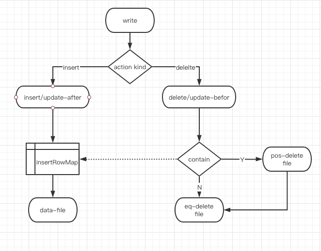
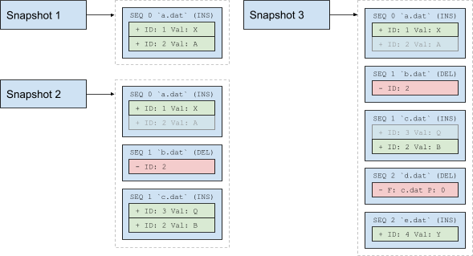
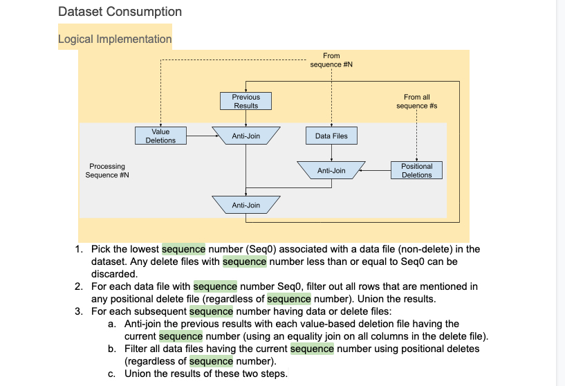
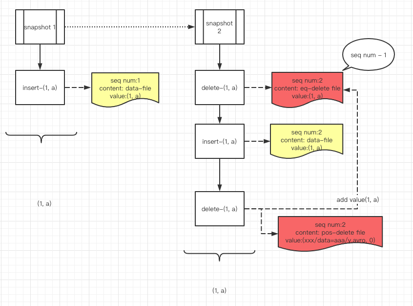

## 引言

本次分享的出发点是为了理清楚 iceberg 是如何实现 MOR 的，以此作为解决 arctic MOR 相关问题的参考，问题：

1. delta 增量数据文件的格式是否与 base 保持一致
2. delta 增量数据文件是否需要拆分为 insert 和 delete 两部分
3. delete 文件的格式规范如何设计，兼顾数据摄取的吞吐量和查询效率
4. 实现 MOR 后，minor compaction 和 major compaction 是如何设计的

在 Iceberg 中 MOR 相关的功能是在 Iceberg Table Spec Version 2: Row-level Deletes 中进行实现的，V1 是没有相关实现的。

Row-Level Delete 是指根据一个条件从一个数据集里面删除指定行。它实现方式可以分为Copy on Write模式和Merge on Read模式，其中Copy on Write模式可以保证下游的数据读具有最大的性能，而Merge on Read模式保证上游数据插入、更新、和删除的性能，减少传统Copy on Write模式下写放大问题。本次我们只讨论基于 Merge on Read 模式的实现方式。

## 整体进度

根据官网和 Github ，当前 Row-level Deletes 相关的功能并未完全开发完毕，当前进度约为 90%。

根据里程碑【3】，我们可以发现已经完成的部分：

-  Spec: equality delete files & position-based delete files
- Add reader and writer implementations for delete files
- Add a row filter implementation for deletes
- Update scan planning with DeleteFiles in each task

我们可以发现未完成的部分：

- Add an action to rewrite equality deletes as position deletes
- Add an action to compact delete files （minor compaction）
- Add an action to rewrite data files and remove deleted rows （major compaction）

综上，社区当前对 delete file 的规范，reader 和 writer 都已经实现好了，而提高性能的 compaction 还未完成。


## 实现

### 新概念

在 Iceberg 实现数据更新删除的方案中新引入如下概念：

- **delete file**：（删除文件）描述了在读取数据时那些需要被删除的行的数据集， 它可以使用基于位置的数据集(position-based delete file)来描述，也可以使用基于值数据集(value-based delete file)来描述。
- **sequence number**: （序列号）描述Iceberg文件的顺序数，序列号越小，生成该文件的时间越早。它决定了删除文件是否应该和对应的数据文件进行合并，当删除文件的序列号大于数据文件的序列号时，需要进行数据合并。


### delete file

>  delete file use the table's default format

delete file 的文件格式与 data file 保持一致，因此适用于 data file 的 filter 之类的操作也同样适用 delete file，文件类型靠 content 字段区分，因为严格来说文件类型一共有三种，delete file 有两种类型：

1. Position deletes mark a row deleted by data file path and the row position in the data file
2. Equality deletes mark a row deleted by one or more column values, like id = 5

#### 1.Position Delete Files

Position-based delete files identify deleted rows by file and position in one or more data files, and may optionally contain the deleted row.

| Field id, name             | Type                       | Description                                                  |
| :------------------------- | :------------------------- | :----------------------------------------------------------- |
| **`2147483546 file_path`** | `string`                   | Full URI of a data file with FS scheme. This must match the `file_path` of the target data file in a manifest entry |
| **`2147483545 pos`**       | `long`                     | Ordinal position of a deleted row in the target data file identified by `file_path`, starting at `0` |
| **`2147483544 row`**       | `required struct<...>` [1] | Deleted row values. Omit the column when not storing deleted rows. |

 The rows in the delete file must be sorted by `file_path` then `position` to optimize filtering rows while scanning

 

#### 2.Equality Delete Files

Equality delete files identify deleted rows in a collection of data files by one or more column values, and may optionally contain additional columns of the deleted row.

The delete `id = 3` could be written as either of the following equality delete files:

```
equality_ids=[1]

 1: id
-------
 3
```

 

####  3.Compare From Streaming CDC in Iceberg

 

Here we provide a table to describe the two different designs and requirements: 


|                                     | file/pos-deletes                                             | equality-deletes                                             |
| ----------------------------------- | ------------------------------------------------------------ | ------------------------------------------------------------ |
| Cases                               | Batch update/delete etc.                                     | Streaming CDC events.                                        |
| Requirements                        | Update/Delete as quickly as possible by consuming as few resources as possible. | Accomplish data ingestion/extraction with low latency and high throughput, should also provide acceptable batch read performance. |
| Frequency                           | Less frequent.                                               | High frequent.                                               |
| Rows to be affected for each query. | One query updates lots of rows.                              | One query updates one row usually. For example, the mysql row-level binlog. |
| Query traits                        | With a condition to filter rows in the iceberg table, so we actually don’t know which physical rows are going to be updated/deleted when the query comes. | The query provides all column values to match one row exactly. For example, INSERT will provide all the new column values; DELETE will provide all the old column values to be deleted; UPDATE will provide both new column values and old column values. |


 

### delete file 的生成逻辑

首先我们应该会有第一个困惑，既然 delete file 有两种，在规范和适用场景上也有一定区别，那么是由什么决定此时这个 delete 原语对应哪种类型的 delete file？

根据 iceberg flink sink 中的实现可以发现，equality-delete file 是肯定会生成的，pos-delete file 在一个批次(streaming with checkpoint)内可能会生成, 取决于本批次内是否有 history insert record ：

```java
@Override
public void write(RowData row) throws IOException {
  RowDataDeltaWriter writer = route(row);

  switch (row.getRowKind()) {
    case INSERT:
    case UPDATE_AFTER:
// 插入的数据会缓存在 insertedRowMap 中，在 delete 时即可确定 fileId 和 position。当然，insertedRowMap 不会一直存在，每次 checkpoint 周期都会 new 一个
      writer.write(row);
      break;

    case DELETE:
    case UPDATE_BEFORE:
      writer.delete(row);
      break;

    default:
      throw new UnsupportedOperationException("Unknown row kind: " + row.getRowKind());
  }
}
```


```java
/**
 * Write the pos-delete if there's an existing row matching the given key.
 *
 * @param key has the same columns with the equality fields.
 */
private void internalPosDelete(StructLike key) {
  PathOffset previous = insertedRowMap.remove(key);

  if (previous != null) {
    // TODO attach the previous row if has a positional-delete row schema in appender factory.
    posDeleteWriter.delete(previous.path, previous.rowOffset, null);
  }
}

/**
 * Delete those rows whose equality fields has the same values with the given row. It will write the entire row into
 * the equality-delete file.
 *
 * @param row the given row to delete.
 */
public void delete(T row) throws IOException {
  // 若能找到 position，则写入 pos-delete file，但是肯定会写入 eq-delete file
  internalPosDelete(structProjection.wrap(asStructLike(row)));

  eqDeleteWriter.write(row);
}
```

write 的代码逻辑如下图：



### **sequence number**

 

sequence number 的生成是与 snapshot 强相关的，可以这样理解，在每次生成新的 snapshot 时（即每一次 commit success 时），会为本次新生成的 data-file 、delete-file 以及对应的 manifest 分配一个递增的序列号。

 

所有文件的序列号是 immutable 的，因此可以在其他 snapshot 中重复使用，而不会导致数据错乱。

在此有一个特殊处理细节需要注意，eq-delete file 的 seq-num 在 plan 阶段会减 1，这样做的原因可以参考这个 PR [2]

```java
List<Pair<Long, DeleteFile>> filesSortedBySeq = deleteFilesByPartition.get(partition).stream()
    .map(entry -> {
      // a delete file is indexed by the sequence number it should be applied to
      long applySeq = entry.sequenceNumber() -
          (entry.file().content() == FileContent.EQUALITY_DELETES ? 1 : 0);
      return Pair.of(applySeq, entry.file());
    })
    .sorted(Comparator.comparingLong(Pair::first))
    .collect(Collectors.toList());

```

 

### 数据读取流程




例如，在上图中的snapshot 2，b.dat是一个删除文件，因为它的序列号（减 1）不小于 a.dat, 表示这个删除文件应该与数据文件a.dat进行合并，但是它的序列号小于数据文件c.dat的序列号，说明不用与c.dat进行合并，所以最后snapshot 2里面包含的数据是：`{(1, X), (3, Q), (2, B)}`。

第二个例子是snapshot 3，这里包含了一个基于文件名和位置的删除文件，它的序列号大于数据文件a.dat和c.dat的序列号，表示最后的结果集需要和这两文件进行合并，所以最后snapshot 3的数据集是 `{(1, X), (2, B), (4, Y)}`。故

snapshot 1最终结果是：`{(1, X), (2, A)}`

snapshot 2最终结果是：`{(1, X), (3, Q), (2, B)}`

```
snapshot3最终结果是：{(1, X), (2, B), (4, Y)}
```

将上述流程转换为可执行的代码逻辑如下：

 

例如下图，黄色表示 data file， 红色表示 delete file



## reference

【1】https://iceberg.apache.org/spec/#row-level-deletes

【2】https://github.com/apache/iceberg/pull/1288

[【3】](https://github.com/apache/iceberg/pull/1288)https://github.com/apache/iceberg/milestone/4

【4】[https://docs.google.com/document/d/1FMKh_SQ6xSUUmoCA8LerTkzIxDUN5JbStQp5Hzot4eo/edit#](https://docs.google.com/document/d/1FMKh_SQ6xSUUmoCA8LerTkzIxDUN5JbStQp5Hzot4eo/edit)