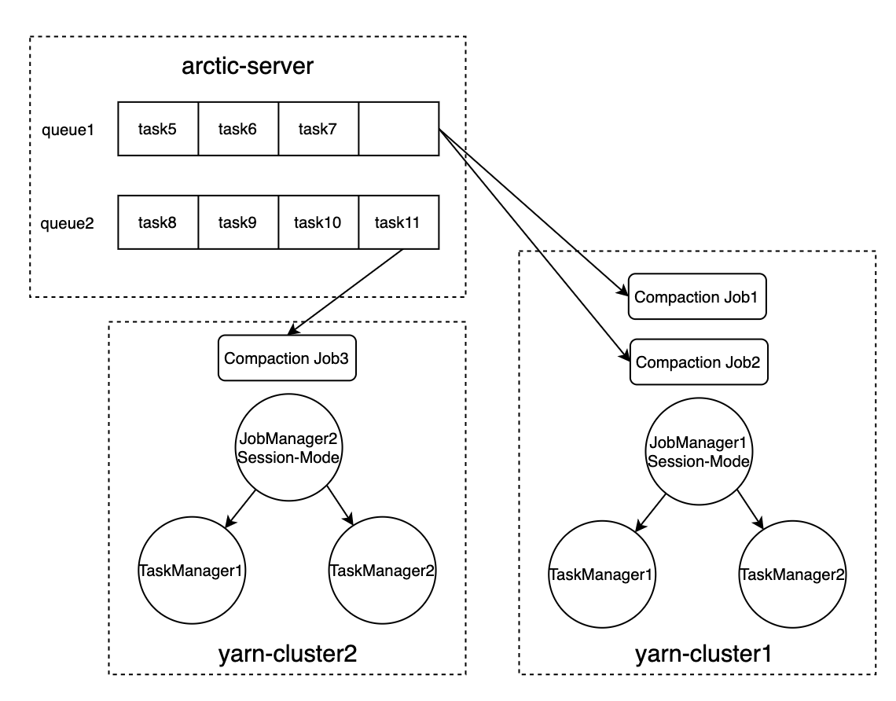

# [3-Arctic-server流式调度框架设计](http://doc.hz.netease.com/pages/viewpage.action?pageId=278087169)

[转至元数据结尾](http://doc.hz.netease.com/pages/viewpage.action?pageId=278087169#page-metadata-end)

- 创建： [王涛](http://doc.hz.netease.com/display/~wangtao3@corp.netease.com)，最新修改于： [2021 年 4 月 26 日](http://doc.hz.netease.com/pages/diffpagesbyversion.action?pageId=278087169&selectedPageVersions=3&selectedPageVersions=4)

[转至元数据起始](http://doc.hz.netease.com/pages/viewpage.action?pageId=278087169#page-metadata-start)

[toc]

# [Arctic-server流式调度框架设计](http://doc.hz.netease.com/pages/viewpage.action?pageId=278087169#arctic-server流式调度框架设计)

## [需求](http://doc.hz.netease.com/pages/viewpage.action?pageId=278087169#需求)

- 充分利用当前资源持续执行文件合并
- commit频率不能太高
- 不同表有优先级
- 可以兼容Major/Minor-Compaction（统一称为compaction）

采用流任务的原因

- 提高operator资源的利用率

  待解决问题：

  arctic-server集中commit，认证问题

## [方案设计](http://doc.hz.netease.com/pages/viewpage.action?pageId=278087169#方案设计)

- 允许一个或多个流任务同时运行
- 每个流任务可以同时处理多张表的compaction
- 一张表的compaction可拆分给多个流任务同时执行

执行方式选择：

- Session-mode：节省JobManager资源（推荐）
- Application-mode：更好的隔离性

### [概述](http://doc.hz.netease.com/pages/viewpage.action?pageId=278087169#概述)

基于Session-mode的调度框架如下图所示：

CompactionJob从CompactionQueue中消费CompactionTask（Http接口），执行后将CompactionResult上报给Arctic-Server（Http接口），由Arctic-Server进行Commit。

**Compaction队列**：Arctic Server（CompactionManager模块）中维护Compaction队列（如图左上角所示queue，队列中的元素是CompactionTask，队列可以有多个）。

**JobManager-CompactionJob**：Session-mode下，每个JobManager上可以运行多个Compaction Job，在本期实现中，每个yarn集群部署一个JobManager即可（保留后续版本可以支持多个的可能），每个Compaction Job可以单独决定从哪个queue消费数据，queueId作为Job的配置。

Compaction Queue与Compaction Job二者的管理是解耦的，二者的关联仅仅在于Compaction Job需要设置从哪个Compaction Queue（queueId）消费数据，Compaction Queue不需要知道下游的消费者。

**整体调度方案示意图**

**flink-Job执行流程示意图**

### [flink-Job执行流程描述](http://doc.hz.netease.com/pages/viewpage.action?pageId=278087169#flink-job执行流程描述)

#### [1.生成compaction task](http://doc.hz.netease.com/pages/viewpage.action?pageId=278087169#1生成compaction-task)

由arctic-server的Scheduler模块生成CompactionTask写入Compaction Queue，task的状态为Pending，请求的生成机制有两个：

- arctic-server在TableMeta中周期性检查生成
- arctic-server接收外部的commit请求（包含新增的文件，触发compaction条件后生成task）

#### [2.source](http://doc.hz.netease.com/pages/viewpage.action?pageId=278087169#2source)

流入：FROM CompactionQueue，source从CompactionQueue获取task后，Arctic-Server更新task状态为Executing，并记录执行task的JobId

http接口：https://nei.hz.netease.com/interface/detail/?pid=56368&id=347387

执行：将task交给下游operator执行compaction

流出：TO operator

#### [3.compact operator](http://doc.hz.netease.com/pages/viewpage.action?pageId=278087169#3compact-operator)

流入：FROM source

执行：根据task要求，合并特定文件

流出：TO sink，合并的结果（成功/失败：报错信息）

#### [4.sink](http://doc.hz.netease.com/pages/viewpage.action?pageId=278087169#4sink)

流入：FROM operator，合并的结果

执行：调用Arctic-Server接口返回合并的结果

流出：合并的结果

http接口：https://nei.hz.netease.com/interface/detail/req/?pid=56368&id=343691

### [功能详细设计](http://doc.hz.netease.com/pages/viewpage.action?pageId=278087169#功能详细设计)

#### [Compaction Queue](http://doc.hz.netease.com/pages/viewpage.action?pageId=278087169#compaction-queue)

Compaction队列（CompactionQueue）主要起到缓存作用，也可以依托Compaction队列做优先级管理。

类1：CompactQueueMeta

| 属性         | 参数名   | 类型 | 说明 |
| :----------- | :------- | :--- | :--- |
| 队列唯一标识 | queueId  | int  |      |
| 队列最大长度 | capacity | int  |      |

功能点：

- arctic-server维护表和Compaction队列的映射关系（作为表的属性，有默认的default队列）
- 新增Compaction队列，新增Compaction队列会到集群启动JobManager
- 删除Compaction队列，删除Compaction队列的前提条件，队列上面的task已经清除，且没有表与task存在映射关系
- Compaction队列参数：队列ID、队列最大长度
- 修改表与Compaction队列的映射关系，将旧的队列上的这张表的Pending状态的task迁移到新的映射队列上，其他task不受影响
- 队列达到最大长度之后：阻塞task写入

#### [Compaction Job](http://doc.hz.netease.com/pages/viewpage.action?pageId=278087169#compaction-job)

CompactionJob是compation的实际执行者，Arctic-server可以将大部分CompactionJob的管理工作交给flink来做，arctic-server对CompactionJob的特殊要求有两个

- 需要提供Job的唯一标识（在调用消费、上报接口时提供）
- 启动CompactionJob时指定queueId（在调用消费、上报接口时提供）

CompactionJob

| 属性              | 参数名      | 类型               | 说明 |
| :---------------- | :---------- | :----------------- | :--- |
| Job唯一标识       | jobId       | String             |      |
| 队列ID            | queueId     | int                |      |
| 并发度            | parallelism | int                |      |
| 其他flink-job参数 | properties  | Map<String,String> |      |

CompactionJobRuntime

| 属性        | 参数名 | 类型   | 说明 |
| :---------- | :----- | :----- | :--- |
| Job唯一标识 | jobId  | String |      |
|             |        |        |      |
|             |        |        |      |

- 每个Compaction Job可以独立配置并发度等参数
- Compaction Job无状态（不依赖checkpoint）
- Compaction Job支持新增
- 最好有：Compaction Job可以主动下线，flink上Cancel Job，在Arctic-Server中将执行在这台Job上的Task状态设置为Pending（可以将任务立刻调度给其他Job执行，不用等到超时后再调度）

#### [Compaction Task](http://doc.hz.netease.com/pages/viewpage.action?pageId=278087169#compaction-task)

CompactionTask是执行的基本单元，本质上是将一批文件合并为另一批文件，每个CompactionTask的执行都是独立的，不受其他Task的影响。

CompactionTask

| 属性           | 参数名     | 类型               | 说明        |
| :------------- | :--------- | :----------------- | :---------- |
| Task唯一标识   | taskId     | long               |             |
| Task类型       | type       | CompactionTaskType | Minor/Major |
| 表信息         | table      | ArcticTable        |             |
| 合并的文件列表 | files      | List<DeltaFile>    |             |
| 写入的节点     | target     | List<TreeNode>     |             |
| 生成时间       | createTime | long               |             |
| 其他参数       | properties | Map<String,String> |             |

CompactionTaskRunTime

| 属性         | 参数名       | 类型               | 说明        |
| :----------- | :----------- | :----------------- | :---------- |
| Task唯一标识 | taskId       | long               |             |
| Task类型     | type         | CompactionTaskType | Minor/Major |
| 状态         | status       | CompactStatus      |             |
| 执行任务ID   | jobId        | String             |             |
| 失败重试次数 | retry        | int                |             |
| 失败原因     | failReason   | String             |             |
| 失败时间     | failTime     | long               |             |
| 合并完成时间 | preparedTime | long               |             |
| commit时间   | commitTime   | long               |             |
|              |              |                    |             |

CompactionResult

| 属性             | 参数名        | 类型               | 说明           |
| :--------------- | :------------ | :----------------- | :------------- |
| Task唯一标识     | taskId        | long               |                |
| Task类型         | type          | CompactionTaskType | MINOR/MAJOR    |
| 合并结果         | result        | Result             | Success/Failed |
| 替代的文件       | replacedFiles | List<DeltaFile>    |                |
| 合并后的文件列表 | resultFiles   | List<DeltaFile>    |                |
| 合并完成时间     | preparedTime  | long               |                |
| 失败原因         | failReason    | String             |                |
| 失败时间         | failTime      | long               |                |
|                  |               |                    |                |

- 触发compaction检查时生成
- 有状态（status）：Init Pending Executing Failed Prepared Committed
- task内容修改：处于Pending状态的task，会被下次compaction检查时覆盖内容
- task生命周期结束：在commit完成后结束，多个compaction task聚合为一个CompactionRecord计入MySQL，CompactionRecord超过一定时间后自动删除（分区表自动清理）

### [其他问题说明](http://doc.hz.netease.com/pages/viewpage.action?pageId=278087169#其他问题说明)

#### [问题一：如何避免对尚未完成的compaction文件重复发起compaction调度？](http://doc.hz.netease.com/pages/viewpage.action?pageId=278087169#问题一如何避免对尚未完成的compaction文件重复发起compaction调度)

arctic-server CompactionManager可以查到当前正在执行中（Executing/Prepared）的文件集合，Scheduler触发compaction检查时跳过这些文件；

对于major-compaction，如果分区有正在执行的major-compaction-task，则整个分区跳过检查

#### [问题五：状态查看](http://doc.hz.netease.com/pages/viewpage.action?pageId=278087169#问题五状态查看)

历史状态：历史执行的minor compaction record，每次commit生成一次minor compaction record，多个minor-compaction task合并为一个minor compaction record

当前状态：CompactionManager中维护了compaction task，可以访问compaction task

#### [问题六：失败task处理](http://doc.hz.netease.com/pages/viewpage.action?pageId=278087169#问题六失败task处理)

处于Failed状态的task可以触发重试，由单独的线程定期（5s）检查所有Task将失败的task重新放入队列中，队列中Failed任务可以像Pending任务一样被source获取到。失败的任务重新放入队列的前提条件是

- 当前时间>failTime+全局配置的重试间隔
- retry次数<全局配置的最大重试次数（3次）

为了避免重试的任务和之前的任务出现上报混乱，每次执行都分配一个唯一的attemptId，task只接受与当前attemptId相同的上报

#### [问题七：task状态更新异常处理（arctic-server的状态补偿）](http://doc.hz.netease.com/pages/viewpage.action?pageId=278087169#问题七task状态更新异常处理arctic-server的状态补偿)

flink job调用Arctic Server接口更新task状态时出现异常，重试后忽略异常，不阻塞后续compaction过程；

Arctic Server需要有状态补偿机制：如果长时间（需要一个全局的时间阈值参数）处于执行中（Executing）状态的文件，将状态改为Failed，触发自动重试；

#### [问题八：优先级控制](http://doc.hz.netease.com/pages/viewpage.action?pageId=278087169#问题八优先级控制)

(本次方案先不考虑优先级的实现，按照FIFO设计)

优先级是高度个性化的配置，优先执行的需求来源于用户，也避免不了用户手动设置

两个层面的问题需要解决：如何确定优先级，以及如何根据优先级调度

如何确定优先级：

- 简单的方案，区分高优先级和低优先级，作为表的属性（采用，需要用户配置）
- 复杂的方案，每一个task都有优先级，根据表的优先级、碎片化程度等指标确认优先级

根据优先级调度：

- 简单的方案：Compaction队列之间区分优先级，单独开放Compaction队列给高优先级的表使用（采用，需要平台配置）
- 复杂的方案：Compaction队列内部区分优先级，队列采用优先队列（需要对每个task进行优先级评估，还要避免饿死的问题）

在简单的方案下，用户不需要了解优先级的概念，只需要为需要优先执行的表配置单独的Compaction队列即可

在复杂的方案下，需要为每个task设置优先级，计算方式是：

- 先比较表的优先级，表优先级高的task优先级高
- 相同表优先级的，再比较task优先级，task优先级=task要处理的小文件个数