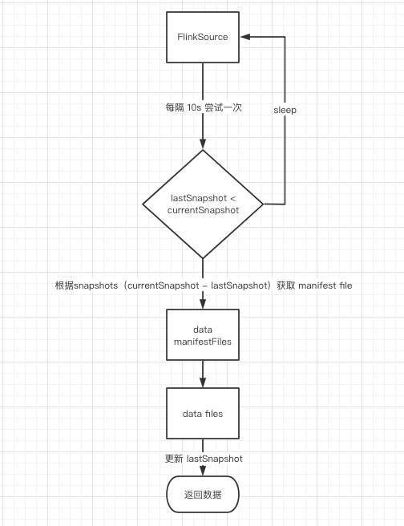
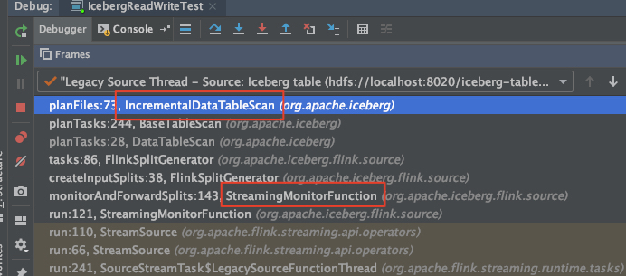

本文说讨论的 **IncrementalPuller** 是指 Hadoop 数据的增量查询，有两种场景，batch 模式下查询是指一次性返回所有或者有变化的数据，steaming 模式下查询是指连续返回所有数据并接着只返回有变化的数据，或者只返回有变化的数据，这取决于用户如何指定 increment scan 的 snapshot。

IncrementalPuller 配合数据的 Row Level Delete（即数据的update、delete）即可以实现 [Incremental processing on Hadoop](https://www.oreilly.com/content/ubers-case-for-incremental-processing-on-hadoop/) ,介于 batch processing 和 Stream processing 之间的 near-real-time processing，比如 batch processing 指的是数据结果延迟 1小时以上的，经典的是以 MR/Spark 为代表的 T+1 数据，Stream processing 指的是数据结果延迟小于5分钟，以 Flink/Spark Streaming 为代表，而 near-real-time processing 指的是数据结果延迟在 5分钟 到 1小时 之间计算，经典的场景是计算最近X分钟某种结果，Uber 把这种近实时处理称为 Incremental processing， 即增量处理。

举个例子，计算最近十五分钟订单的成交金额，原始数据在 kafka 中，在不引入第三方存储或者分析引擎，如 druid、ES、Kudu 等，批处理是无法得到结果的，但是对应的代价就是架构的复杂和重复的存储。当然如果使用流处理利用窗口是可以得到结果的，劣势在于流处理是长时间持有 Yarn Container 资源的，会对资源有浪费。若能实现增量处理，即通过只处理最近15分钟变化的数据，可以避免批处理需要扫描所有数据，也可以避免流处理常驻进程导致的资源浪费。


# Iceberg

以 flink 为例，在 iceberg 中 increment read 实现分为两种，以 isStreaming 标志分别是 batch 和 streaming 两种模式，batch 模式较为简单，我们以 streaming 模式具体展开。

## 参数说明

- streaming true： 表示流计算模式
- snapshotId： 表示读取哪个版本的数据，streaming reader 下不能设置该参数
- asOfTimestamp： 和 snapshotId 参数作用类似，相当于用时间戳来指定 snapshotId ，若在时间递增的情况下，有 snapshotId-NAN，timestamp-A，snapshotId-1，snapshotId-2，timestamp-B，snapshotId-3，其中 timestamp-A < timestamp-B， snapshotId-NAN 表示无 snapshot 生成，若用户指定 timestamp-B，则从 snapshot-2 开始读取数据，即最近提交的版本，

​     若用户指定 timestamp-A，则将报错，因为之前没有提交成功的版本

- startSnapshotId： streaming reader 从哪个版本开始读取数据，但是不包括该版本的数据，不指定则读取历史所有数据

- endSnapshotId： streaming reader 不能指定 end，batch 时指定后表示读取到哪个版本为止，包括该版本

  

## 实现

### 测试类

```java
/**
 * 需要本地启动 hadoop 服务
 */
public class IcebergReadWriteTest {

  public static void main(String[] args) throws Exception {
//    write();
    incrementalRead();
  }

  public static void write() throws Exception {
    StreamExecutionEnvironment env = initEnv();

    DataStream<RowData> inputStream = env.addSource(new RichSourceFunction<RowData>() {

      private static final long serialVersionUID = 1L;
      boolean flag = true;

      @Override
      public void run(SourceContext<RowData> ctx) throws Exception {
        while (flag) {
          GenericRowData row = new GenericRowData(2);
          row.setField(0, System.currentTimeMillis());
          row.setField(1, StringData.fromString(UUID.randomUUID().toString()));

          ctx.collect(row);
        }

      }

      @Override
      public void cancel() {
        flag = false;
      }
    });
    // define iceberg table schema.
    Schema schema = new Schema(Types.NestedField.optional(1, "id", Types.LongType.get()),
            Types.NestedField.optional(2, "data", Types.StringType.get()));
    // define iceberg partition specification.
    PartitionSpec spec = PartitionSpec.unpartitioned();

    // table path
    String basePath = "hdfs://localhost:8020/";

    String tablePath = basePath.concat("iceberg-table-2");

    // property settings, format as orc or parquet
    Map<String, String> props =
            ImmutableMap.of(TableProperties.DEFAULT_FILE_FORMAT, FileFormat.ORC.name());

    // create an iceberg table.
    Table table = new HadoopTables().create(schema, spec, props, tablePath);

    TableLoader tableLoader = TableLoader.fromHadoopTable(tablePath);

    FlinkSink.forRowData(inputStream).table(table).tableLoader(tableLoader).writeParallelism(1).build();
    env.execute("iceberg write and read.");
  }

  public static void incrementalRead() throws Exception {
    StreamExecutionEnvironment env = initEnv();

    // table path
    String basePath = "hdfs://localhost:8020/";
    String tablePath = basePath.concat("iceberg-table-2");
    TableLoader tableLoader = TableLoader.fromHadoopTable(tablePath);

    //read file
    DataStream<RowData> dataStream = FlinkSource.forRowData().env(env).tableLoader(tableLoader).streaming(true)
            .startSnapshotId(2790691321534033651L).build();

    dataStream.print("===");

    env.execute("iceberg read");
  }
  
  public static StreamExecutionEnvironment initEnv() throws Exception {
    StreamExecutionEnvironment env = StreamExecutionEnvironment.getExecutionEnvironment();
    env.setParallelism(1);
    env.enableCheckpointing(5000L);
    env.getCheckpointConfig().setCheckpointingMode(CheckpointingMode.EXACTLY_ONCE);
    env.getCheckpointConfig().setMinPauseBetweenCheckpoints(5000);
    env.getCheckpointConfig().setCheckpointTimeout(60 * 1000L);
    env.getCheckpointConfig().setMaxConcurrentCheckpoints(1);
    env.getCheckpointConfig().enableExternalizedCheckpoints(CheckpointConfig.ExternalizedCheckpointCleanup.RETAIN_ON_CANCELLATION);

    return env;
  }
}
```

###  整体流程

1. FlinkSource 每隔 10s 尝试去拉取增量数据，判断上次读取的版本号，即 lastSnapshot，若 lastSnapshot 已经为当前最新的版本，说明所有的数据已经读取，进入休眠

2. 若 lastSnapshot 小于当前最新版本，说明至少有一个版本的 change log 没有读取，则根据 currentSnapshot - lastSnapshot 得到所有未读取的 snapShots

3. 根据 snapShots，可以得到这些版本号对应的所有的 manifestList，通过 manifestList 得到对应所有的 manifestFile，对 manifestFile 过滤，得到只属于这些 snapShot 新增的 data manifestFile（manifestFile 新建时维护了相关属性 content 和 snapshot）

4. 根据上一步的 data manifestFile，得到对应所有的 data file，对 data file 过滤，得到只属于这些 snapShot 新增的 data file （data file 新建时维护了相关属性 status 和 snapshot）

5. 根据 data file 构建 FileScanTask，并更新 lastSnapshot 为currentSnapshot

   

### 代码说明

FlinkSource.build() 方法中根据 isStreaming=true 会构造 StreamingMonitorFunction，这个类继承 Flink RichSourceFunction，相当于 Source

```

@Override
public void run(SourceContext<FlinkInputSplit> ctx) throws Exception {
  this.sourceContext = ctx;
  while (isRunning) {
    synchronized (sourceContext.getCheckpointLock()) {
      if (isRunning) {
        monitorAndForwardSplits();
      }
    }
	// 固定时间间隔去构造 FlinkInputSplit，默认 10s，
    Thread.sleep(scanContext.monitorInterval().toMillis());
  }
}
```

由 StreamingMonitorFunction 中构造 Split ，一直跳转到 IncrementalDataTableScan 构造 planFiles，获取需要特定文件构造 Source 中本次读取的数据



```java

@Override
public CloseableIterable<FileScanTask> planFiles() {
// 获取所需要遍历的 Snapshot 集合，(fromSnapshotId, toSnapshotId], 左开右闭
  List<Snapshot> snapshots = snapshotsWithin(table(),
      context().fromSnapshotId(), context().toSnapshotId());
  Set<Long> snapshotIds = Sets.newHashSet(Iterables.transform(snapshots, Snapshot::snapshotId));
// 遍历得到所有需要扫描的 ManifestFile
  Set<ManifestFile> manifests = FluentIterable
      .from(snapshots)
// 过滤 deleteManifests
      .transformAndConcat(Snapshot::dataManifests)
// manifestFile 创建的时候会带上对应的 snapshotId，此处过滤相当于获取每个 snapshot 新增的 manifestFile
      .filter(manifestFile -> snapshotIds.contains(manifestFile.snapshotId()))
      .toSet();

  ManifestGroup manifestGroup = new ManifestGroup(tableOps().io(), manifests)
      .caseSensitive(isCaseSensitive())
      .select(colStats() ? SCAN_WITH_STATS_COLUMNS : SCAN_COLUMNS)
      .filterData(filter())
      .filterManifestEntries(
          manifestEntry ->
// manifestEntry 是 dataFile 或 deleteFile 的包装类，file 创建时会带上对应的 snapshotId，此处过滤相当于获取每个 manifestFile 中新增的 dataFile（deleteManifests 已被过滤）
              snapshotIds.contains(manifestEntry.snapshotId()) &&
              manifestEntry.status() == ManifestEntry.Status.ADDED)
      .specsById(tableOps().current().specsById())
      .ignoreDeleted();

  if (shouldIgnoreResiduals()) {
    manifestGroup = manifestGroup.ignoreResiduals();
  }

  Listeners.notifyAll(new IncrementalScanEvent(table().name(), context().fromSnapshotId(),
      context().toSnapshotId(), context().rowFilter(), schema()));

  if (PLAN_SCANS_WITH_WORKER_POOL && manifests.size() > 1) {
    manifestGroup = manifestGroup.planWith(ThreadPools.getWorkerPool());
  }

  return manifestGroup.planFiles();
}
```


```java

/**
 * manifestGroup.planFiles() 通过上一步，已经得到部分 dataFile， 此处对所有 dataFile 进行遍历，每一个 dataFile 构造为一个 task
 * 当前 IncrementalDataTableScan 不支持 overwrite 操作，故 delete file 为空
 */
public CloseableIterable<FileScanTask> planFiles() {
  LoadingCache<Integer, ResidualEvaluator> residualCache = Caffeine.newBuilder().build(specId -> {
    PartitionSpec spec = specsById.get(specId);
    Expression filter = ignoreResiduals ? Expressions.alwaysTrue() : dataFilter;
    return ResidualEvaluator.of(spec, filter, caseSensitive);
  });

  DeleteFileIndex deleteFiles = deleteIndexBuilder.build();

  boolean dropStats = ManifestReader.dropStats(dataFilter, columns);
  if (!deleteFiles.isEmpty()) {
    select(ManifestReader.withStatsColumns(columns));
  }

  Iterable<CloseableIterable<FileScanTask>> tasks = entries((manifest, entries) -> {
    int specId = manifest.partitionSpecId();
    PartitionSpec spec = specsById.get(specId);
    String schemaString = SchemaParser.toJson(spec.schema());
    String specString = PartitionSpecParser.toJson(spec);
    ResidualEvaluator residuals = residualCache.get(specId);
    if (dropStats) {
      return CloseableIterable.transform(entries, e -> new BaseFileScanTask(
          e.file().copyWithoutStats(), deleteFiles.forEntry(e), schemaString, specString, residuals));
    } else {
      return CloseableIterable.transform(entries, e -> new BaseFileScanTask(
          e.file().copy(), deleteFiles.forEntry(e), schemaString, specString, residuals));
    }
  });

  if (executorService != null) {
    return new ParallelIterable<>(tasks, executorService);
  } else {
    return CloseableIterable.concat(tasks);
  }
}
```


# Hudi

测试类如下，实现待定～

```java
@Test def testCount() {
  // First Operation:
  // Producing parquet files to three default partitions.
  // SNAPSHOT view on MOR table with parquet files only.
  val records1 = recordsToStrings(dataGen.generateInserts("001", 100)).toList
  val inputDF1 = spark.read.json(spark.sparkContext.parallelize(records1, 2))
  inputDF1.write.format("org.apache.hudi")
    .options(commonOpts)
    .option("hoodie.compact.inline", "false") // else fails due to compaction & deltacommit instant times being same
    .option(DataSourceWriteOptions.OPERATION_OPT_KEY, DataSourceWriteOptions.INSERT_OPERATION_OPT_VAL)
    .option(DataSourceWriteOptions.TABLE_TYPE_OPT_KEY, DataSourceWriteOptions.MOR_TABLE_TYPE_OPT_VAL)
    .mode(SaveMode.Overwrite)
    .save(basePath)
  assertTrue(HoodieDataSourceHelpers.hasNewCommits(fs, basePath, "000"))
  val hudiSnapshotDF1 = spark.read.format("org.apache.hudi")
    .option(DataSourceReadOptions.QUERY_TYPE_OPT_KEY, DataSourceReadOptions.QUERY_TYPE_SNAPSHOT_OPT_VAL)
    .load(basePath + "/*/*/*/*")
  assertEquals(100, hudiSnapshotDF1.count()) // still 100, since we only updated

  // Second Operation:
  // Upsert the update to the default partitions with duplicate records. Produced a log file for each parquet.
  // SNAPSHOT view should read the log files only with the latest commit time.
  val records2 = recordsToStrings(dataGen.generateUniqueUpdates("002", 100)).toList
  val inputDF2: Dataset[Row] = spark.read.json(spark.sparkContext.parallelize(records2, 2))
  inputDF2.write.format("org.apache.hudi")
    .options(commonOpts)
    .mode(SaveMode.Append)
    .save(basePath)
  val hudiSnapshotDF2 = spark.read.format("org.apache.hudi")
    .option(DataSourceReadOptions.QUERY_TYPE_OPT_KEY, DataSourceReadOptions.QUERY_TYPE_SNAPSHOT_OPT_VAL)
    .load(basePath + "/*/*/*/*")
  assertEquals(100, hudiSnapshotDF2.count()) // still 100, since we only updated
  val commit1Time = hudiSnapshotDF1.select("_hoodie_commit_time").head().get(0).toString
  val commit2Time = hudiSnapshotDF2.select("_hoodie_commit_time").head().get(0).toString
  assertEquals(hudiSnapshotDF2.select("_hoodie_commit_time").distinct().count(), 1)
  assertTrue(commit2Time > commit1Time)
  assertEquals(100, hudiSnapshotDF2.join(hudiSnapshotDF1, Seq("_hoodie_record_key"), "left").count())

  // incremental view
  // base file only
  val hudiIncDF1 = spark.read.format("org.apache.hudi")
    .option(DataSourceReadOptions.QUERY_TYPE_OPT_KEY, DataSourceReadOptions.QUERY_TYPE_INCREMENTAL_OPT_VAL)
    .option(DataSourceReadOptions.BEGIN_INSTANTTIME_OPT_KEY, "000")
    .option(DataSourceReadOptions.END_INSTANTTIME_OPT_KEY, commit1Time)
    .load(basePath)
  assertEquals(100, hudiIncDF1.count())
  assertEquals(1, hudiIncDF1.select("_hoodie_commit_time").distinct().count())
  assertEquals(commit1Time, hudiIncDF1.select("_hoodie_commit_time").head().get(0).toString)
  hudiIncDF1.show(1)
  // log file only
  val hudiIncDF2 = spark.read.format("org.apache.hudi")
    .option(DataSourceReadOptions.QUERY_TYPE_OPT_KEY, DataSourceReadOptions.QUERY_TYPE_INCREMENTAL_OPT_VAL)
    .option(DataSourceReadOptions.BEGIN_INSTANTTIME_OPT_KEY, commit1Time)
    .option(DataSourceReadOptions.END_INSTANTTIME_OPT_KEY, commit2Time)
    .load(basePath)
  assertEquals(100, hudiIncDF2.count())
  assertEquals(1, hudiIncDF2.select("_hoodie_commit_time").distinct().count())
  assertEquals(commit2Time, hudiIncDF2.select("_hoodie_commit_time").head().get(0).toString)
  hudiIncDF2.show(1)

  // base file + log file
  val hudiIncDF3 = spark.read.format("org.apache.hudi")
    .option(DataSourceReadOptions.QUERY_TYPE_OPT_KEY, DataSourceReadOptions.QUERY_TYPE_INCREMENTAL_OPT_VAL)
    .option(DataSourceReadOptions.BEGIN_INSTANTTIME_OPT_KEY, "000")
    .option(DataSourceReadOptions.END_INSTANTTIME_OPT_KEY, commit2Time)
    .load(basePath)
  assertEquals(100, hudiIncDF3.count())
  // log file being load
  assertEquals(1, hudiIncDF3.select("_hoodie_commit_time").distinct().count())
  assertEquals(commit2Time, hudiIncDF3.select("_hoodie_commit_time").head().get(0).toString)

  // Unmerge
  val hudiSnapshotSkipMergeDF2 = spark.read.format("org.apache.hudi")
    .option(DataSourceReadOptions.QUERY_TYPE_OPT_KEY, DataSourceReadOptions.QUERY_TYPE_SNAPSHOT_OPT_VAL)
    .option(DataSourceReadOptions.REALTIME_MERGE_OPT_KEY, DataSourceReadOptions.REALTIME_SKIP_MERGE_OPT_VAL)
    .load(basePath + "/*/*/*/*")
  assertEquals(200, hudiSnapshotSkipMergeDF2.count())
  assertEquals(100, hudiSnapshotSkipMergeDF2.select("_hoodie_record_key").distinct().count())
  assertEquals(200, hudiSnapshotSkipMergeDF2.join(hudiSnapshotDF2, Seq("_hoodie_record_key"), "left").count())

  // Test Read Optimized Query on MOR table
  val hudiRODF2 = spark.read.format("org.apache.hudi")
    .option(DataSourceReadOptions.QUERY_TYPE_OPT_KEY, DataSourceReadOptions.QUERY_TYPE_READ_OPTIMIZED_OPT_VAL)
    .load(basePath + "/*/*/*/*")
  assertEquals(100, hudiRODF2.count())

  // Third Operation:
  // Upsert another update to the default partitions with 50 duplicate records. Produced the second log file for each parquet.
  // SNAPSHOT view should read the latest log files.
  val records3 = recordsToStrings(dataGen.generateUniqueUpdates("003", 50)).toList
  val inputDF3: Dataset[Row] = spark.read.json(spark.sparkContext.parallelize(records3, 2))
  inputDF3.write.format("org.apache.hudi")
    .options(commonOpts)
    .mode(SaveMode.Append)
    .save(basePath)
  val hudiSnapshotDF3 = spark.read.format("org.apache.hudi")
    .option(DataSourceReadOptions.QUERY_TYPE_OPT_KEY, DataSourceReadOptions.QUERY_TYPE_SNAPSHOT_OPT_VAL)
    .load(basePath + "/*/*/*/*")
  // still 100, because we only updated the existing records
  assertEquals(100, hudiSnapshotDF3.count())

  // 50 from commit2, 50 from commit3
  assertEquals(hudiSnapshotDF3.select("_hoodie_commit_time").distinct().count(), 2)
  assertEquals(50, hudiSnapshotDF3.filter(col("_hoodie_commit_time") > commit2Time).count())
  assertEquals(50,
    hudiSnapshotDF3.join(hudiSnapshotDF2, Seq("_hoodie_record_key", "_hoodie_commit_time"), "inner").count())

  // incremental query from commit2Time
  val hudiIncDF4 = spark.read.format("org.apache.hudi")
    .option(DataSourceReadOptions.QUERY_TYPE_OPT_KEY, DataSourceReadOptions.QUERY_TYPE_INCREMENTAL_OPT_VAL)
    .option(DataSourceReadOptions.BEGIN_INSTANTTIME_OPT_KEY, commit2Time)
    .load(basePath)
  assertEquals(50, hudiIncDF4.count())

  // skip merge incremental view
  // including commit 2 and commit 3
  val hudiIncDF4SkipMerge = spark.read.format("org.apache.hudi")
    .option(DataSourceReadOptions.QUERY_TYPE_OPT_KEY, DataSourceReadOptions.QUERY_TYPE_INCREMENTAL_OPT_VAL)
    .option(DataSourceReadOptions.BEGIN_INSTANTTIME_OPT_KEY, "000")
    .option(DataSourceReadOptions.REALTIME_MERGE_OPT_KEY, DataSourceReadOptions.REALTIME_SKIP_MERGE_OPT_VAL)
    .load(basePath)
  assertEquals(200, hudiIncDF4SkipMerge.count())

  // Fourth Operation:
  // Insert records to a new partition. Produced a new parquet file.
  // SNAPSHOT view should read the latest log files from the default partition and parquet from the new partition.
  val partitionPaths = new Array[String](1)
  partitionPaths.update(0, "2020/01/10")
  val newDataGen = new HoodieTestDataGenerator(partitionPaths)
  val records4 = recordsToStrings(newDataGen.generateInserts("004", 100)).toList
  val inputDF4: Dataset[Row] = spark.read.json(spark.sparkContext.parallelize(records4, 2))
  inputDF4.write.format("org.apache.hudi")
    .options(commonOpts)
    .mode(SaveMode.Append)
    .save(basePath)
  val hudiSnapshotDF4 = spark.read.format("org.apache.hudi")
    .option(DataSourceReadOptions.QUERY_TYPE_OPT_KEY, DataSourceReadOptions.QUERY_TYPE_SNAPSHOT_OPT_VAL)
    .load(basePath + "/*/*/*/*")
  // 200, because we insert 100 records to a new partition
  assertEquals(200, hudiSnapshotDF4.count())
  assertEquals(100,
    hudiSnapshotDF1.join(hudiSnapshotDF4, Seq("_hoodie_record_key"), "inner").count())

  // Incremental query, 50 from log file, 100 from base file of the new partition.
  val hudiIncDF5 = spark.read.format("org.apache.hudi")
    .option(DataSourceReadOptions.QUERY_TYPE_OPT_KEY, DataSourceReadOptions.QUERY_TYPE_INCREMENTAL_OPT_VAL)
    .option(DataSourceReadOptions.BEGIN_INSTANTTIME_OPT_KEY, commit2Time)
    .load(basePath)
  assertEquals(150, hudiIncDF5.count())

  // Fifth Operation:
  // Upsert records to the new partition. Produced a newer version of parquet file.
  // SNAPSHOT view should read the latest log files from the default partition
  // and the latest parquet from the new partition.
  val records5 = recordsToStrings(newDataGen.generateUniqueUpdates("005", 50)).toList
  val inputDF5: Dataset[Row] = spark.read.json(spark.sparkContext.parallelize(records5, 2))
  inputDF5.write.format("org.apache.hudi")
    .options(commonOpts)
    .mode(SaveMode.Append)
    .save(basePath)
  val commit5Time = HoodieDataSourceHelpers.latestCommit(fs, basePath)
  val hudiSnapshotDF5 = spark.read.format("org.apache.hudi")
    .option(DataSourceReadOptions.QUERY_TYPE_OPT_KEY, DataSourceReadOptions.QUERY_TYPE_SNAPSHOT_OPT_VAL)
    .load(basePath + "/*/*/*/*")
  assertEquals(200, hudiSnapshotDF5.count())

  // Sixth Operation:
  // Insert 2 records and trigger compaction.
  val records6 = recordsToStrings(newDataGen.generateInserts("006", 2)).toList
  val inputDF6: Dataset[Row] = spark.read.json(spark.sparkContext.parallelize(records6, 2))
  inputDF6.write.format("org.apache.hudi")
    .options(commonOpts)
    .option("hoodie.compact.inline", "true")
    .mode(SaveMode.Append)
    .save(basePath)
  val commit6Time = HoodieDataSourceHelpers.latestCommit(fs, basePath)
  val hudiSnapshotDF6 = spark.read.format("org.apache.hudi")
    .option(DataSourceReadOptions.QUERY_TYPE_OPT_KEY, DataSourceReadOptions.QUERY_TYPE_SNAPSHOT_OPT_VAL)
    .load(basePath + "/2020/01/10/*")
  assertEquals(102, hudiSnapshotDF6.count())
  val hudiIncDF6 = spark.read.format("org.apache.hudi")
    .option(DataSourceReadOptions.QUERY_TYPE_OPT_KEY, DataSourceReadOptions.QUERY_TYPE_INCREMENTAL_OPT_VAL)
    .option(DataSourceReadOptions.BEGIN_INSTANTTIME_OPT_KEY, commit5Time)
    .option(DataSourceReadOptions.END_INSTANTTIME_OPT_KEY, commit6Time)
    .load(basePath)
  // compaction updated 150 rows + inserted 2 new row
  assertEquals(152, hudiIncDF6.count())
}
```


# Arcitc

若 arctic 基于 V2 版本进行设计 https://docs.qq.com/doc/DVGNXUUJNV0VQRndS，

则将比社区 iceberg V2 版本实现 incremental puller 要容易。 iceberg 在当前设计下要实现 incremental 非常复杂，原因是 delta 数据已经被拆为 insert 和 delete，且没有LSN，没有一个简单的逻辑能保证原始数据的哪怕相对的顺序性。

arctic 可以基于 LSN ，在特定并发度下实现 