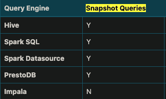
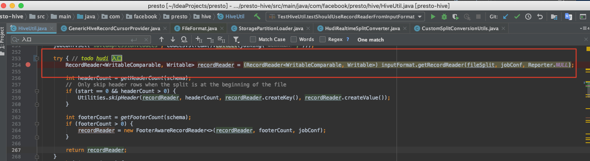
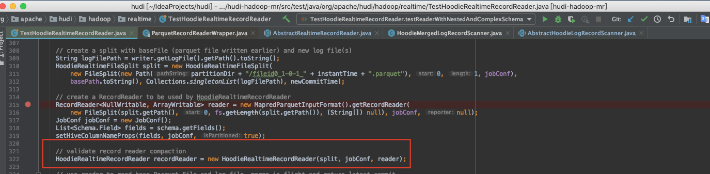
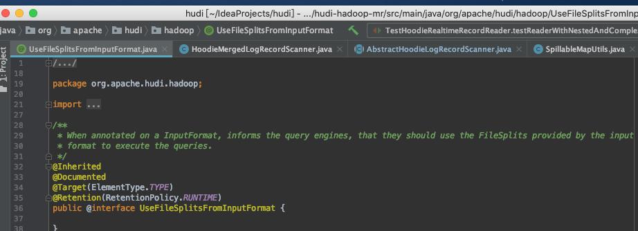

## Hudi

按照我的理解，我们所需要实现的 MOR 与 Hudi 中的 MOR 不同，我们强调的是 query，而 Hudi 中指的是 table type。Hudi 中真正对应的我们的是视图（query type） 中的近实时视图（Snapshot Queries）：

在此视图上的查询将查看某个增量提交操作中数据集的最新快照。该视图通过动态合并最新的基本文件(例如parquet)和增量文件(例如avro)来提供近实时数据集（几分钟的延迟）。

当前支持 Hudi 近实时视图的查询引擎如下图



#### Hudi 实时视图相关逻辑

实现类：HoodieRealtimeRecordReader -> RealtimeCompactedRecordReader


我们可以从 testReaderWithNestedAndComplexSchema() 这个测试方法中看到完整的 Snapshot Queries 的过程，

1. 构建 HoodieRealtimeFileSplit，其中包含了 baseFilePath 、logFilePath、 hadoop-conf
2. 构建 HoodieRealtimeRecordReader，参数是上一步初始化好的 split，初始化过程中 scan() 方法会将 split 中的 logFile 读取到 Map 中，key 为 _hoodie_record_key
3. 在 HoodieRealtimeRecordReader.RealtimeCompactedRecordReader 的 next 方法中会对 base 和 delta 进行 merge, 根据 _hoodie_record_key 使用 delta 数据替换 base 中的数据

```java
// next 方法本身遍历的是 parquet 文件，即每条 base 数据读出来后，都去 deltaRecordMap 中 contains 下，这里的 HOODIE_RECORD_KEY 就发挥重要作用了，看看有没有对应的 delta 数据
  @Override
  public boolean next(NullWritable aVoid, ArrayWritable arrayWritable) throws IOException {
    // Call the underlying parquetReader.next - which may replace the passed in ArrayWritable
    // with a new block of values 
    // 此处的 parquetReader，为之前构造 HoodieRealtimeRecordReader 中传入的 ParquetRecordReader
    boolean result = this.parquetReader.next(aVoid, arrayWritable);
    if (!result) {
      // if the result is false, then there are no more records
      return false;
    } 
    if (!deltaRecordMap.isEmpty()) {
      //  Right now, we assume all records in log, have a matching base record. (which
      // would be true until we have a way to index logs too)
      // return from delta records map if we have some match.
      String key = arrayWritable.get()[HoodieInputFormatUtils.HOODIE_RECORD_KEY_COL_POS].toString();
      if (deltaRecordMap.containsKey(key)) {
        // (NA): Invoke preCombine here by converting arrayWritable to Avro. This is required since the
        // deltaRecord may not be a full record and needs values of columns from the parquet
        Option<GenericRecord> rec;
        if (usesCustomPayload) {
          rec = deltaRecordMap.get(key).getData().getInsertValue(getWriterSchema());
        } else {
          rec = deltaRecordMap.get(key).getData().getInsertValue(getReaderSchema());
        }
        if (!rec.isPresent()) {
          // If the record is not present, this is a delete record using an empty payload so skip this base record
          // and move to the next record
          return next(aVoid, arrayWritable);
        }
        GenericRecord recordToReturn = rec.get();
        if (usesCustomPayload) {
          // If using a custom payload, return only the projection fields. The readerSchema is a schema derived from
          // the writerSchema with only the projection fields
          recordToReturn = HoodieAvroUtils.rewriteRecordWithOnlyNewSchemaFields(rec.get(), getReaderSchema());
        }
        // we assume, a later safe record in the log, is newer than what we have in the map &
        // replace it. Since we want to return an arrayWritable which is the same length as the elements in the latest
        // schema, we use writerSchema to create the arrayWritable from the latest generic record 
        // 这里的 aWritable 我个人理解为 avroWritable
        ArrayWritable aWritable = (ArrayWritable) HoodieRealtimeRecordReaderUtils.avroToArrayWritable(recordToReturn, getHiveSchema());
        // log 中的 delta 数据
        Writable[] replaceValue = aWritable.get(); 
        if (LOG.isDebugEnabled()) {
          LOG.debug(String.format("key %s, base values: %s, log values: %s", key, HoodieRealtimeRecordReaderUtils.arrayWritableToString(arrayWritable),
              HoodieRealtimeRecordReaderUtils.arrayWritableToString(aWritable)));
        }
        // parquet 中的 base 数据
        Writable[] originalValue = arrayWritable.get(); 
        try {
          // Sometime originalValue.length > replaceValue.length.
          // This can happen when hive query is looking for pseudo parquet columns like BLOCK_OFFSET_INSIDE_FILE
          // 复制并且覆盖 base 的 parquet 数据 
          System.arraycopy(replaceValue, 0, originalValue, 0,
              Math.min(originalValue.length, replaceValue.length));
          arrayWritable.set(originalValue); 
        } catch (RuntimeException re) {
          LOG.error("Got exception when doing array copy", re);
          LOG.error("Base record :" + HoodieRealtimeRecordReaderUtils.arrayWritableToString(arrayWritable));
          LOG.error("Log record :" + HoodieRealtimeRecordReaderUtils.arrayWritableToString(aWritable));
          String errMsg = "Base-record :" + HoodieRealtimeRecordReaderUtils.arrayWritableToString(arrayWritable)
              + " ,Log-record :" + HoodieRealtimeRecordReaderUtils.arrayWritableToString(aWritable) + " ,Error :" + re.getMessage();
          throw new RuntimeException(errMsg, re);
        }
      }
    }
    return true;
  }
```


#### 查询引擎重点介绍 Presto 

Presto 集成 Hudi 的逻辑可以用一句话来概括：

**使用 HoodieParquetRealtimeInputFormat 中的 HoodieRealtimeRecordReader 读取 HoodieRealtimeFileSplit**

引出两点：

1. 加载HoodieParquetRealtimeInputFormat。 因为Presto使用其原生的ParquetPageSource而不是InputFormat的记录读取器，Presto将只显示基本Parquet文件，而不显示来自Hudi日志文件的实时更新，后者是avro数据（本质上与普通的读优化Hudi查询相同）。所以需要在 Presto 中使用 Hudi 已经实现好的 HoodieParquetRealtimeInputFormat，当前是使用注解方式实现的，即在 HoodieParquetRealtimeInputFormat 类上添加注解 `@UseRecordReaderFromInputFormat`

2. 重建 Hudi FileSplit。从 HiveSplit 的额外元数据重新创建 Hudi 切片，实现类 HudiRealtimeSplitConverter

    下面两张图片分别是 presto 和 hudi 构造 HoodieRealtimeRecordReader 的方法，可以看出是基本相同的






下图是发挥通知引擎作用的 Hudi 枚举



综上，Hudi 对于 MOR表 所支持的视图-近实时查询做了基础的工作，以注解方式对外提供 HoodieParquetRealtimeInputFormat 供外部的查询引擎进行集成，Presto 也正是通过了 @UseFileSplitsFromInputFormat 注解来加载 Hudi 的 RecordReader，通过修改了 HiveUtil 相关的少部分逻辑做到了支持 Hudi MOR 表的近实时查询。

## Iceberg

经过测试，iceberg 写入的时候是没有所谓的 log(avro) 或者 名为 delta 的增量文件，Iceberg 对于每批数据都是直接写到 parquet 文件中去的，故现状是没有所谓的 MOR 需实现。

若考虑后期 Iceberg 支持 Row-Level 的 Upsert 和 Delete ，那么可能就有实现 MOR 的必要，这取决于 Iceberg 的 Row-Level Delete的 实现方式，目前社区这一工作尚未完成，[Iceberg Row-level Delete](https://github.com/apache/iceberg/milestone/4) 

> Row-level update和delete通常有Copy-on-Write和Merge-on-Read两种方案。其中Copy-on-Write把生成新数据文件的压力集中于写入的时候，适合对读有较高要求的场景；而Merge-on-Read把合并最终结果的压力放在读取的时候，适合于快速写入的场景。
>
> 我们在内部已经实现了基于Copy-on-Write的方式。同时也将Iceberg作为Spark 3.0的V2 Data Source和multi-catalog，和Spark进行了集成，用户可以方便的通过Spark SQL进行update、delete和merge into等DML操作，以及建表删表等DDL操作。


## Arctic

Arctic 的 MOR 实现在数据的 ingestion 层面本身就已经实现了，即 base 文件(pqrquet) + 增量日志(avro)的形式，故本次开发应主要是集中查询(Query Engine)层面。

**目标**是对当前 Compaction 进行升级，即每次 Compaction 的持续时间过长，导致用户对最新数据的可见时间 delay 较长，通过 MOR 的方式减少最新数据的可见时间，

也就是说哪怕因为数据量或未初始化等导致的 Compaction 不及时，也不过份影响用户查询最新的数据。

**实现方式**可以参考 Hudi，在 Arctic 项目中实现 base 和 delta 文件的合并，查询引擎通过注解的方式调用 Arctic 功能，以此构建查询引擎与 Arctic 的集成。