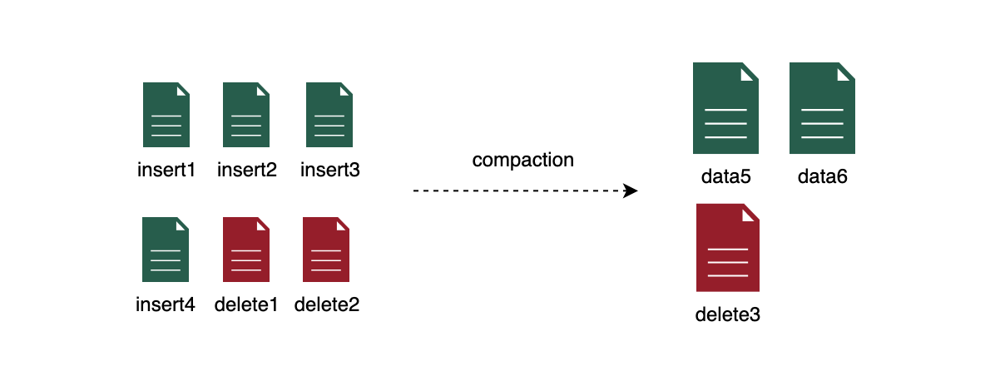
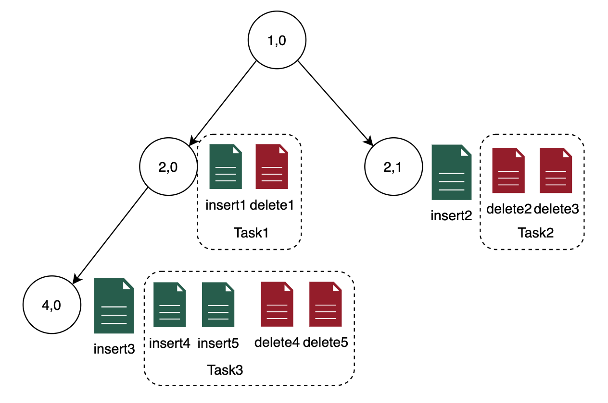

# [4-Minor-compaction详细设计](http://doc.hz.netease.com/pages/viewpage.action?pageId=278087125)

## [Minor-compaction详细设计](http://doc.hz.netease.com/pages/viewpage.action?pageId=278087125#minor-compaction详细设计)

minor-compaction需要实现的功能要求：

- 处理的文件范畴为delta files，不涉及base files的处理
- Delta files的小文件合并，降低文件碎片化程度
- 合并后的文件主键去重，非强制要求
- delete files与insert files的合并，减少insert files的大小
- 并发执行

设计方向问题：

| 功能点                                           | Minor  | Major | 收益                     |
| :----------------------------------------------- | :----- | :---- | :----------------------- |
| delete files的小文件合并                         | 支持   |       | 减少delete files的文件数 |
| delete files的小文件去重                         | 支持   |       | 减少delete files数据量   |
| insert files的小文件合并                         | 支持   |       | 减少insert files的文件数 |
| insert files的小文件去重                         | 支持   |       | 减少insert files数据量   |
| delete files小文件和insert files小文件的合并     | 支持   |       | 减少Insert files数据量   |
| delete files非小文件的主键去重                   | 不支持 |       | 减少delete files数据量   |
| insert files非小文件的主键去重                   | 不支持 |       | 减少Insert files数据量   |
| delete files非小文件和insert files非小文件的合并 | 不支持 |       | 减少delete files数据量   |
| 数据下推                                         | 不支持 |       | 提高并发度               |
| 数据上浮                                         | 不支持 |       |                          |

### [Minor-compaction调度执行单元（Task划分）](http://doc.hz.netease.com/pages/viewpage.action?pageId=278087125#minor-compaction调度执行单元task划分)

Task拆分有多个维度的考量

- 一个Task合并的文件类型（insert file，delete file，insert delete file混合）
- 一个Task写入的arctic-node（单个节点（local/root）、多个节点（leaves））

#### [1.文件类型层面划分Task](http://doc.hz.netease.com/pages/viewpage.action?pageId=278087125#1文件类型层面划分task)

**方案一：（推荐）**

Minor compaction Task-insert delete files混合

insert和delete的混合task可以解决所有场景的问题，但是也存在问题：

- insert和delete的配比不确定，合并输出两个文件，文件的大小不容易预估，合并之后可能仍然可能产生小文件，这个小文件后续还要参与compaction，甚至会参与多次，产生更高的资源消耗

#### [2.节点层面划分Task](http://doc.hz.netease.com/pages/viewpage.action?pageId=278087125#2节点层面划分task)

最简单直接的方式，每个task写入自己所在的node，每个node对应一个task，优点：最大程度保证执行并发度、多个task之间独立提交。

与其他可能的方式比较

|                                                | 并发执行 | task独立性 | 数据下推 | 数据上浮 |
| :--------------------------------------------- | :------- | :--------- | :------- | :------- |
| 每个task写入自己所在的node（本方案）           | 是       | 是         | 否       | 否       |
| 每个task写入多个叶子节点                       | 差       | 是         | 是       | 否       |
| 每个task写入一个叶子节点（类major compaction） | 是       | 否         | 是       | 否       |
| 每个task写入最高的父节点                       | 是       | 是         | 否       | 是       |

说明，每个task写入多个叶子节点，意味着要写多个文件，一个task需要写的数据量就会增大（否则不能解决小文件的问题），从而降低并发度。

### [Minor compaction的触发](http://doc.hz.netease.com/pages/viewpage.action?pageId=278087125#minor-compaction的触发)

由arctic-server调度，基本的方式是根据当前delta files（最新的snapshot）的指标确认是否需要进行minor-compaction，然后将拆分成多个相互独立的minor-compaction-task，所谓的相互独立指的是任何一个或若干个minor-compaction-task都可以进行单独commit或一起commit，不影响数据一致性。

上述触发过程拆分为几个环节描述：

- 判断是否可以进行minor-compaction的delta files的指标
- delta files的文件信息的获取方式
- minor-compaction-task的拆分方式（Plan过程）

#### [1.指标定义](http://doc.hz.netease.com/pages/viewpage.action?pageId=278087125#1指标定义)

先要明确的一点是指标的统计范畴，比如表级别、partition级别、tree-node级别，由于预期划分的task是属于node内的，因此这里选择的是node级别

指标描述的是文件的碎片化程度，即当碎片化程度比较高时，触发minor-compaction，有如下几个参数：

- 小文件大小：小于这个值的文件判定为小文件，超过这个值的文件不在minor-compaction的考虑范围内，不应该超过目标文件大小的1/2
- 小文件总大小：node内小文件大小总计超过这个值，触发minor-compaction
- 小文件个数：node内小文件个数超过这个值，触发minor-compaction，用来处理大量小文件的场景（碎片化）
- 最小间隔：两次plan的最小间隔

具体来说，获取node内的小文件，分为delete files和insert files两个集合，每个集合内部单独进行判断：

1.最小间隔判断：先判断是否小于最小间隔，如果低于最小间隔，则推迟检查（延迟任务还是等待下次检查？等待下次检查）

2.划分小文件：根据文件大小划分出小文件，不属于小文件的不在处理范围内

3.delete files或insert files集合中任何一个满足小文件总大小超过阈值或者小文件个数超过阈值，触发node内的小文件合并

#### [2.delta files的文件信息的获取方式：](http://doc.hz.netease.com/pages/viewpage.action?pageId=278087125#2delta-files的文件信息的获取方式)

最简单可靠的方式是arctic-server周期性获取最新的delta snapshot中的所有文件信息，除此之外也应当开放接口，支持delta files增量获取，加速compaction的触发。

减少周期性获取的代价，优化点：

- 记录上次检查的snapshot id，两次之间检查之间delta snapshot版本没有增长，跳过
- arctic-server执行minor-compaction commit之后，更新记录的snapshot id到较大值

每次周期性检查后，将小文件信息缓存、落入系统库，作为元数据的base

delta files增量获取，开放接口，允许上报delta commit信息

- 如果收到的snapshot id不超过上次检查的snapshot，忽略
- 否则，记录其中的小文件信息，缓存并入库，累加到元数据base中，并更新元数据base的snapshot id
- 如果小文件达到了上述指标，则主动触发一次delta files检查（当前不考虑正确性保证，省略这一步），进入后续触发流程（和一次周期性检查一致）

#### [3.minor-compaction-task的拆分方式（Plan过程）](http://doc.hz.netease.com/pages/viewpage.action?pageId=278087125#3minor-compaction-task的拆分方式plan过程)

在一个node内，如果满足了上述指标，则将node的所有小文件（包含insert files delete files）组合成一个task。

### [Minor-compaction执行](http://doc.hz.netease.com/pages/viewpage.action?pageId=278087125#minor-compaction执行)

#### [insert files + delete files合并](http://doc.hz.netease.com/pages/viewpage.action?pageId=278087125#insert-files--delete-files合并)

- delete files的主键和lsn读入delete map（主键->最大lsn），这里有两种方式，根据delete files预估的解压后占用内存总大小，如果超过了
- delete files的个数>1，则将delete files的所有值读入，按照delete map去重：判断delete map中 lsn> delete files 一行记录的lsn，则忽略这行delete记录，否则输出到文件
- 读入所有insert files，按照delete map去重：方法同上

这里存在一个优化，在delete files比较小的时候，可以避免重复读取delete files两次

- 获取delete files的预估总大小（解压后占用内存大小），如果不超过超过允许内存的80%，则直接将delete files的所有值一次性全部读入到delete map（LinkedHashMap），再写到合并后的delete files，不需要重新读一遍delete files

delete join insert的方案

### [Minor-compaction提交](http://doc.hz.netease.com/pages/viewpage.action?pageId=278087125#minor-compaction提交)

有专门负责commit的线程池，对每张表周期性执行提交（允许每张表配置自己的提交周期，默认5分钟），每次提交时，将所有prepared状态的task提交，提交的内容：

- 需要覆盖的文件列表
- 覆盖之后的文件列表

## [补充：sink做小文件合并的兼容（待完善](http://doc.hz.netease.com/pages/viewpage.action?pageId=278087125#补充sink做小文件合并的兼容待完善)

明确问题：

**1.sink当前是否专门指flink-arctic-table-sink**

**2.当前flink-arctic-table-sink的实现逻辑**

多个writer（DeltaRecordWriter）并发写入不同的文件，在触发snapshot时执行commit（将write写入的多个文件提交）

writer的划分依据

**3.上述方式出现小文件的原因**

a.每次commit时，需要将当时所有文件关闭并提交

b.writer会同时写多个文件（不同partition不同node对应不同的文件），所有文件大小总和超过内存限制后将最大的文件关闭并提交

文件个数计算：

每个DeltaRecordWriter（一个Task）同时写入多个文件（多个partition的多个node）

文件个数（上限） = commit次数 x writer并发度 x partition个数 x node个数

**4.上述写入过程中不能打破的原则**

写入的文件应在规定时间内尽快提交（不能等待累计到一定大小再commit）

已经写入并关闭的文件不可追加写

**5.sink做小文件合并的方式**

方式1：writer写入时内存做buffer，达到一定大小才写入文件？

不可行，导致数据无法commit

方式2：将之前的小文件读入并合并为大文件并输出？

多一次读，多一次写

不如后面的方案

方式3：commit后，生成小文件，但是将小文件buffer在内存中，和后续的写入合并到一个文件中？

多一次写

重启后内存buffer的小文件是否要恢复：不考虑恢复，由major-compaction兜底

buffer在内存中数据，写入到parquet文件需要消耗一定时间，由writer算子一次性触发写入会导致

1.writer处理消息的性能不平稳

2.checkpiont生成时间长

创建另外的compact算子处理compact文件的写入：

1.compact算子写入是周期性的

2.checkpoint生成时间可以得到控制（生成checkpoint之后再触发写入，下次checkpoint时再将之前写入的结果发送给committer提交），方案比较复杂

方式4（推荐）：写文件时，同时写两个文件，一个小文件随时可以提交，一个大文件，累计到一定文件大小后提交并覆盖之前的小文件

多一次写

parquet文件提交之前仍然是buffer在内存中的，因此这个方案不会带来减少内存消耗的收益

问题：

在文件写入阶段（提交之前）是不清楚文件是否是小文件的，因此可能将不需要合并的大文件进行了不必要的合并

如果写入的小文件个数累加起来超过了128M，会拆分为两个文件，也就是合并后的文件也可能是多个文件（并且也可能再次产生小文件）

场景讨论：

上述问题的存在，如果上述方案不做优化，这样的方式不适合这样的场景

- 正常写入会频繁产生一些大文件
- 要求合并后的文件大小接近128M

非常适合这样的场景：

- 增量写入比较少，产生文件很小，合并后的文件远小于128M（甚至增量写入在一个major-compaction周期内都不超过128M）

优化方向：

- 允许文件大小超过128M，比如将100M 15M 15M三个文件合并成130M的文件，而不是128M + 2M的文件
- compaction到达拆分域值，进行128M拆分的同时，将原文件也做拆分

**6.sink端做小文件合并的优势和劣势有什么**

优势：

减少一次读

合并的实时性高

劣势：

Ingestion写放大问题

sink内存占用增大，写入多个partition的情况下，sink内存可能不够用来做compaction

**7.sink端做小文件的合并的已有案例**

音乐？

**8.arctic-server需要提供的功能**

**必须有：**

文件管理（根据周期性查询和每次commit时上报的信息维护）：查看（前端需求）、

minor-compaction历史记录

**应该有：**

兜底：sink-compaction后仍然存在的小文件（major-compaction完全可以做到）

可能的原因：

1.没有采用上述方式导入的文件

1. 

**最好有：**

有利于sink端做minor-compaction的场景：

每个task写入一个文件：增量数据只写入一个partition，并发度和node个数相同，每个task写入一个node的一个文件

不利于sink端做minor-compaction的场景：

每个task写入的文件非常多：同时写入的partition多

内存缓存做小文件合并效果比较差（内存缓存做小文件合并，合并后的文件大小受内存大小/文件个数的限制）

这种情况通过server端做小文件合并，

小文件合并的效果评估方法：

效果评估本质上是一个node内，用户需要读取的增量文件个数n，n越小则效果越好

场景一：node内增量文件的大小不超过一个block的大小，这是最常见的场景；合并不进行主键去重

一个node内合并后的文件大小：不应该成为评估标准，因为合并后的文件大小取决于写入流量

一个node内合并后的文件个数：应当尽可能接近1

一个node内小文件生成并最终合并成大文件之间的时间差：时间差越短则合并效果越好

合并方案：

合并到一个文件的方案：一定是每次commit都生成一个大文件的效果是最好的

积攒多个文件合并成一个文件的方案：

n：用户平均读取到的文件个数

cf：commit频率

m：合并后的文件个数

n=

sink端做minor-compaction的几个不同点

评估标准：问题：这两个如何整合到一个优化目标函数里（应该和文件大小存在相关性，文件越大，收益相比代价越小）

1.代价：写放大

2.收益：减少merge on read读文件的个数

文件超过内存的问题：