### 背景

当前组内已实现 Arctic 这种表格式，实现原理是 WAL，也就是新的数据会先写到 delta（avro format） 日志文件中，然后定时合并到 base（parquetformat）文件中。

由于使用 hive 引擎查询的时候只能查询到 base 文件的数据，只有等 Compaction 作业合并 delta 文件后才能查询到表最新数据，时间上会有分钟级别以上的延迟。

所以我们打算实现基于 Arctic 的 Merge On Read（MOR），能够直接读取还未完成 Compaction 的 delta 日志数据，进而降低 Compaction 作业频率和性能要求。

本次适配的查询引擎是 Presto。下面我分成三部分进行介绍，分别是

1. Presto 整体简介：基本架构、数据模型、执行流程
2. Presto Connector 简介：自定义 Connector 的步骤
3. Arctic 与 Presto 的集成：Presto-Connector-Arctic 的具体实现

说明：**Presto 提供的是数据的计算能力**，不负责数据管理，数据管理和存储交给 Arctic！具体可以看后面的软件架构图。

### Presto 整体简介

作为一个开源的分布式SQL查询引擎，它被设计为专门用来进行快速、实时的数据分析，是 OLAP 产品谱中的佼佼者。 个人认为对比其他 OLAP 产品如 Impala，Presto 最大的优势

在于其优雅的设计不仅可以友好的对接各种数据源，更能使用标准的SQL对多种数据源进行级联查询，查询性能和其他 MMP 架构的 OLAP 引擎差不多。

```
级联查询什么意思？有人称为联邦查询，就是可以在 Presto Join 多种数据源的数据，比如 Mysql、Oracle、Kafka、Redis、Hbase、Hive 等。
举个例子，Flink 实时计算出来的实时指标大多会写到 Redis 或者 Hbase，然后离线同学每天会做 T+1 的离线指标结果会写到 Hive，如果想要对实时数据进行检验的，
我们就可以在 Presto 上使用一条 Sql 直接查询 Redis 或 Hbase，然后直接 Join 和 Hive 表数据进行对比，如果没有 Presto ，我们就做不到使用一份 Sql 一口气查询多个数据源。
```

#### 基本架构

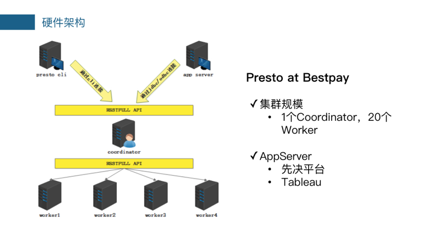

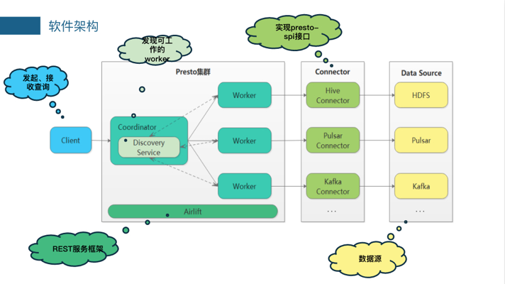

软件架构除了 client 主要分为：

- Coordinator （Master）

​      一般Coordinator部署在集群中一个单独节点，是整个Presto集群的管理节点。它主要用户接受客户端提交的查询，解析查询并生成查询计划，对任务进行调度，对worker管理。

- Worker （Slave）

​     工作节点，一般多个，主要进行数据的处理和Task的执行，它会周期性的向Coordinator进行Restful “沟通”，即心跳。


#### 数据模型


##### 表模型

Connector：一种数据源的驱动程序。比如说 Hive

Catalog：一个数据源实例。比如sloth hive 、 bdms hive 分别是两个 Hive Catalog

Schema：数据库=DB

Table：数据表


表数据模型

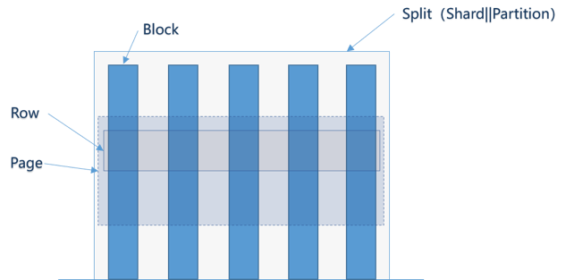

Split：分布式处理的一个数据分区，如文件64M一个分片；HBase一个region 一个分片

Page：一个Split中一次返回的多行数据的集合，包含多个列的数据。内部仅提供逻辑行（Row），实际以列式存储。

Block：一列数据


#### 查询过程

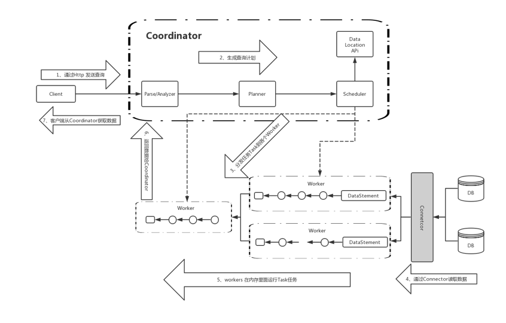

```
Presto SQL执行步骤
1.客户端通过 HTTP 发送一个查询语句给Presto集群的Coordinator；
2.Coordinator 接收到客户端传来的查询语句，对该语句进行解析、生成查询执行计划，并根据查询执行计划依次生成 SqlQueryExecution -> SqlStageExecution -> HttpRemoteTask；
3.Coordinator 将每个Task分发到所需要处理的数据所在的Worker上进行分析；
4.执行Source Stage 的 Task，这些Task通过Connector从数据源中读取所需要的数据；
5.处于下游的Stage中用的Task会读取上游的Stage产生的输出结果，并在该Stage的每个Task所在的Worker内存中进行后续的计算和处理；
6.Coordinator 从分发的Task之后，一直持续不断的从Single Stage 中的Task获得计算结果，并将结果写入到缓存中，直到所所有的计算结束；
7.Client 从提交查询后，就一直监听 Coordinator 中的本次查询结果集，立即输出。直到轮训到所有的结果都返回，本次查询结束；
```


下面介绍如何自定义 Presto 的 Connector！


### Presto Connector 简介

通过软件架构图上可以明显看到，Connector 在 Presto 中的位置和作用。

在整个 Presto 工程中所有的功能都是以插件（SPI）的形式实现，而 Connector 则是一种负责 Presto 与数据源进行交互的插件，不同的数据库对应于不同的 Connector。

#### SPI 

```
Presto 没有采用复杂的模块化技术，利用了 JDK 中内置的 ServiceLoader 实现简单的 SPI。ServiceLoader 规范Service Provider Interfaces ，
简单来讲就是在src/main/resources/META-INF/services/ 中添加一个名为.Plugin 的文件, 相当于整个 Connector 的入口。
```

实现一个自定义的 Connector ，咱们一般只需要实现这几个接口就行：

- Plugin ：实现代表 catalog 的 ConnectorFactory，及Function，类似 Hive UDF ；
- ConnectorFactory：connector 连接器，里面有metadata、splitManager、recordSetProvider等实例
- ConnectorMetadata ：支撑 show databases、show tables、desc table; 返回 Connector 的 DB、Table、Column
- ConnectorSplitManager：将计算任务切分成若干 split 由 coordinator 进行并发调度
- ConnectorRecordSetProvider : 获得数据，接收 split，发送给处理器 RecordCursor
- RecordCursor : 数据迭代处理，定义应该如何根据拿到的一个 split 到库中查询数据


Connector 可通过两个实现：**ConnectorPageSourceProvider** 和 **ConnectorRecordSetProvider** 获得数据， 可选择实现任意一个。ConnectorPageSourceProvider 主要创建 ConnectorPageSource 采用 Page 的方式**获得数据集**。 ConnectorRecordSetProvider 主要适合数据量不大的查询，返回的 RecordSet 类似List。RecordSet 有个 InMemoryRecordSet 默认的实现，用于把返回的数据集直接放到内存List中。如果需要采用游标的方式获得数据需要自行实现 RecordSet 按照 batch 遍历数据。 实际上，Presto Core 也是通过 RecordPageSource 代理 RecordSet 的方式，把 ResourceSet数据集转为 Page的。本次 Demo，我们使用 ConnectorRecordSetProvider。


各个类之间的调用关系如下：

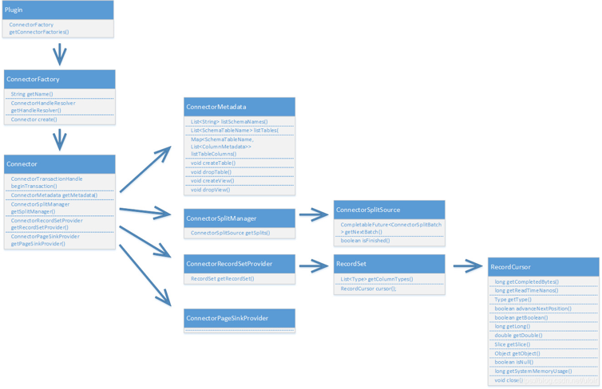

### Arctic 与 Presto 的集成

下面进入正题，如何实现 Arctic Connector ！！

代码地址： https://g.hz.netease.com/arctic/arctic-core/-/tree/develop-presto-mor

根据自定义 Connector 需要实现类的关系，我们来展开具体的实现。

!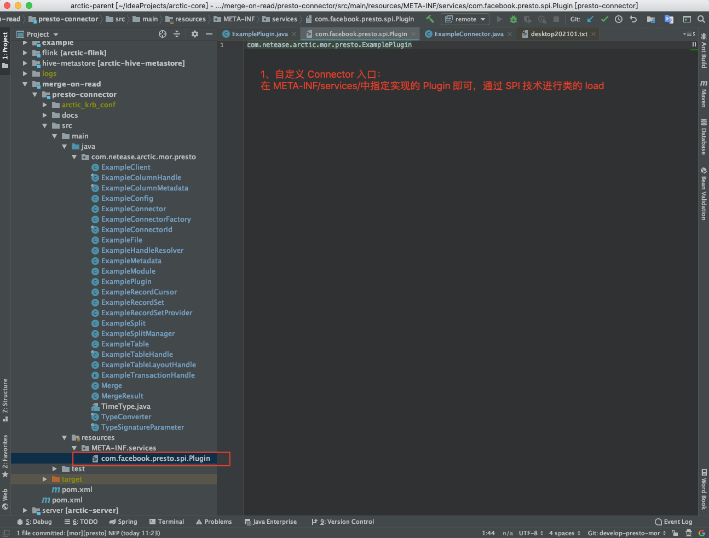

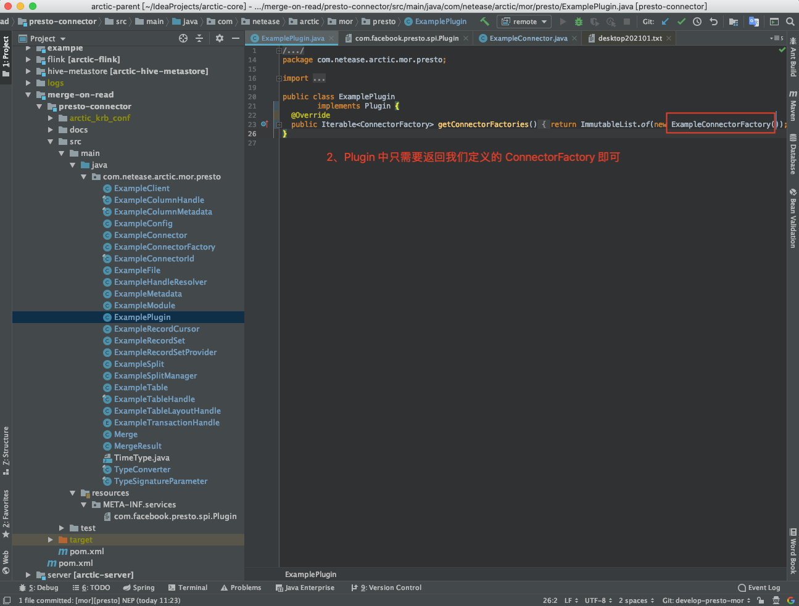

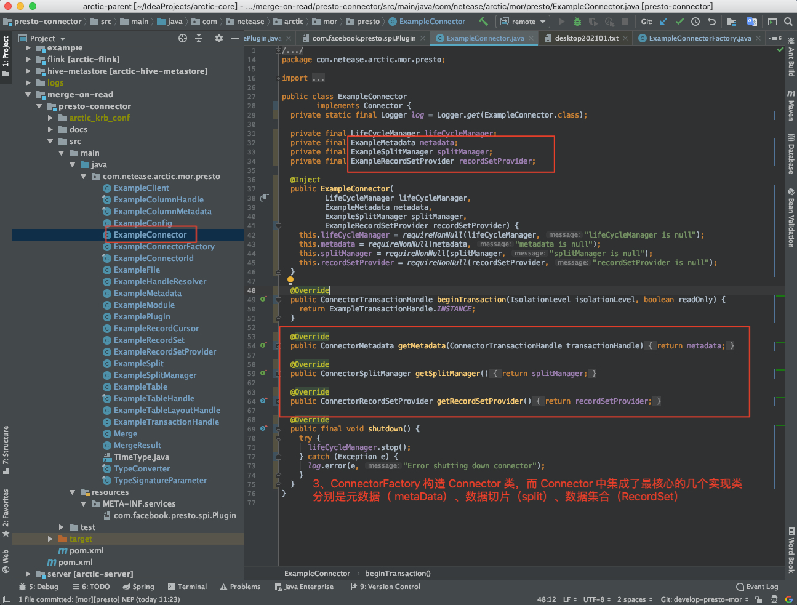

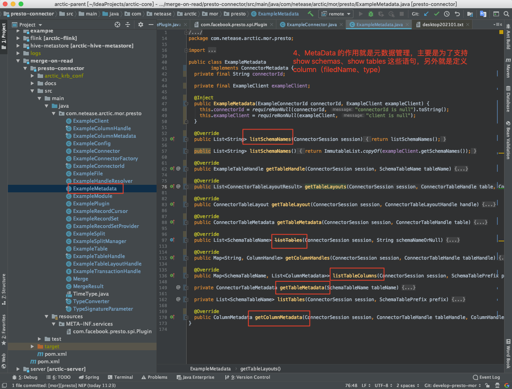

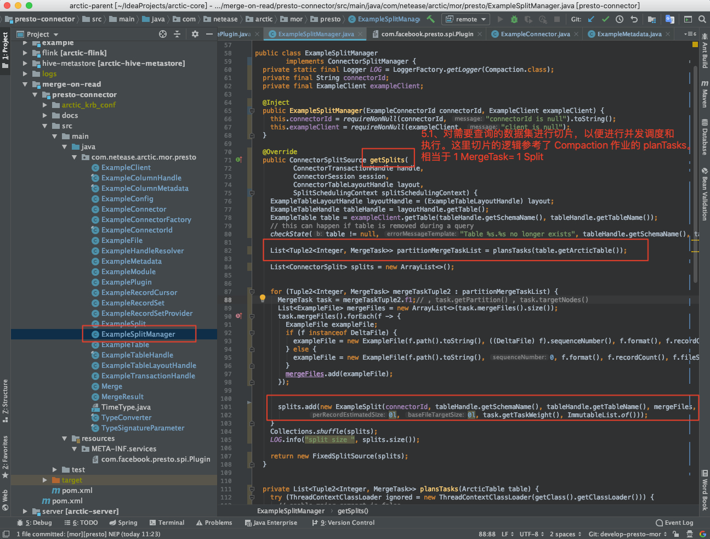

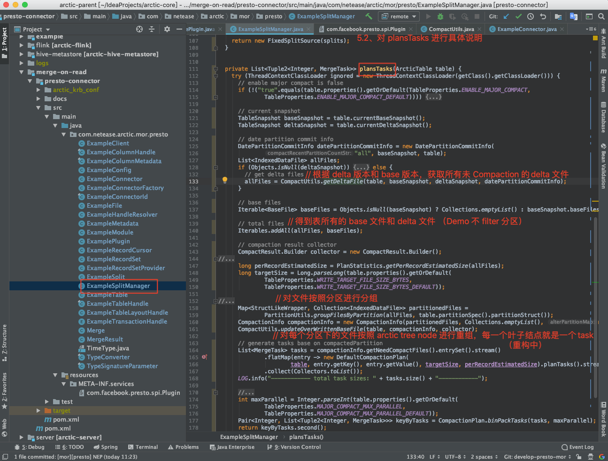

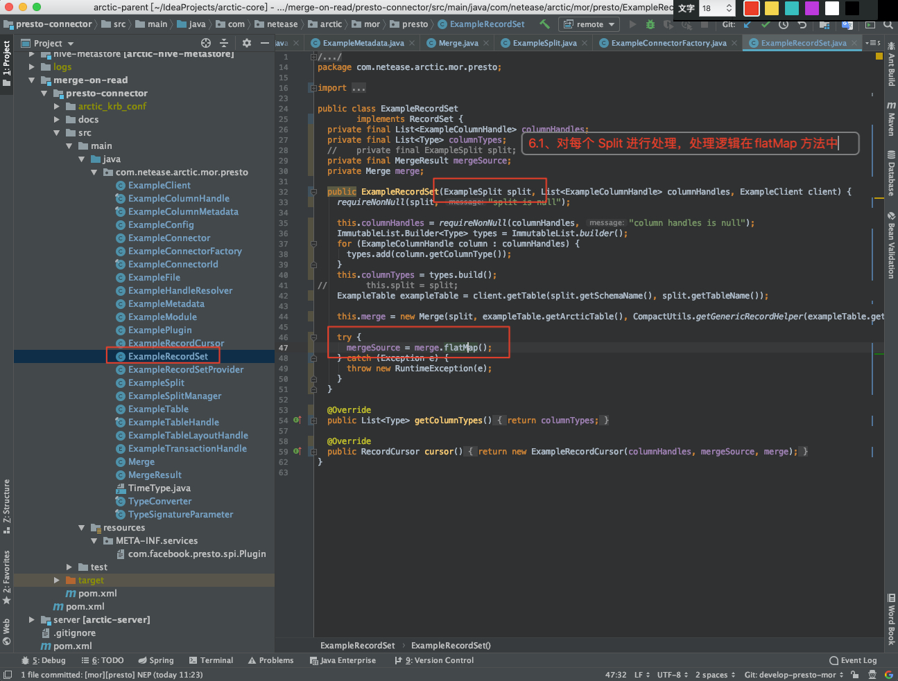

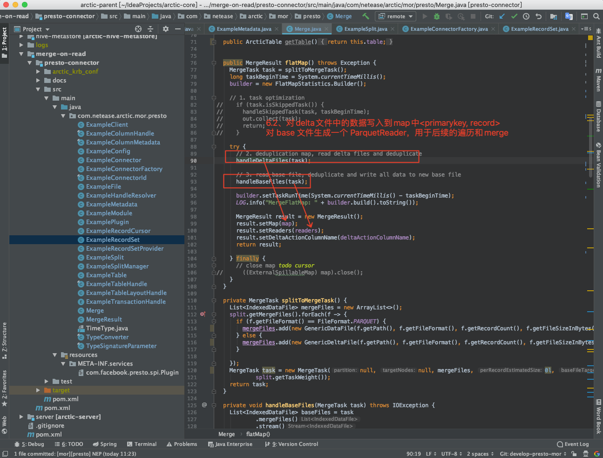

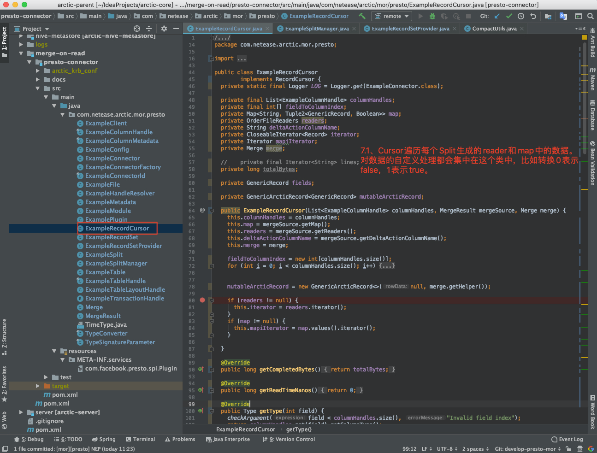

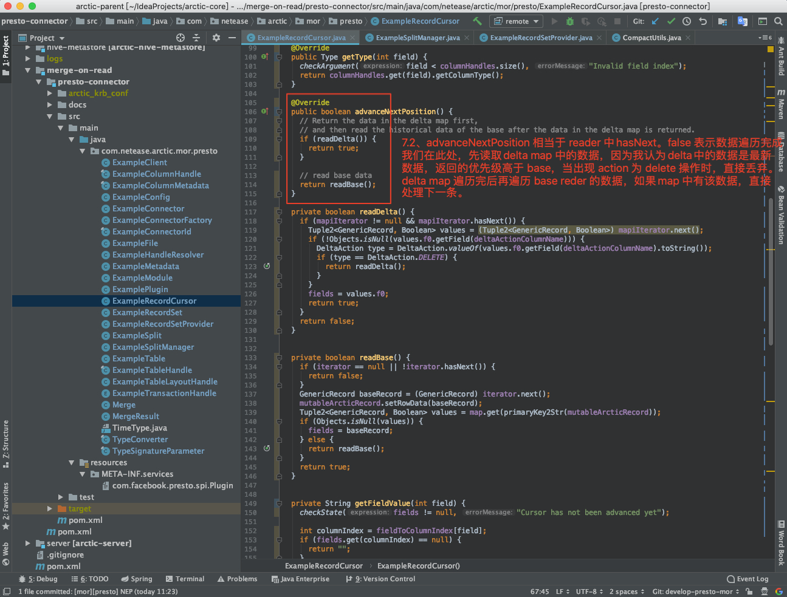


因为只是 Demo，该方案存在的优化点：

- 根据分区过滤所需读取的文件，从存储层减少返回的数据量
- 根据limit 和 filter进一步过滤所需读取的文件，从存储层减少返回的数据量
- RecordSet 改为 RecordPageSource，以支持数据量较大的查询
- plansTask 优化，当前基本拷贝了 Compaction 的plans，需要改造为 MOR 的方式，否则可能会出现返回重复数据的问题（暂不展开）


杂想：

- Presto 给我的感受是代码设计优雅，对接成本很低，自定义个 Connector 照着 example 写就能完成

- Presto 类似于 Flink、Spark 的 Standalone 模式，不需要使用 Yarn 去分配 Container 拉起新的进程(秒级)，这是它查询快的一个体现

- Presto 的 Client 会不断监听 Coodinator，一旦有数据就返回，而不是等所有数据再一起返回，在用户视角看起来也是快的一个体现

  

#### 本地测试

测试环境：slothtest1 服务器上部署有集成 Arcitc 的 Presto 服务，可以进行 MOR 的测试。 可以直接结合代码进行远程 debug 。 

相关命令：

// 启动客户端 app目录下

```
./presto-cli --server localhost:8001 --catalog arctic
```

// schema = ndc_test_db，table = test_wl

```
select * from ndc_test_db.test_wl;
```

// 可以在mysql 中操作数据，会通过NDC服务同步到同名的 arctic 表中

具体操作和数据库信息私聊。


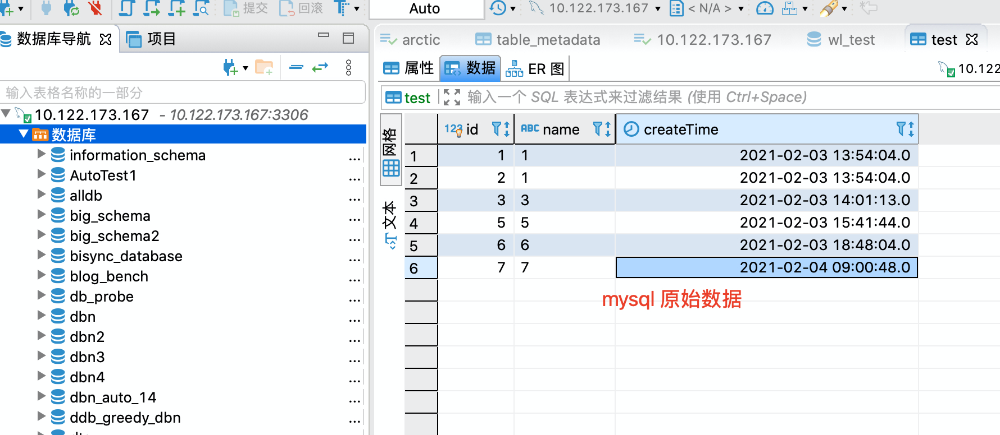

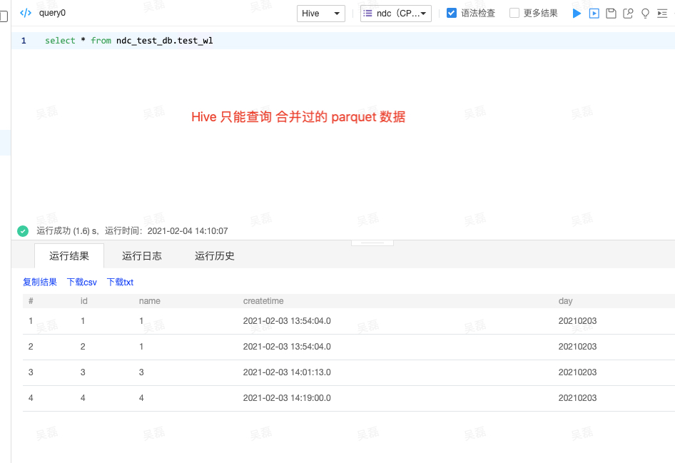

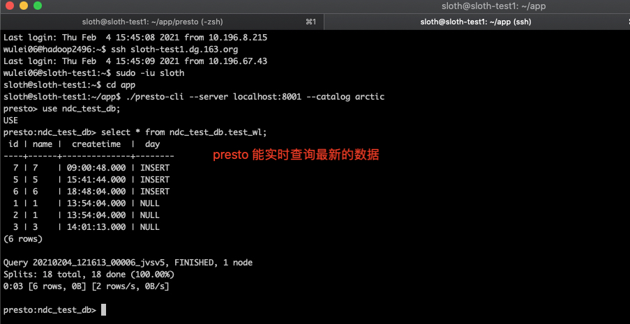


分享的PPT附件   [presto-connector.pptx](http://doc.hz.netease.com/download/attachments/277408421/presto-connector.pptx?version=1&modificationDate=1612428619000&api=v2)