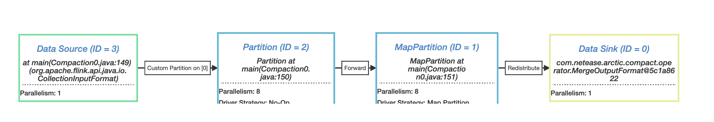
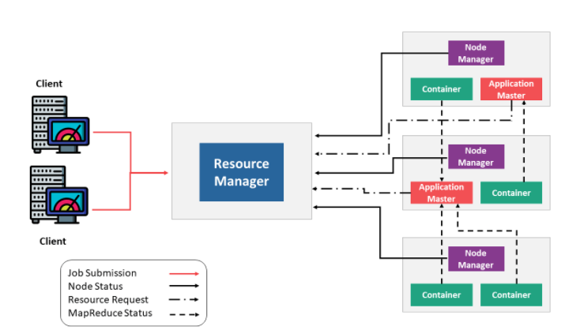
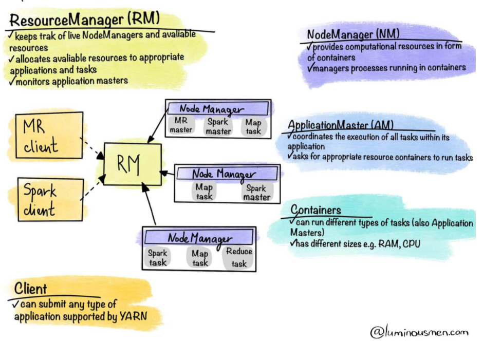
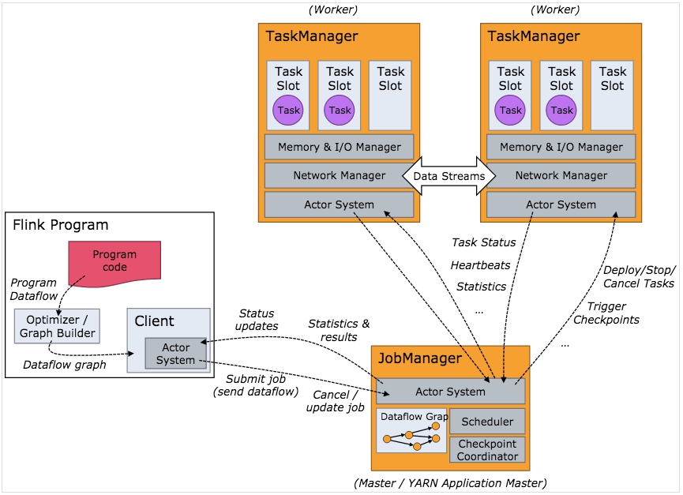
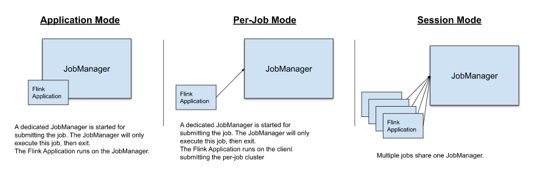
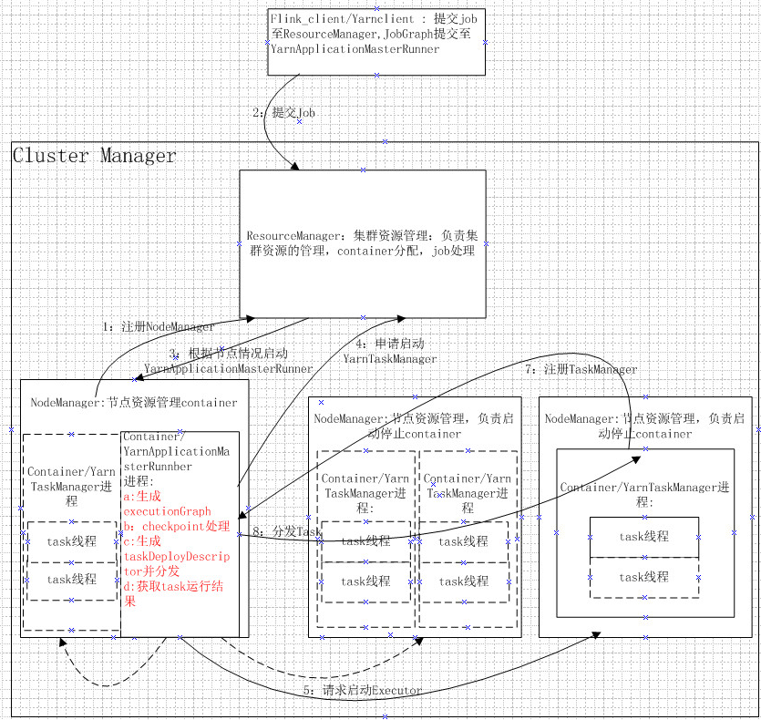
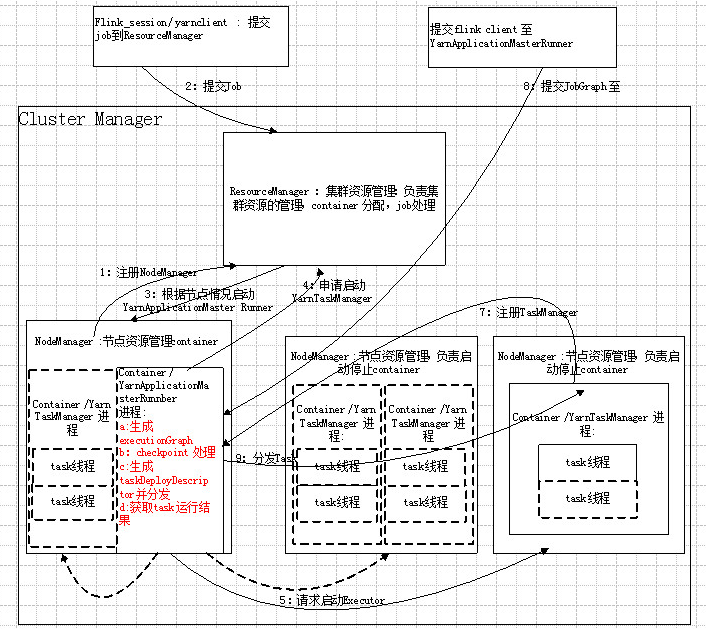

## [需求调研](http://doc.hz.netease.com/pages/viewpage.action?pageId=276001163#需求调研)

### [1.arctic-server的功能点概括](http://doc.hz.netease.com/pages/viewpage.action?pageId=276001163#1arctic-server的功能点概括)

- 核心功能-compaction的周期性调度：v1版本-原生iceberg表；v2版本-支持copy-on-write的arctic表
- 补充功能：arctic表全量数据的初始化导入（init），ndc初始化的除外
- compaction的历史结果的持久化和展示：job file
- *未来还需要引入哪些功能？*

### [2.当前实现方案](http://doc.hz.netease.com/pages/viewpage.action?pageId=276001163#2当前实现方案)

#### [2.1 compaction的特点](http://doc.hz.netease.com/pages/viewpage.action?pageId=276001163#21-compaction的特点)

- 分类：major-compaction（base-file和delt-file的合并）/minor-compaction（delt-file的小文件合并，还未实现）；*问题：minor-compaction是否是arctic-server后续需要调度的任务类型？*
- 操作对象：每次compaction的操作对象是一张（arctic）表
- 表类型：原生iceberg表的compaction（音乐），arctic表的COW-compaction（德邦）
- 调度周期：分钟级别到小时级别不等，周期性调度（固定间隔的调度策略）
- 执行耗时：秒级到分钟级别
- 具体实现：flink的批任务（DataSet API实现），jar包的形式，目前有SlothIcebergSinkCompaction和COW-Compaction两种
- compaction的client端初始化：有部分耗时的初始化操作（main方法）：读取文件，生成plan等，*具体耗时的量级？*
- compaction的并发度：是根据本次执行时生成的compaction-plan决定的，受文件状态等影响
- compaction partition逻辑：*待确认（目前理解是多个互不相交的文件组分别交给不同的线程执行，超过了表的最大并发如何处理？）*
- COW-compaction执行流程：https://flink.apache.org/visualizer/

#### [2.2 compaction执行方式以及存在的问题](http://doc.hz.netease.com/pages/viewpage.action?pageId=276001163#22-compaction执行方式以及存在的问题)

已经实现的有两种方案：

- Session-Mode：先启动JobManager，然后调用JobManager提供的REST接口执行多个Compaction-Job
- Application-Mode：每个Compaction-Job独占一个JobManager，且main方法在JobManager中执行

Session-Mode存在的问题：https://doc.hz.netease.com/pages/viewpage.action?pageId=255801079

- Client/JobManager易成为瓶颈（*是否和main中的init过程有关？*）
- TaskManager下不同任务互相影响的问题（*配置互串？具体是什么，是否有解决的方案*）

Application-Mode存在的问题：https://doc.hz.netease.com/pages/viewpage.action?pageId=275243997

- 调度时TaskManager需要较长时间（几十秒）>任务本身执行时间（*待确认，主要耗时在哪里，是否还有优化的可能，比如使用本地jar包*）

## [架构调研](http://doc.hz.netease.com/pages/viewpage.action?pageId=276001163#架构调研)

### [1.yarn架构](http://doc.hz.netease.com/pages/viewpage.action?pageId=276001163#1yarn架构)

https://luminousmen.com/post/hadoop-yarn-spark

https://www.edureka.co/blog/hadoop-yarn-tutorial/

核心概念：

RM NM

Container：ApplicationMaster Task

### [2.flink架构](http://doc.hz.netease.com/pages/viewpage.action?pageId=276001163#2flink架构)

官网https://ci.apache.org/projects/flink/flink-docs-release-1.12/concepts/flink-architecture.html

http://wuchong.me/blog/2016/05/03/flink-internals-overview/

http://wuchong.me/blog/2016/05/09/flink-internals-understanding-execution-resources/

关键点：

JobManager：管控节点，一个JVM进程，可以管理多个Job的运行

TaskManager：执行节点，一个JVM进程

Slot：TaskManager的资源，彼此之间有内存隔离的不同线程（普通线程之间是没有内存隔离的语义的），slot平均分配TaskManager的内存资源，共享CPU资源。

slot不能在不同Job之间共享，slot可以在同一个Job的不同task的subTasks之间共享（默认情况下，Job占用的slot数量等于Job的最高并行度，非默认配置下，slot数>=最高并行度）。

task：抽象概念，执行逻辑上可以chain在一起的多个operator（source sink）

subTask：实际存在的最小的执行单元，是task的具体实例

### [3.部署方式](http://doc.hz.netease.com/pages/viewpage.action?pageId=276001163#3部署方式)

https://ci.apache.org/projects/flink/flink-docs-release-1.12/deployment/

https://blog.csdn.net/xianpanjia4616/article/details/109140570

https://stackoverflow.com/questions/52316067/flink-on-yarn-use-yarn-session-or-not

Application Mode和Per-Job Mode是比较类似的，差别在于main()函数的执行位置，从避免client成为瓶颈，节省client机器带宽资源的角度，选择Application Mode。

Session-Mode和Application-Mode的选型依据（待补充）

|                   | Session-Mode | Application-Mode |
| :---------------- | :----------- | :--------------- |
| Job之间的资源隔离 | 否           | 是               |
| Job生命周期短     | 是           | 否               |
| Job启动延迟       | 低           | 高               |
|                   |              |                  |

### [4.Flink-on-yarn](http://doc.hz.netease.com/pages/viewpage.action?pageId=276001163#4flink-on-yarn)

https://ci.apache.org/projects/flink/flink-docs-release-1.12/deployment/resource-providers/yarn.html

https://www.jianshu.com/p/0f4725f1b7d8

#### [4.1 yarn-cluster（Application Mode）方式](http://doc.hz.netease.com/pages/viewpage.action?pageId=276001163#41-yarn-clusterapplication-mode方式)

#### [4.2 yarn-session（Session Mode）方式](http://doc.hz.netease.com/pages/viewpage.action?pageId=276001163#42-yarn-sessionsession-mode方式)

## [设计思路](http://doc.hz.netease.com/pages/viewpage.action?pageId=276001163#设计思路)

### [第一个层面：compaction任务的调度层面](http://doc.hz.netease.com/pages/viewpage.action?pageId=276001163#第一个层面compaction任务的调度层面)

要解决的问题：调度频繁、短生命周期的compaction任务的执行架构

- 优先级最高、最直接的方案：on flink yarn-cluster/yarn-session，上述面临的问题可否解决？
- 次优先级方案：spark on yarn，相比flink on yarn的优势在哪里？
- 不建议考虑的方案：on yarn，解决了flink on yarn/spart on yarn的什么问题？
- 不推荐的方案：完全定制化的执行集群（类似NDC，高开发量，独立部署运维），存在什么问题上述几个方案一定无法解决？

### [第二个层面：compaction任务的层面](http://doc.hz.netease.com/pages/viewpage.action?pageId=276001163#第二个层面compaction任务的层面)

问题：调度compaction的粒度是否可以调整，将compaction任务的调度向降低调度频率、延长生命周期的角度调整

### [第三个层面：不同场景多种调度方式的结合](http://doc.hz.netease.com/pages/viewpage.action?pageId=276001163#第三个层面不同场景多种调度方式的结合)

区分高资源消耗和低资源消耗的任务，高执行频率低执行频率的任务，高优先级和低优先级的任务，高资源隔离需求和低资源隔离需求的任务，用不同的方式调度