## 一、大数据处理流程

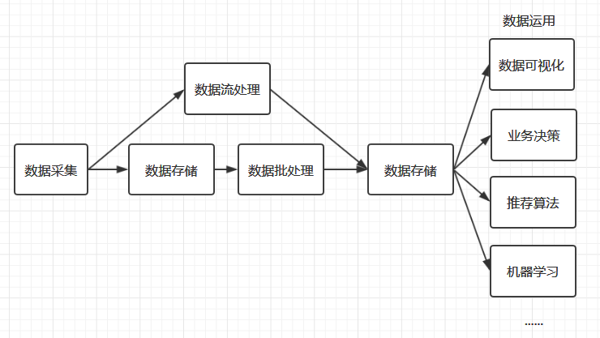

### 上图是一个简化的大数据处理流程图，大数据处理的主要流程包括数据收集、数据存储、数据处理、数据应用等主要环节。

###  数据收集

大数据处理的第一步是数据的收集。现在的中大型项目通常采用微服务架构进行分布式部署，所以数据的采集需要在多台服务器上进行，且采集过程不能影响正常业务的开展。基于这种需求，就衍生了多种日志收集工具，如 Flume 、Logstash、Kibana 等，它们都能通过简单的配置完成复杂的数据收集和数据聚合。

### 数据存储

收集到数据后，下一个问题就是：数据该如何进行存储？通常大家最为熟知是 MySQL、Oracle 等传统的关系型数据库，它们的优点是能够快速存储结构化的数据，并支持随机访问。但大数据的数据结构通常是半结构化（如日志数据）、甚至是非结构化的（如视频、音频数据），为了解决海量半结构化和非结构化数据的存储，衍生了 Hadoop HDFS 、KFS、GFS 等分布式文件系统，它们都能够支持结构化、半结构和非结构化数据的存储，并可以通过增加机器进行横向扩展。

分布式文件系统完美地解决了海量数据存储的问题，但是一个优秀的数据存储系统需要同时考虑数据存储和访问两方面的问题，比如你希望能够对数据进行随机访问，这是传统的关系型数据库所擅长的，但却不是分布式文件系统所擅长的，那么有没有一种存储方案能够同时兼具分布式文件系统和关系型数据库的优点，基于这种需求，就产生了 HBase、MongoDB。

### 数据分析

大数据处理最重要的环节就是数据分析，数据分析通常分为两种：批处理和流处理。

l 批处理：对一段时间内海量的离线数据进行统一的处理，对应的处理框架有 Hadoop MapReduce、Spark、Flink 等；

l 流处理：对运动中的数据进行处理，即在接收数据的同时就对其进行处理，对应的处理框架有 Storm、Spark Streaming、Flink Streaming 等。

批处理和流处理各有其适用的场景，时间不敏感或者硬件资源有限，可以采用批处理；时间敏感和及时性要求高就可以采用流处理。随着服务器硬件的价格越来越低和大家对及时性的要求越来越高，流处理越来越普遍，如股票价格预测和电商运营数据分析等。

上面的框架都是需要通过编程来进行数据分析，那么如果你不是一个后台工程师，是不是就不能进行数据的分析了？当然不是，大数据是一个非常完善的生态圈，有需求就有解决方案。为了能够让熟悉 SQL 的人员也能够进行数据的分析，查询分析框架应运而生，常用的有 Hive 、Spark SQL 、Flink SQL、 Pig、Phoenix 等。这些框架都能够使用标准的 SQL 或者 类 SQL 语法灵活地进行数据的查询分析。这些 SQL 经过解析优化后转换为对应的作业程序来运行，如 Hive 本质上就是将 SQL 转换为 MapReduce 作业，Spark SQL 将 SQL 转换为一系列的 RDDs 和转换关系（transformations），Phoenix 将 SQL 查询转换为一个或多个 HBase Scan。

###  数据应用

数据分析完成后，接下来就是数据应用的范畴，这取决于你实际的业务需求。比如你可以将数据进行可视化展现，或者将数据用于优化你的推荐算法，这种运用现在很普遍，比如短视频个性化推荐、电商商品推荐、头条新闻推荐等。当然你也可以将数据用于训练你的机器学习模型，这些都属于其他领域的范畴，都有着对应的框架和技术栈进行处理，这里就不一一赘述。

###  其他框架

上面是一个标准的大数据处理流程所用到的技术框架。但是实际的大数据处理流程比上面复杂很多，针对大数据处理中的各种复杂问题分别衍生了各类框架：

l 单机的处理能力都是存在瓶颈的，所以大数据框架都是采用集群模式进行部署，为了更方便的进行集群的部署、监控和管理，衍生了 Ambari、Cloudera Manager 等集群管理工具；

l 想要保证集群高可用，需要用到 ZooKeeper ，ZooKeeper 是最常用的分布式协调服务，它能够解决大多数集群问题，包括首领选举、失败恢复、元数据存储及其一致性保证。同时针对集群资源管理的需求，又衍生了 Hadoop YARN ;

l 复杂大数据处理的另外一个显著的问题是，如何调度多个复杂的并且彼此之间存在依赖关系的作业？基于这种需求，产生了 Azkaban 和 Oozie 等工作流调度框架；

l 大数据流处理中使用的比较多的另外一个框架是 Kafka，它可以用于消峰，避免在秒杀等场景下并发数据对流处理程序造成冲击；

l 另一个常用的框架是 Sqoop ，主要是解决了数据迁移的问题，它能够通过简单的命令将关系型数据库中的数据导入到 HDFS 、Hive 或 HBase 中，或者从 HDFS 、Hive 导出到关系型数据库上。

### 整体架构图

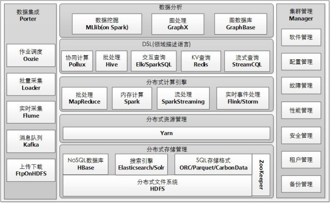

## 二、Hadoop（HDFS）

### HDFS 组成架构

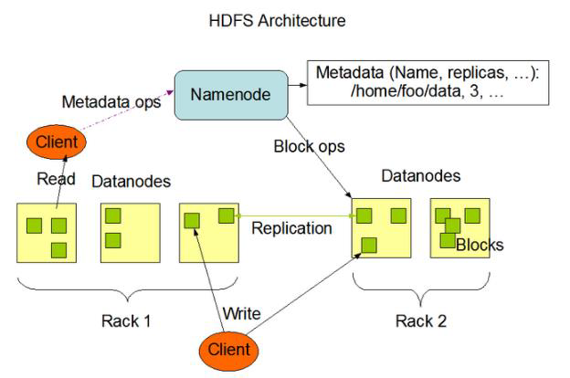

1）NameNode（nn）：就是Master，它是一个主管、管理者。

（1）管理HDFS的名称空间；

（2）配置副本策略；

（3）管理数据块（Block）映射信息；

（4）处理客户端读写请求。

2）DataNode：就是Slave。NameNode下达命令，DataNode执行实际的操作。

（1）存储实际的数据块；

（2）执行数据块的读/写操作。

3）Client：就是客户端。

（1）文件切分。文件上传HDFS的时候，Client将文件切分成一个一个的Block，然后进行上传；

（2）与NameNode交互，获取文件的位置信息；

（3）与DataNode交互，读取或者写入数据；

（4）Client提供一些命令来管理HDFS，比如NameNode格式化；

（5）Client可以通过一些命令来访问HDFS，比如对HDFS增删查改操作；

4）Secondary NameNode：并非NameNode的热备。当NameNode挂掉的时候，它并不

能马上替换NameNode并提供服务。

（1）辅助NameNode，分担其工作量，比如定期合并Fsimage和Edits，并推送给NameNode；

（2）在紧急情况下，可辅助恢复NameNode。

### HDFS 的Shell 操作

\1. 显示当前目录结构

\# 显示当前目录结构 hadoop fs -ls <path># 递归显示当前目录结构 hadoop fs -ls -R <path># 显示根目录下内容 hadoop fs -ls /

\2. 创建目录

\# 创建目录 hadoop fs -mkdir <path> # 递归创建目录 hadoop fs -mkdir -p <path> 

\3. 删除操作

\# 删除文件 hadoop fs -rm <path># 递归删除目录和文件 hadoop fs -rm -R <path> 

\4. 从本地加载文件到 HDFS

\# 二选一执行即可 hadoop fs -put [localsrc] [dst] hadoop fs - copyFromLocal [localsrc] [dst] 

\5. 从 HDFS 导出文件到本地

\# 二选一执行即可 hadoop fs -get [dst] [localsrc] hadoop fs -copyToLocal [dst] [localsrc] 

\6. 查看文件内容

\# 二选一执行即可 hadoop fs -text <path> hadoop fs -cat <path> 

\7. 显示文件的最后一千字节

hadoop fs -tail <path> # 和Linux下一样，会持续监听文件内容变化 并显示文件的最后一千字节 hadoop fs -tail -f <path> 

\8. 拷贝文件

hadoop fs -cp [src] [dst]

\9. 移动文件

hadoop fs -mv [src] [dst] 

\10. 统计当前目录下各文件大小

l 默认单位字节

l -s : 显示所有文件大小总和，

l -h : 将以更友好的方式显示文件大小（例如 64.0m 而不是 67108864）

hadoop fs -du <path> 

\11. 合并下载多个文件

l -nl 在每个文件的末尾添加换行符（LF）

l -skip-empty-file 跳过空文件

hadoop fs -getmerge # 示例 将HDFS上的hbase-policy.xml和hbase-site.xml文件合并后下载到本地的/usr/test.xml hadoop fs -getmerge -nl /test/hbase-policy.xml /test/hbase-site.xml /usr/test.xml

\12. 统计文件系统的可用空间信息

hadoop fs -df -h /

\13. 更改文件复制因子

hadoop fs -setrep [-R] [-w] <numReplicas> <path>

l 更改文件的复制因子。如果 path 是目录，则更改其下所有文件的复制因子

l -w : 请求命令是否等待复制完成

\# 示例 hadoop fs -setrep -w 3 /user/hadoop/dir1

\14. 权限控制

\# 权限控制和Linux上使用方式一致# 变更文件或目录的所属群组。 用户必须是文件的所有者或超级用户。 hadoop fs -chgrp [-R] GROUP URI [URI ...] # 修改文件或目录的访问权限 用户必须是文件的所有者或超级用户。 hadoop fs -chmod [-R] <MODE[,MODE]... | OCTALMODE> URI [URI ...] # 修改文件的拥有者 用户必须是超级用户。 hadoop fs -chown [-R] [OWNER][:[GROUP]] URI [URI ]

\15. 文件检测

hadoop fs -test - [defsz] URI

可选选项：

l -d：如果路径是目录，返回 0。

l -e：如果路径存在，则返回 0。

l -f：如果路径是文件，则返回 0。

l -s：如果路径不为空，则返回 0。

l -r：如果路径存在且授予读权限，则返回 0。

l -w：如果路径存在且授予写入权限，则返回 0。

l -z：如果文件长度为零，则返回 0。

\# 示例 hadoop fs -test -e filename

### HDFS 的读写流程

 

#### HDFS 写数据流程

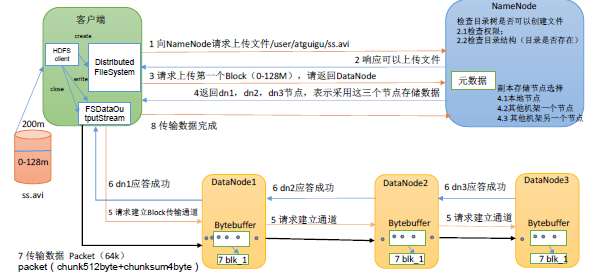

（1）客户端通过Distributed FileSystem 模块向NameNode 请求上传文件，NameNode 检查目标文件是否已存在，父目录是否存在。

（2）NameNode 返回是否可以上传。

（3）客户端请求第一个 Block 上传到哪几个DataNode 服务器上。

（4）NameNode 返回3 个DataNode 节点，分别为dn1、dn2、dn3。

（5）客户端通过FSDataOutputStream 模块请求dn1 上传数据，dn1 收到请求会继续调用

dn2，然后dn2 调用dn3，将这个通信管道建立完成。

（6）dn1、dn2、dn3 逐级应答客户端。

（7）客户端开始往dn1 上传第一个Block（先从磁盘读取数据放到一个本地内存缓存），

以Packet 为单位，dn1 收到一个Packet 就会传给dn2，dn2 传给dn3；dn1 每传一个packet

会放入一个应答队列等待应答。

（8）当一个Block 传输完成之后，客户端再次请求NameNode 上传第二个Block 的服务

器。（重复执行3-7 步）。

#### HDFS 读数据流程

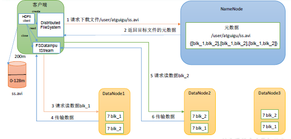

（1）客户端通过DistributedFileSystem 向NameNode 请求下载文件，NameNode 通过查

询元数据，找到文件块所在的DataNode 地址。

（2）挑选一台DataNode（就近原则，然后随机）服务器，请求读取数据。

（3）DataNode 开始传输数据给客户端（从磁盘里面读取数据输入流，以Packet 为单位

来做校验）。

（4）客户端以Packet 为单位接收，先在本地缓存，然后写入目标文件。

### 我的理解

HDFS是一种具有高度容错性，旨在部署在低成本硬件上的分布式文件系统，存储的文件被划分为block块存储在DataNode上的，并通过NameNode管理存储在DataNode中的block。因为资源的耗费问题导致存储的文件不允许修改只能追加，所以在HDFS上建立的数仓被应用于复杂的分析操作（OLAP），这是和日常的事务处理（OLTP）的关系型数据库的主要不同点

## 三、Hadoop （MapReduce）

### MapReduce编程模型简述

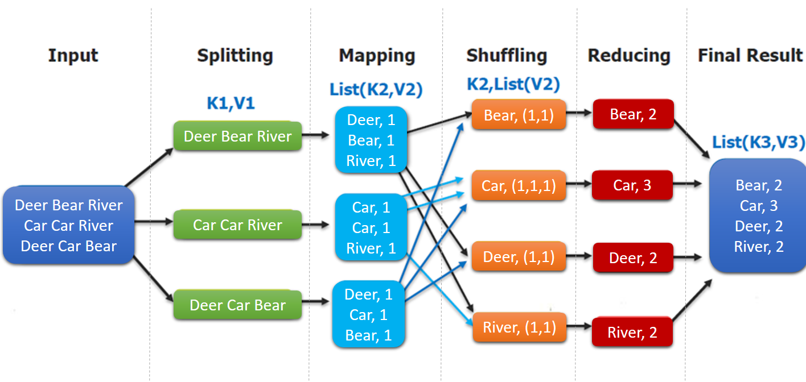

（1）分布式的运算程序往往需要分成至少2 个阶段。

（2）第一个阶段的MapTask 并发实例，完全并行运行，互不相干。

（3）第二个阶段的ReduceTask 并发实例互不相干，但是他们的数据依赖于上一个阶段

的所有MapTask 并发实例的输出。

（4）MapReduce 编程模型只能包含一个Map 阶段和一个Reduce 阶段，如果用户的业

务逻辑非常复杂，那就只能多个MapReduce 程序，串行运行。

### MapReduce 编程规范

1．Mapper阶段

（1）用户自定义的Mapper要继承自己的父类

（2）Mapper的输入数据是KV对的形式（KV的类型可自定义）

（3）Mapper中的业务逻辑写在map()方法中

（4）Mapper的输出数据是KV对的形式（KV的类型可自定义）

（5）map()方法（MapTask进程）对每一个<K,V>调用一次

2．Reducer阶段

（2）Reducer的输入数据类型对应Mapper的输出数据类型，也是KV

（3）Reducer的业务逻辑写在reduce()方法中

（4）ReduceTask进程对每一组相同k的<k,v>组调用一次reduce()方法

3．Driver阶段

相当于YARN集群的客户端，用于提交我们整个程序到YARN集群，提交的是

封装了MapReduce程序相关运行参数的job对象

 

### MapReduce 工作流程

#### MapTask 工作机制

 

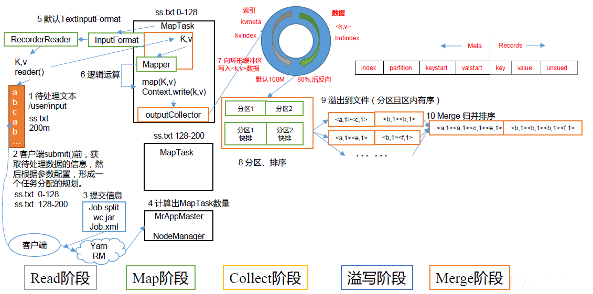

（1）Read 阶段：MapTask 通过InputFormat 获得的RecordReader，从输入InputSplit 中

解析出一个个key/value。

（2）Map 阶段：该节点主要是将解析出的key/value 交给用户编写map()函数处理，并

产生一系列新的key/value。

（3）Collect 收集阶段：在用户编写map()函数中，当数据处理完成后，一般会调用

OutputCollector.collect()输出结果。在该函数内部，它会将生成的key/value 分区（调用

Partitioner），并写入一个环形内存缓冲区中。

（4）Spill 阶段：即“溢写”，当环形缓冲区满后，MapReduce 会将数据写到本地磁盘上，

生成一个临时文件。需要注意的是，将数据写入本地磁盘之前，先要对数据进行一次本地排

序，并在必要时对数据进行合并 、 压缩等操作 。

溢写阶段详情：

步骤 1 利用快速排序算法对缓存区内的数据进行排序，排序方式是，先按照分区编号

Partition进行排序，然后 按照 key进行排序。这样 经过排序后，数据以分区为单位聚集在

一起，且同一分区内所有数据按照 key有序。

步骤 2 按照分区编号由小到大依次将每个分区中的数据写入任务工作目录下的临时文

件 output/spillN.out N表示当前溢写次数 ）中 。如果 用户 设置了 Combiner，则写入文件之

前，对每个分区中 的 数据进行一次聚集操作。

步骤 3 将分区数据的元 信息 写到内存索引数据结构 SpillRecord中 ，其中每个分区的元

信息包括在临时文件中的偏移量、压缩前数据大小和压缩后数据大小。如果 当前 内存索引大

小超过 1MB，则将内存索引写到文件 output/spillN.out.index中 。

5 Merge阶段 ：当所有数据处理完成后 MapTask对 所有临时文件进行一次合并，

以确保最终只会生成一个数据文件。

当 所有数据处理完后， MapTask会 将所有临时文件合并成一个大文件 并 保存 到文件

output/file.out中 ，同时生成相应的索引文件 output/file.out.index。

在 进行文件合并过程中， MapTask以 分区为单位进行合并。对于 某个 分区， 它 将采用多

轮递归合并的方式 。 每轮 合并 mapreduce.task.io.sort.factor（默认 10 个 文件，并将产生的文

件重新加入待合并 列表 中，对文件排序后，重复以上过程，直到最终得到一个大文件。

让 每个 MapTask最终只生成一个数据文件，可避免同时打开大量文件和同时读取大量

小文件产生的随机读取带来的开销。

#### Shuffle 过程详解

（1）MapTask 收集我们的map()方法输出的kv 对，放到内存缓冲区中

（2）从内存缓冲区不断溢出本地磁盘文件，可能会溢出多个文件

（3）多个溢出文件会被合并成大的溢出文件

（4）在溢出过程及合并的过程中，都要调用Partitioner 进行分区和针对key 进行排序

（5）ReduceTask 根据自己的分区号，去各个MapTask 机器上取相应的结果分区数据

（6）ReduceTask 会抓取到同一个分区的来自不同MapTask 的结果文件，ReduceTask 会

将这些文件再进行合并（归并排序）

（7）合并成大文件后，Shuffle 的过程也就结束了，后面进入ReduceTask 的逻辑运算过

程（从文件中取出一个一个的键值对Group，调用用户自定义的reduce()方法）

注意：

（1）Shuffle 中的缓冲区大小会影响到MapReduce 程序的执行效率，原则上说，缓冲区

越大，磁盘io 的次数越少，执行速度就越快。

（2）缓冲区的大小可以通过参数调整，参数：mapreduce.task.io.sort.mb 默认100M。

#### ReduceTask 工作机制

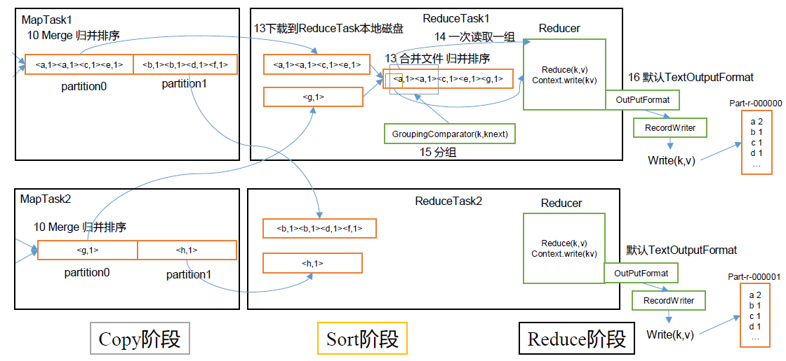

（1）Copy 阶段：ReduceTask 从各个MapTask 上远程拷贝一片数据，并针对某一片数

据，如果其大小超过一定阈值，则写到磁盘上，否则直接放到内存中。

（2）Sort 阶段：在远程拷贝数据的同时，ReduceTask 启动了两个后台线程对内存和磁

盘上的文件进行合并，以防止内存使用过多或磁盘上文件过多。按照MapReduce 语义，用

户编写reduce()函数输入数据是按key 进行聚集的一组数据。为了将key 相同的数据聚在一

起，Hadoop 采用了基于排序的策略。由于各个MapTask 已经实现对自己的处理结果进行了

局部排序，因此，ReduceTask 只需对所有数据进行一次归并排序即可。

（3）Reduce 阶段：reduce()函数将计算结果写到HDFS 上。

### 我的理解

MapReduce属于分布式计算引擎的一种，实现了对存储于HDFS上数据进行ETL的操作，其本身也是实现Hive类SQL查询的计算引擎之一。由于每次MapReduce操作都需要落盘，所以存在性能上的问题。

## 四、Hadoop Yarn

### Yarn基础架构

YARN主要由 ResourceManager、 NodeManager、 ApplicationMaster和 Container等组件

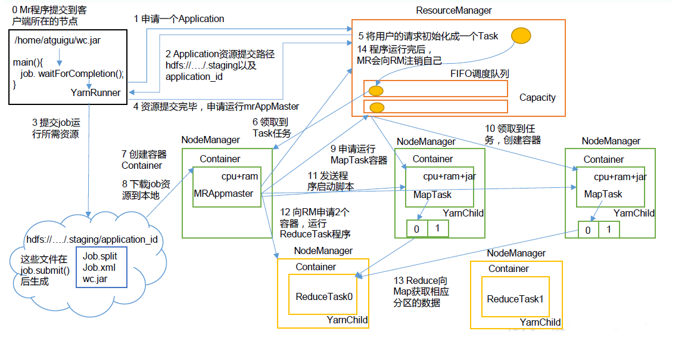

（1）MR 程序提交到客户端所在的节点。

（2）YarnRunner 向ResourceManager 申请一个Application。

（3）RM 将该应用程序的资源路径返回给YarnRunner。

（4）该程序将运行所需资源提交到HDFS 上。

（5）程序资源提交完毕后，申请运行mrAppMaster。

（6）RM 将用户的请求初始化成一个Task。

（7）其中一个NodeManager 领取到Task 任务。

（8）该NodeManager 创建容器Container，并产生MRAppmaster。

（9）Container 从HDFS 上拷贝资源到本地。

（10）MRAppmaster 向RM 申请运行MapTask 资源。

（11）RM 将运行MapTask 任务分配给另外两个NodeManager，另两个NodeManager 分

别领取任务并创建容器。

（12）MR 向两个接收到任务的NodeManager 发送程序启动脚本，这两个NodeManager

分别启动MapTask，MapTask 对数据分区排序。

（13）MrAppMaster 等待所有MapTask 运行完毕后，向RM 申请容器，运行ReduceTask。

（14）ReduceTask 向MapTask 获取相应分区的数据。

（15）程序运行完毕后，MR 会向RM 申请注销自己。

### 作业提交全过程

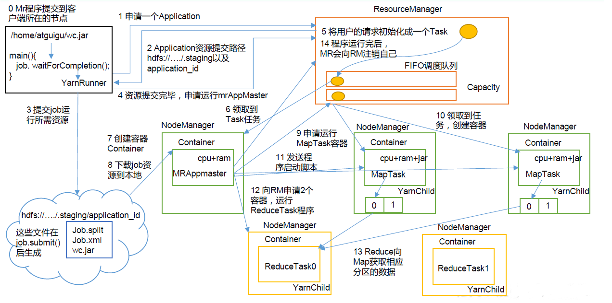

（1）作业提交

第1 步：Client 调用job.waitForCompletion 方法，向整个集群提交MapReduce 作业。

第2 步：Client 向RM 申请一个作业id。

第3 步：RM 给Client 返回该job 资源的提交路径和作业id。

第4 步：Client 提交jar 包、切片信息和配置文件到指定的资源提交路径。

第5 步：Client 提交完资源后，向RM 申请运行MrAppMaster。

（2）作业初始化

第6 步：当RM 收到Client 的请求后，将该job 添加到容量调度器中。

第 7步 某 一个空闲的 NM领取到该 Job。

第 8步： 该 NM创建 Container 并产生 MRAppmaster。

第 9步 ：下载 Client提交的资源到本地。

3 任务分配

第 10步 MrAppMaster向 RM申请运行 多个 MapTask任务资源。

第 11步 RM将 运行 MapTask任务 分配给另外两个 NodeManager 另两个 NodeManager分别领取任务 并 创建容器。

4 任务运行

第 12步 MR向两个接收到任务的 NodeManager发送 程序启动脚本 这两个

NodeManager分别 启动 MapTask MapTask对 数据分区排序。

第 13步 MrAppMaster等待 所有 MapTask运行完毕后，向 RM申请 容器， 运行 ReduceTask。

第 14步 ReduceTask向 MapTask获取 相应分区的数据。

第 15步 程序 运行完毕后， MR会向 RM申请注销 自己。

5 进度和状态更新

YARN中的任务将其进度和状态 (包括 counter)返回给应用管理器 , 客户端每秒 (通过

mapreduce.client.progressmonitor.pollinterval设置 )向应用管理器请求进度更新 , 展示给用户。

6 作业完成

除了向应用管理器请求作业进度外 , 客户端每 5秒 都会通过调用 waitForCompletion()来

检查作业是否完成 。 时间间隔可以通过 mapreduce.client.completion.pollinterval来设置 。 作业

完成之后 , 应用管理器和 Container会清理工作状态 。 作业的信息会被作业历史服务器存储

以备之后用户核查 。

### Yarn调度器和调度算法

Hadoop作业调度器主要有三种： FIFO、 容量（ Capacity Scheduler 和 公平（ Fair Scheduler

### 我的理解

Yarn利用ResourceManager来管理全局的cpu、内存、网络等资源，每个Job通过ApplicationMaster来管理。ApplicationMaster根据自己所需的资源向ResourceManager进行申请。Yarn根据调度算法管理各个正在运行的应用程序，他不仅限于HDFS中，后面Flink和spark的中也有涉及。

## 五、Spark Core

### 集群架构

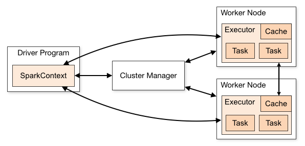

| Term（术语）    | Meaning（含义）                                              |
| --------------- | ------------------------------------------------------------ |
| Application     | Spark 应用程序，由集群上的一个 Driver 节点和多个 Executor 节点组成。 |
| Driver program  | 主运用程序，该进程运行应用的 main() 方法并且创建 SparkContext |
| Cluster manager | 集群资源管理器（例如，Standlone Manager，Mesos，YARN）       |
| Worker node     | 执行计算任务的工作节点                                       |
| Executor        | 位于工作节点上的应用进程，负责执行计算任务并且将输出数据保存到内存或者磁盘中 |
| Task            | 被发送到 Executor 中的工作单元                               |

执行过程：

1. 用户程序创建 SparkContext 后，它会连接到集群资源管理器，集群资源管理器会为用户程序分配计算资源，并启动 Executor；

2. Driver 将计算程序划分为不同的执行阶段和多个 Task，之后将 Task 发送给 Executor；

3. Executor 负责执行 Task，并将执行状态汇报给 Driver，同时也会将当前节点资源的使用情况汇报给集群资源管理器。

### Spark部署模式与作业提交

Spark 所有模式均使用 

spark-submit

命令提交作业，其格式如下：

./bin/spark-submit \

  --class <main-class> \    # 应用程序主入口类

  --master <master-url> \    # 集群的 Master Url

  --deploy-mode <deploy-mode> \ # 部署模式

  --conf <key>=<value> \    # 可选配置     

... # other options    

<application-jar> \      # Jar 包路径  

[application-arguments]    #传递给主入口类的参数 

 

需要注意的是：在集群环境下，application-jar 必须能被集群中所有节点都能访问，可以是 HDFS 上的路径；也可以是本地文件系统路径，如果是本地文件系统路径，则要求集群中每一个机器节点上的相同路 径都存在该 Jar 包。

#### Local模式

Local 模式，就是不需要其他任何节点资源就可以在本地执行 Spark 代码的环境，一般用于教学，调试，演示等

#### Standalone模式

#### Standalone 是 Spark 提供的一种内置的集群模式，采用内置的资源管理器进行管理。Spark on Yarn模式

Spark 支持将作业提交到 Yarn 上运行，此时不需要启动 Master 节点，也不需要启动 Worker 节点。

### rdd算子

RDD全称为 Resilient Distributed Datasets，是 Spark 最基本的数据抽象，它是只读的、分区记录的集合，支持并行操作，可以由外部数据集或其他 RDD 转换而来，它具有以下特性：

l 一个 RDD 由一个或者多个分区（Partitions）组成。对于 RDD 来说，每个分区会被一个计算任务所处理，用户可以在创建 RDD 时指定其分区个数，如果没有指定，则默认采用程序所分配到的 CPU 的核心数；

l RDD 拥有一个用于计算分区的函数 compute；

l RDD 会保存彼此间的依赖关系，RDD 的每次转换都会生成一个新的依赖关系，这种 RDD 之间的依赖关系就像流水线一样。在部分分区数据丢失后，可以通过这种依赖关系重新计算丢失的分区数据，而不是对 RDD 的所有分区进行重新计算；

l Key-Value 型的 RDD 还拥有 Partitioner(分区器)，用于决定数据被存储在哪个分区中，目前 Spark 中支持 HashPartitioner(按照哈希分区) 和 RangeParationer(按照范围进行分区)；

l 一个优先位置列表 (可选)，用于存储每个分区的优先位置 (prefered location)。对于一个 HDFS 文件来说，这个列表保存的就是每个分区所在的块的位置，按照“移动数据不如移动计算“的理念，Spark 在进行任务调度的时候，会尽可能的将计算任务分配到其所要处理数据块的存储位置。

#### Transformation

| Transformation 算子                                          | Meaning（含义）                                              |
| ------------------------------------------------------------ | ------------------------------------------------------------ |
| map(func)                                                    | 对原 RDD 中每个元素运用 func 函数，并生成新的 RDD            |
| filter(func)                                                 | 对原 RDD 中每个元素使用func 函数进行过滤，并生成新的 RDD     |
| flatMap(func)                                                | 与 map 类似，但是每一个输入的 item 被映射成 0 个或多个输出的 items（ func 返回类型需要为 Seq ）。 |
| mapPartitions(func)                                          | 与 map 类似，但函数单独在 RDD 的每个分区上运行， func函数的类型为 Iterator<T> => Iterator<U> ，其中 T 是 RDD 的类型，即  RDD[T] |
| mapPartitionsWithIndex(func)                                 | 与 mapPartitions 类似，但 func 类型为 (Int,  Iterator<T>) => Iterator<U> ，其中第一个参数为分区索引 |
| sample(withReplacement, fraction, seed)                      | 数据采样，有三个可选参数：设置是否放回（withReplacement）、采样的百分比（fraction）、随机数生成器的种子（seed）； |
| union(otherDataset)                                          | 合并两个 RDD                                                 |
| intersection(otherDataset)                                   | 求两个 RDD 的交集                                            |
| distinct([numTasks]))                                        | 去重                                                         |
| groupByKey([numTasks])                                       | 按照 key 值进行分区，即在一个 (K, V) 对的 dataset 上调用时，返回一个 (K, Iterable<V>)  Note: 如果分组是为了在每一个 key 上执行聚合操作（例如，sum 或 average)，此时使用 reduceByKey 或 aggregateByKey 性能会更好  Note: 默认情况下，并行度取决于父 RDD 的分区数。可以传入 numTasks 参数进行修改。 |
| reduceByKey(func,  [numTasks])                               | 按照 key 值进行分组，并对分组后的数据执行归约操作。          |
| aggregateByKey(zeroValue,numPartitions)(seqOp, combOp,  [numTasks]) | 当调用（K，V）对的数据集时，返回（K，U）对的数据集，其中使用给定的组合函数和 zeroValue 聚合每个键的值。与 groupByKey 类似，reduce 任务的数量可通过第二个参数进行配置。 |
| sortByKey([ascending],  [numTasks])                          | 按照 key 进行排序，其中的 key 需要实现 Ordered 特质，即可比较 |
| join(otherDataset,  [numTasks])                              | 在一个 (K, V) 和 (K, W) 类型的 dataset 上调用时，返回一个 (K, (V, W)) pairs 的 dataset，等价于内连接操作。如果想要执行外连接，可以使用 leftOuterJoin, rightOuterJoin 和 fullOuterJoin 等算子。 |
| cogroup(otherDataset,  [numTasks])                           | 在一个 (K, V) 对的 dataset 上调用时，返回一个 (K, (Iterable<V>,  Iterable<W>)) tuples 的 dataset。 |
| cartesian(otherDataset)                                      | 在一个 T 和  U 类型的 dataset 上调用时，返回一个 (T,  U) 类型的 dataset（即笛卡尔积）。 |
| coalesce(numPartitions)                                      | 将 RDD 中的分区数减少为 numPartitions。                      |
| repartition(numPartitions)                                   | 随机重新调整 RDD 中的数据以创建更多或更少的分区，并在它们之间进行平衡。 |
| repartitionAndSortWithinPartitions(partitioner)              | 根据给定的 partitioner（分区器）对 RDD 进行重新分区，并对分区中的数据按照 key 值进行排序。这比调用 repartition 然后再  sorting（排序）效率更高，因为它可以将排序过程推送到 shuffle 操作所在的机器。 |

#### Action

| Action（动作）                            | Meaning（含义）                                              |
| ----------------------------------------- | ------------------------------------------------------------ |
| reduce(func)                              | 使用函数func执行归约操作                                     |
| collect()                                 | 以一个 array 数组的形式返回 dataset 的所有元素，适用于小结果集。 |
| count()                                   | 返回 dataset 中元素的个数。                                  |
| first()                                   | 返回 dataset 中的第一个元素，等价于 take(1)。                |
| take(n)                                   | 将数据集中的前 n 个元素作为一个 array 数组返回。             |
| takeSample(withReplacement, num,  [seed]) | 对一个 dataset 进行随机抽样                                  |
| takeOrdered(n, [ordering])                | 按自然顺序（natural order）或自定义比较器（custom comparator）排序后返回前 n 个元素。只适用于小结果集，因为所有数据都会被加载到驱动程序的内存中进行排序。 |
| saveAsTextFile(path)                      | 将 dataset 中的元素以文本文件的形式写入本地文件系统、HDFS 或其它 Hadoop 支持的文件系统中。Spark 将对每个元素调用 toString 方法，将元素转换为文本文件中的一行记录。 |
| saveAsSequenceFile(path)                  | 将 dataset 中的元素以 Hadoop SequenceFile 的形式写入到本地文件系统、HDFS 或其它 Hadoop 支持的文件系统中。该操作要求 RDD 中的元素需要实现 Hadoop 的 Writable 接口。对于 Scala 语言而言，它可以将 Spark 中的基本数据类型自动隐式转换为对应 Writable 类型。(目前仅支持 Java and Scala) |
| saveAsObjectFile(path)                    | 使用 Java 序列化后存储，可以使用 SparkContext.objectFile() 进行加载。(目前仅支持 Java and  Scala) |
| countByKey()                              | 计算每个键出现的次数。                                       |
| foreach(func)                             | 遍历 RDD 中每个元素，并对其执行fun函数                       |

#### shuffle

在 Spark 中，一个任务对应一个分区，通常不会跨分区操作数据。但如果遇到 reduceByKey 等操作，Spark 必须从所有分区读取数据，并查找所有键的所有值，然后汇总在一起以计算每个键的最终结果 ，这称为 Shuffle。

由于 Shuffle 操作对性能的影响比较大，所以需要特别注意使用，以下操作都会导致 Shuffle：

及到重新分区操作：repartition和coalesce；

所有涉及到 ByKey 的操作：如 groupByKey 和 reduceByKey，但 countByKey 除外；

联结操作：如 cogroup 和 join。

#### RDD 依赖关系

RDD 窄依赖 窄依赖表示每一个父(上游)RDD 的 Partition 最多被子（下游）RDD 的一个 Partition 使用， 窄依赖我们形象的比喻为独生子女

RDD 窄依赖

窄依赖表示每一个父(上游)RDD 的 Partition 最多被子（下游）RDD 的一个 Partition 使用

RDD 宽依赖

宽依赖表示同一个父（上游）RDD 的 Partition 被多个子（下游）RDD 的 Partition 依赖，会 引起 Shuffle

#### RDD 阶段划分

 DAG（Directed Acyclic Graph）有向无环图是由点和线组成的拓扑图形，该图形具有方向， 不会闭环。例如，DAG 记录了 RDD 的转换过程和任务的阶段。 

#### RDD 任务划分

RDD 任务切分中间分为：Application、Job、Stage 和 Task 

Application：初始化一个 SparkContext 即生成一个 Application； 

Job：一个 Action 算子就会生成一个 Job； 

Stage：Stage 等于宽依赖(ShuffleDependency)的个数加 1； 

Task：一个 Stage 阶段中，最后一个 RDD 的分区个数就是 Task 的个数。 

注意：Application->Job->Stage->Task 每一层都是 1 对 n 的关系。

### 累加器

累加器用来把 Executor 端变量信息聚合到 Driver 端。在 Driver 程序中定义的变量，在 Executor 端的每个 Task 都会得到这个变量的一份新的副本，每个 task 更新这些副本的值后， 传回 Driver 端进行 merge

### 广播变量

广播变量用来高效分发较大的对象。向所有工作节点发送一个较大的只读值，以供一个 或多个 Spark 操作使用。比如，如果你的应用需要向所有节点发送一个较大的只读查询表， 广播变量用起来都很顺手。在多个并行操作中使用同一个变量，但是 Spark 会为每个任务 分别发送。

 

## 六、Spark Sql

SparkSQL 的前身是 Shark，给熟悉 RDBMS 但又不理解 MapReduce 的技术人员提供快速上手的工具。 Hive 是早期唯一运行在 Hadoop 上的 SQL-on-Hadoop 工具。但MapReduce 计算过程中大量的中间磁盘落地过程消耗了大量的 I/O，降低的运行效率，为了提高 SQL-on-Hadoop 的效率，大量的 SQL-on-Hadoop 工具开始产生，其中表现较为突出的是： 

1Drill 2 Impala 2 Shark

其中 Shark 是伯克利实验室 Spark 生态环境的组件之一，是基于 Hive 所开发的工具，它修改了下图所示的右下角的内存管理、物理计划、执行三个模块，并使之能运行在 Spark 引擎 上。

Spark SQL 为了简化 RDD 的开发， 提高开发效率，提供了 2 个编程抽象，类似 Spark Core 中的 RDD ： DataFrame 和DataSet

DataSet

### DataFrame & DataSet & RDDs

#### DataFrame

为了支持结构化数据的处理，Spark SQL 提供了新的数据结构 DataFrame。DataFrame 是一个由具名列组成的数据集。它在概念上等同于关系数据库中的表或 R/Python 语言中的 DataFrame。

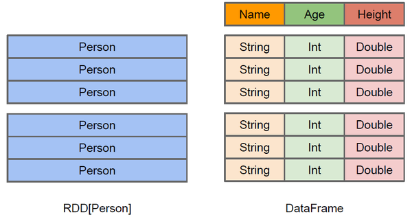

DataFrame 内部的有明确 Scheme 结构，即列名、列字段类型都是已知的，这带来的好处是可以减少数据读取以及更好地优化执行计划，从而保证查询效率。

#### DataSet

Dataset 也是分布式的数据集合，在 Spark 1.6 版本被引入，它集成了 RDD 和 DataFrame 的优点，具备强类型的特点，同时支持 Lambda 函数，但只能在 Scala 和 Java 语言中使用。在 Spark 2.0 后，为了方便开发者，Spark 将 DataFrame 和 Dataset 的 API 融合到一起，提供了结构化的 API(Structured API)，即用户可以通过一套标准的 API 就能完成对两者的操作。

#### 总结

l RDDs 适合非结构化数据的处理，而 DataFrame & DataSet 更适合结构化数据和半结构化的处理；

l DataFrame & DataSet 可以通过统一的 Structured API 进行访问，而 RDDs 则更适合函数式编程的场景；

l 相比于 DataFrame 而言，DataSet 是强类型的 (Typed)，有着更为严格的静态类型检查；

l DataSets、DataFrames、SQL 的底层都依赖了 RDDs API，并对外提供结构化的访问接口。

### Spark SQL的运行原理

DataFrame、DataSet 和 Spark SQL 的实际执行流程都是相同的：

1. 进行 DataFrame/Dataset/SQL 编程；

2. 如果是有效的代码，即代码没有编译错误，Spark 会将其转换为一个逻辑计划；

3. Spark 将此逻辑计划转换为物理计划，同时进行代码优化；

4. Spark 然后在集群上执行这个物理计划 (基于 RDD 操作) 。

#### 逻辑计划(Logical Plan)

执行的第一个阶段是将用户代码转换成一个逻辑计划。它首先将用户代码转换成 unresolved logical plan(未解决的逻辑计划)，之所以这个计划是未解决的，是因为尽管您的代码在语法上是正确的，但是它引用的表或列可能不存在。 Spark 使用 analyzer(分析器) 基于 catalog(存储的所有表和 DataFrames 的信息) 进行解析。解析失败则拒绝执行，解析成功则将结果传给 Catalyst 优化器 (Catalyst Optimizer)，优化器是一组规则的集合，用于优化逻辑计划，通过谓词下推等方式进行优化，最终输出优化后的逻辑执行计划。

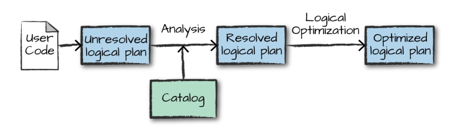

#### 物理计划(Physical Plan)

得到优化后的逻辑计划后，Spark 就开始了物理计划过程。 它通过生成不同的物理执行策略，并通过成本模型来比较它们，从而选择一个最优的物理计划在集群上面执行的。物理规划的输出结果是一系列的 RDDs 和转换关系 (transformations)。

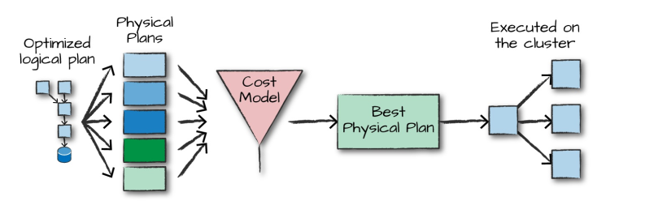

#### 执行

在选择一个物理计划后，Spark 运行其 RDDs 代码，并在运行时执行进一步的优化，生成本地 Java 字节码，最后将运行结果返回给用户。

### Structured API基本使用

参考官方文档：https://spark.apache.org/docs/latest/sql-getting-started.html

 

## 七、Hive

Hive 是基于 Hadoop 的一个数据仓库工具，可以将结构化的数据文件映射为一张表，并 提供类 SQL 查询功能。

Hive 本质：将 HQL 转化成 MapReduce 程序

（1）  Hive 处理的数据存储在 HDFS

（2）  Hive 分析数据底层的实现是 MapReduce

（3）  执行程序运行在 Yarn 上

### Hive 架构原理

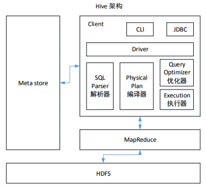

1）用户接口：Client CLI（command-line interface）、JDBC/ODBC(jdbc 访问 hive)、WEBUI（浏览器访问 hive）

2）元数据：Metastore 元数据包括：表名、表所属的数据库（默认是 default）、表的拥有者、列/分区字段、 表的类型（是否是外部表）、表的数据所在目录等； 默认存储在自带的 derby 数据库中，推荐使用 MySQL 存储 Metastore

3）Hadoop 使用 HDFS 进行存储，使用 MapReduce 进行计算。 

4）驱动器：Driver 

（1）  解析器（SQL Parser）：将 SQL 字符串转换成抽象语法树 AST，这一步一般都用第 三方工具库完成，比如 antlr；对 AST 进行语法分析，比如表是否存在、字段是否存在、SQL 语义是否有误。

（2）  编译器（Physical Plan）：将 AST 编译生成逻辑执行计划。

（3）  优化器（Query Optimizer）：对逻辑执行计划进行优化。

（4）  执行器（Execution）：把逻辑执行计划转换成可以运行的物理计划。对于 Hive 来 说，就是 MR/Spark。

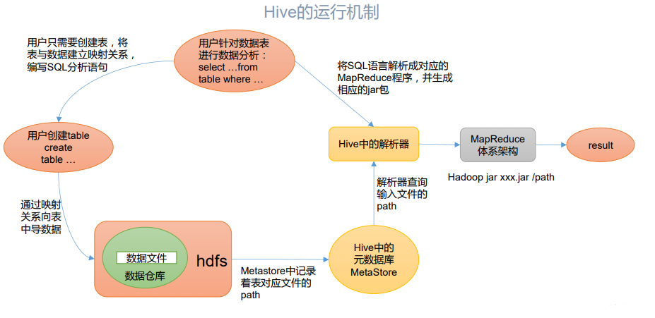

### Hive 和数据库比较

由于 Hive 采用了类似SQL 的查询语言 HQL(Hive Query Language)，因此很容易将 Hive 理

解为数据库。其实从结构上来看， Hive 和数据库除了拥有类似的查询语言，再无类似之处。

本文将从多个方面来阐述 Hive 和数据库的差异。数据库可以用在 Online 的应用中，但是

Hive 是为数据仓库而设计的，清楚这一点，有助于从应用角度理解 Hive 的特性。

#### 查询语言

由于 SQL 被广泛的应用在数据仓库中，因此，专门针对 Hive 的特性设计了类 SQL 的查

询语言 HQL 。熟悉 SQL 开发的开发者可以很方便的使用 Hive 进行开发。

#### 数据更新

由于 Hive 是针对数据仓库应用设计的，而 数据仓库 的内容是读多写少的。 因此， Hive 中

不建议对数据的改写，所有的数据都是在加载的时候确定好的。 而数据库中的数据通常是需

要经常进行修改的，因此可以使用 INSERT INTO VALUES 添加数据，使用 UPDATE SET 修

改数据。

#### 执行延迟

Hive 在查询数据的时候，由于没有索引，需要扫描整个表，因此延迟较高。另外一个导致Hive 执行延迟高的因素是 MapReduce 框架。由于 MapReduce 本身具有较高的延迟，因此在利用 MapReduce 执行 Hive 查询时，也会有较高的 延迟。相对的，数据库的执行延迟较低。当然，这个低是有条件的，即数据规模较小，当数据规模大到超过数据库的处理能力的时候，Hive 的并行计算显然能体现出优势。

#### 数据规模

由于Hive 建立在集群上并可以利用 MapReduce 进行并行计算，因此可以支持很大规模

的数据；对应的，数据库可以支持的数据规模较小。

### [Hive 常用 DDL 操作](https://github.com/heibaiying/BigData-Notes/blob/master/notes/Hive常用DDL操作.md)

### [Hive 常用 DML 操作](https://github.com/heibaiying/BigData-Notes/blob/master/notes/Hive常用DML操作.md)

### 个人理解

Hive是第一个实现MapReduce操作简化为类SQL查询的框架，通过将HQL转化为事先定义的MapReduce模板实现对存储在HDFS上数据的分析操作，当然后面替换计算引擎实现了性能的提升，但本身其他组件依然对性能存在制约，所以出来了SparkSQL。但后续出来的架构一般也会兼容Hive。

 

## 参考学习资料

环境搭建：https://zhuanlan.zhihu.com/p/360945733

Flink：https://ververica.cn/developers/flink-training-course3/

视频：尚硅谷https://www.bilibili.com/video/BV1Qp4y1n7EN

框架：https://github.com/heibaiying/BigData-Notes

 

 

 

 

 

 

 

 

 

 

 

 

 

 

 
