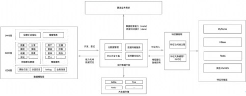
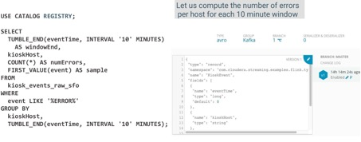
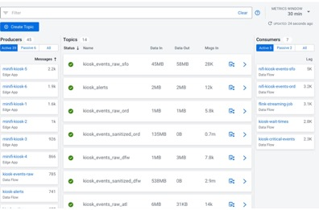

# **实时数仓建设白皮书**

## **Background**

实时数仓目前是大数据领域非常 hot 的反[[1\]](#_msocom_1) 向，这个方向应该是从 2019 年开始逐渐变得流行，我最早知道这个概念始于[严选[1\]](https://www.codercto.com/a/47662.html)在内部做的分享（现在来看严选的实时数仓很初级，跟流计算平台没有什么差异），我们也能在网上看到一些实时数仓的实践：[美团[2\]](https://tech.meituan.com/2018/10/18/meishi-data-flink.html)，[知乎[3\]](https://zhuanlan.zhihu.com/p/56807637)，这些实时数仓距离我们想要的中台层面的实时数仓，还有很大的距离。

 

云音乐从去年年底也开始做实时数仓的规划，它的诉求来自于：

**图 1. 云音乐实时数仓场景概览**

 

无论是内部外部，目前讲到的实时数仓都围绕 flink 来搭建，使用 flink 收益[4]：

●   flink 支持 SQL 和自定义 JAR 任务，SQL 提供了标准化和低门槛的计算模型，自定义 JAR 以及CEP计算模型提供了更加灵活的任务定义方式，可以满足更多的生产场景

●   flink 是纯事件驱动，在实时性上优于 spark streaming

●   flink 本身有完善的状态管理机制，watermark 处理乱序问题

●   flink 自身支持 exactly-once 处理，有成熟的两阶段框架（一致性保障）

 

业界主流的流计算引擎除了 flink 还有 spark streaming，多年的互相借鉴，spark streaming 和 flink 能力在逐渐趋同，flink 自流而批，spark 自批而流，flink 各种特性在 spark streaming 中都能找到对标方案，之所以国内 flink 在实时场景几乎一统江湖的原因在于 flink 的切入点是在线场景，最早 flink 的最直接竞争对手是 storm，flink 几乎完善了 storm 的所有不足，而生产场景中有大量基于 storm 构建的实时大屏，风控，定制化监控等，比如考拉最早就是用 storm 实现的双 11 大屏，flink 在风风火火收割 storm的时候，spark streaming 还没有把自己定位到在线处理的高度，因为批的思路天生不适合用在实时性要求非常高的场景。随着 flink 的在线场景成为业界标杆，基于在线场景的复杂度，重要程度，出于降低门槛和提升能效的目的，逐渐产生了将 flink 的任务开发，运维，监控等功能抽象为独立产品的需求，而这个产品也能很好应对大数据场景下的实时 ETL，数据清洗，打宽，聚合，甚至 AI 等场景， flink 在大数据端的这些场景正在演变为我们今天的实时数仓。

 

sloth 是数科围绕 flink 引擎构建的流计算平台，除了 sloth 外，基于 flink 的流计算平台在市场上层出不穷，BAT 不用多言，光网易在 2019 年就有三个 flink 流计算产品（数科，严选，云音乐），鉴于面前提到的历史原因，围绕 spark streaming 的流计算平台比较罕见。

## **Motivation**

严格来说，实时数仓应当是流计算平台在大数据端的细分领域，因为流计算平台最早是为了解决实时大屏，风控等在线场景，它的形态和功能都不是为大数据量身定制。流计算平台与离线数仓在计算和存储两方面的差异体现在：

1. 计算方面，离线数仓引入了 workflow 做离线任务的依赖管理，实现了离线计算的解耦和复用，数据中台基于离线数据开发，衍生出了数据模型，数据质量等治理型应用。而流计算平台的形态围绕单个流计算任务展开（一个很重要的原因是流计算只能保证单个任务的     exactly-once 语义），通常包含任务开发，任务运维，任务监控等模块
2. 存储方面，数仓流计算在存储上天然存在异构性，flink     的官方定位是端到端（E2E）的流计算解决方案，流计算的 source 一般为消息队列，sink 根据应用场景选择不同的实时存储方案，包括Redis、mysql、hbase等，离线数仓的存储具有较强的同构性，除了集市端，一般都会选择     hdfs 作为数据的输入和输出。

 

首先，流计算平台是面向计算的管理，管理方式是计算任务的”一锤子买卖“，即端到端（消息队列到自选存储）的任务管理，任务流和数据端缺乏有效的治理和复用，见图 2。数仓平台，无论是离线数仓还是业务需要的实时数仓，应当是面向数据的管理，见图 3，多年来离线数仓围绕 hive 形成了模块化（数据开发，数据模型，数据质量等），规范化和标准化的数据中台体系，在生产资料之间形成了更强的连接，为大数据业务创新提供更强的枢纽和共享能力[5]，所以实时数仓的实施，潜在驱动之一是坚守数据中台的方法论，未来希望能够在数据开发，数据血缘/地图，数据资产，数据质量等模块上充分融合，在成本和能效满足预期的前提下，管理好存储的异构性问题：

1. 提供类似于 hive 的实时数仓标准存储方案，过去两年     kafka 和 kudu 是这个定位
2. 将异构的数据源整合到与离线统一的元数据中心

 **图 2. 流计算平台面向任务的管理**

**图 3. 离线数仓面向数据的管理**

 

音乐的 magina 已经在元数据整合上迈出了关键的一步：

 

**图 4. 音乐实时数仓统一元数据中心**

 

其次，在围绕流计算平台构建实时数仓的实践中，业界普遍以 kafka 作为流表实现（ODS + DWD），原因有二，一是流计算天生以消息队列作为数据源，文件或行存系统没有流式的接口，二是通过 kafka 的订阅功能，在某个节点从故障恢复后，可以自动触发整个 dataflow 的恢复。在目前的实时数仓实践中，kafka 几乎成为了流表的事实标准，以 kafka 作为流表带来的问题有：

1. 容量限制，社区对 kafka 的定位是大数据的WAL，企业很难像     hdfs 一样给 kafka 预留足够的空间，且 kafka 按消息存储，压缩能力有限，云音乐的体量下，kafka 只能存半天的数据
2. kafka 天生没有 schema ，没有办法保障     schema 和数据的强一致，数据资产属性很弱，难以治理
3. kafka 的使用方式是 FIFO，目前的数据质量模块不适用
4. kafka 作为流表使用，其 schema 受到业务约束，未来在需要用隐式列实现跨任务的数据一致性保障，retraction     等功能时，难以实施
5. 批流分离，需要在业务侧用复杂的 lambda 架构实现批流一体

 

再次，在网易之前的实时数仓中，批表围绕 kudu 来设计（DWS + ADS），kudu 的优势在于：

1. 支持 upsert/delete，这是相比离线数仓无可比拟的优势
2. 列存，支持较为高效的OLAP
3. 结合 impala/presto 使用支持联邦查询

 

使用 kudu 作为实施数仓的存储组件，遇到的问题有：

1. olap 与 parquet 相比性能不如（下推，裁减）
2. 写放大问题严重，难以应对流量陡坡（类似 oltp）
3. 非存算分离的架构，且无法使用 hadoop 的资源池，成本不可控
4. 没有流式接口，数据孤岛，有进无出

 

在未来的实时数仓中，我们对存储的愿景包含如下特性：

●   对实时指标（非在线类业务），分钟级延迟大部分是可以接受的，因为很多 ap 就是分钟级别的，数据延迟和ap延迟可以对冲，kudu在数据延迟方面能力过剩，ap 能力不足

●   批流共用存储，解决 kafka 作为 ods 层在容量规划上的尴尬，可以用批对流做 backfill 或回放某个时间段的流式数据

●   成本可控，可以复用hdfs的存储池，而不必向kudu,druid一样重新部署一套资源，随着体量的增大需要为它进行扩容和容量规划，成本可控的另一个诉求是需要存算分离的架构

●   sla 要求，突发状况可以接受一定延迟，但是不要crash，系统缓冲能力要足够强，不需要堆成本去应对流量变化，在任务出现异常时可以快速回复，相比于离线计算，实时计算的异常恢复应该是分钟级别甚至是秒级。

●   具备治理功能，可以解决或规避hdfs小文件问题

●   支持 upsert/delete

 

**2020-06-09 与音乐业务方沟通，实时数仓的核心诉求总结（子集）：**

●   用一套模型维护数仓，不需要离线和实时写两套代码，以音乐 K 歌场景为例，同样的表，同样的计算逻辑，在离线场景和实时场景要分别写两套 DDL 和 DML（spark 和 flink）

●   通过 upsert 解决 flink 大状态问题（通过设置比较短的 TTL，upsert 由底层来保障）

●   解决小文件问题

 

## **Goals**

 

| **融合数据中台** | 实时数仓要融入数据资产，数据地图，数据模型，数据血缘，数据质量等模块，对外展现统一的数据中台服务，融合的最终目标是离线数仓和实时数仓不分家，可以无缝互迁 |
| ---------------- | ------------------------------------------------------------ |
| **存储批流一体** | 在一套存储系统上共用批表和流表，具有一套强约束的  schema，支持在这套存储上跑批任务和流任务，支持批和流的 acess API，支持联邦查询 |
| **计算批流一体** | 计算批流一体，也是模型的批流一体，核心诉求是业务对同一个场景，离线和实时任务不需要维护两套代码 |
| **低成本**       | 存算分离是大趋势，是成本优化的主路径，另外一个潜在的目标是使用  hadoop 生态，这样可以复用存储池，不用像 kudu，druid 一样要单独部署 |

 

## **None goals**

 

| **颠覆流计算平台** | 实时数仓建设不以牺牲流计算平台功能为前提，未来  flink 依然要满足在线业务对流计算的需求，在流计算任务开发，运维，监控方面大数据和在线业务的需求是相通的，实时数仓定位应当是流计算平台的增量价值 |
| ------------------ | ------------------------------------------------------------ |
|                    |                                                              |

 

## **Product**

准确地说，目前业界还没有一个产品形态非常完备的实时数仓产品，cloudera 的 dataflow 算是走在也行业前列，阿里云（包含公有云和 dataworks）有一些自己的特色，其他诸如美团，严选，知乎等互联网公司分享的实时数仓更多是实践方面的内容（很多在讲从 spark 到 flink 的迁移）。

 

所以我们的调研对象重点是 cloudera 和阿里云，结合目前云音乐的生产需求，我想将实时数仓分为三个世代，第一个世代，是我们用传统流计算平台的方案解决实时数仓需求，这个是我们过去两年的做法，目前有些互联网企业还停留在这个世代；第二个世代是向数据中台过度，这个时期的流计算平台与离线数仓统一元数据中心，提供更多面向数仓开发者的友好功能，这个世代的目标是产品整合和提升能效，这也是流计算平台发展的必然趋势，现在还在迭代的流计算平台普遍在朝这个方向迈进，网易二代实时数仓的典型架构是 kafka + flink + kudu；第三个世代，是批流一体的世代，也是去 lambda 的世代，这时的实时数仓与离线数仓在架构上，存储上，计算上高度统一，第三世代的突破在于提供了批流一体的存储方案，并且与计算引擎高度整合，目前业界中 hudi 是朝着这个方向去的，我们基于 iceberg 做的方案也是这个目标，deltalake 是潜在在竞品，我们将这个批流一体的存储方案称之为 “实时数据湖”。

 

在 roadmap 上，我们在完善第二世代，创造第三世代，两边的工作同时进行，第二世代的工作主要是产品形态的完善，尤其是 kafka 流表体系和数据中台的对接，目前列在计划中的主要包含三点：

1. 统一元数据中心（数据资产）
2. 数据血缘功能（数据地图）
3. kafka 监控（数据资产）
4. 接入权限中心

 

统一元数据中心，是数据资产和数据地图模块的基础和前提，在实时数仓的形态中，具有数据源登记和数仓元数据管理的模块，最终受益的是在任务定义时，可以省去开发者写 DDL 的过程，音乐号称有 100+ 实时任务开发者，统一的元数据中心可以省去大量同步元数据的时间，提升开发能效，cloudera 和 云音乐统一元数据中心后的任务开发形态分别如下：

**图 5，6. 业务不用再定义DDL，直接复用元数据中心定义好的表**

血缘和 kafka 监控是可以放在一起来考虑的（或者做一些低成本的关联），这方面 cloudera 做地很优秀，这里列举一下 cloudera 的血缘功能和 kafka 监控的有效结合：

**图 8，9. cloudera 的数据血缘功能与 kafka 监控的整合，简洁大气**

 

相比阿里云的数据血缘比较一般，看起来和猛犸数据开发的 workflow 很像：

**图 10. 阿里 stream studio 数据血缘**

 

因为实时数仓需要对开发者，管理者，用户组权限做出区分，而数据中台未来有建设统一权限中心的规划，这块我们会和猛犸一起来设计。

 

第二代实时数仓的重点是产品形态的完善和融合，第二代的成熟标志着实时数仓可以无缝进入第三代，换句话说，第三代实时数仓不要求形态上做出重大改变，因为批流一体的收益是通过更优的底层架构，用更低的成本提供更强大的功能，举例来说，用支持 upsert 的 iceberg 替换 kudu，就这个 feature 而言只要在 SQL 定义中切换类型就好。

 

**第三代实时数仓会面临一个终极问题**：离线数仓的数据开发和实时数仓的任务开发，能否整合为一个流程，站在离线数仓的用户角度来说，目前线上定义好的离线计算任务，能否直接无缝迁移到实时计算，离线指标和实时指标一键互转，对新的需求，不再区分离线计算和实时计算，离线和实时作为计算的一个属性来设置。在实时数仓真正进入第三世代之后，这个规划有落地的可能，第三代实时数仓是统一数仓的必要非充分条件，其他需要的条件，包括 flink 支持跨流表的 dataflow（exactly-once 和 retraction），以及业务侧使用场景的更多调研。

 

**2020-06-09 与音乐业务方沟通，三代实时数仓形态问题（业务视角）：**

1. 我们的核心诉求是模型统一，解决 flink 大状态问题，小文件问题，业务不用写两套代码，维护两套东西，产品是拖拽式的     workflow（离线数仓形态），还是任务中心（流计算平台形态），不重要，做完自然就清楚了
2. 猛犸 workflow 也是几年前的东西了，阿里云现在就是任务中心，特别大的     workflow 运维起来也很麻烦（举了个配置报警的例子），而用户只要关心自己的任务，围绕 SQL 来运维，这种交互方式挺好的，另外数据血缘也能够很好满足对治理的需要
3. 从我个人理解，数据血缘 = 不可编辑的     workflow，目前实时数仓有明确的数据血缘需要，未来可能不会去和离线数仓的 workflow 整合（业务没诉求），这个具体要跟猛犸的产品再讨论下

## **Arctecture**

这里主要说明一下第三代实时数仓在批流一体方面的架构设计。

 

先举个二代实时数仓，由上层实现 lambda 架构来实现批流一体的案例，业务场景是ABTests，例如在上线一个算法后，业务需要计算一些用户的行为指标来评价算法效果，传统离线数仓的指标是 T+1，意味着业务必须在第二天才能看到算法效果，在这个场景下，业务的明确诉求是希望能够在分钟级别得到线上指标的响应，以加快算法迭代。对这个场景音乐给出的解决方案是 spark + flink 的 lambda 架构（业务 SQL 见附录），如下图所示：

****

这是一个非常典型的 lambda 架构案例，flink 从 kafka 消费的数据在计算的同时，也会存一份到 hdfs，hdfs 的数据可以用于 spark 的批计算，也可以用于异常状况下的数据回补（backfill），在 DWS 之前的 ODS 和 DWD，flink 和 spark 是两条不同的路线，所用存储也不同，flink 使用 kafka 作为流表，spark 使用 hdfs 作为批表，在 DWS 这一层，统一使用 kudu 存储，基于 kudu 的 olap 来 join 行为表和 metrics 得到业务想要的实时指标，另外也可以通过 spark 对 kudu 定时执行离线任务，得到离线指标。 

 

lambda 架构的价值在于批流“互补”，流批各一条 dataflow 看似重复造轮子，实际是为了不同场景下的互补，业务可以根据需要灵活调配资源。流的场景是为了实时，但是因为实时数据存在乱序，重复等不可避免的问题，实时计算的准确性是打折扣的；批的场景是为了准确，一个很直观的概念：我们计算的样本数据跨度越大，结果越精确。批流各自在实时性和准确定上做出互补，如果业务对准确性要求不是特别高（或者实时的误差对场景来说可以忽略），就不需要批计算的链路，如果业务对实时性要求不高，T+1 满足需求，则不需要实时的链路。

 

实时性和准确性的 trade off 是 lambda 架构理想的场景，在现有架构体系下，因为流和批在计算和存储上都使用不同的选型，成本很高，尤其使用 kafka 的流表存储历史数据时，需要为 kafka 预备足够的空间，虽然可以引入 hdfs 来存储 kafka 的历史数据，但是 hdfs 没有流式接口，使用 hdfs 和 kafka 结合来解决数仓分层的问题，对开发者很不友好，尤其在遇到 upsert 场景。

 

另外一端，虽然 kudu 看似统一了批流的存储，但是 kudu 本身是个数据孤岛，独立于 hadoop 生态，业务要重新为 kudu 部署的体量不可能达到 hadoop 的量级，网易目前也没有这方面的实践，现在普遍的做法是用 kudu 存储最近几天的数据（多是 binlog 数据），hive 存储所有历史数据。德邦的数仓体系对实时性要求很高，使用 kudu 的方法也是保存 45 天内的数据，即便如此，在体量上来之后问题也很多，这里也有隐性的人力消耗。

 

kafka 和 kudu 这套实践的问题在 motivation 一节中已具体总结过，不再赘述，我们的目标在 goals 中强调过，flink 目前已经可以做到计算的批流一体，存储方面，我们要做的批流一体是建立在 hadoop 生态上，存算分离，去 lambda 的批流一体：

可以看到 arctic 这套架构将流和批收敛在一条链路上，批表和流表共用一套存储，并且同时提供批流访问接口，real-time pull 是类似于消息队列的订阅功能，是实时链路的常规路径，batch pull 是批计算的常规路径，incremental pull 提供历史某个时间段的数据重放，用于 backfill，增量表等场景，属于流的接口，但是利用到了批的大体量优势。arctic 用统一的链路实现了去 lambda 化，降低了业务架构复杂度，提升了能效。

 

arctic 的最大价值不在于统一，而在与支持基于主键的 upsert，upsert 的价值从 hudi 社区的活跃度就可见一二，我之前在 iceberg 社区发的第一篇 proposal：[p1](https://docs.google.com/document/d/1FlTTJTiCMKMCapJBE7iOaEm13QlkSQdSfIGSfm34tXA/edit?usp=sharing) 详细的讨论了这个功能的重要性，upsert/delete 的价值在于数仓的能力从仅限于 immutable data 变为可支持 mutable data，而 mutable data 一定会有个主键来标记数据的唯一性。在我们上面的案例中，ODS/DWD 的数据可以通过 upsert 功能实现去重，提高实时计算的准确性，DWS 层可以用 arctic 替换 kudu，我们不用再担忧 kudu 池子不够大，而且 arctic 天生存算分离，基于异步的 compaction 可以提供强大的 SLA 缓冲能力，我们还可以预见，arctic 基于 iceberg 和 hadoop 生态，可维护性要强于 kudu，可以说，相比 kudu，arctic 牺牲了数据的实时性（从毫秒级别到分钟级别），这个牺牲在在线场景下也许是不能忍受的，但是在大数据场景下，分钟级别的实时性有时更加契合业务需求；arctic 成全了成本，SLA和性能，这里的性能是指在很大程度上解决了写放大的问题（想象线上一直不断地更新一行数据，kudu 会陷入不停地compaction，同时也会导致数据摄取性能不可控），提升了 compaction 效率，本质上是读延迟和整理之间的trade off，以写性能为优先的存储结构（lsm tree, delta tree）都遵循这个原则。

 

以上我们从架构上，自外而内地对 arctic 这个批流一体的实时数仓解决方案做出了定义，它在功能上特性总结如下：

1. 批表流表共用存储，同时提供批流接口
2. 支持主流的计算引擎（flink, spark），支持主流的     AP 引擎（impala，presto）
3. 支持 upsert/delete，支持分钟级别数据延迟
4. 支持 incremental pull
5. 基于 hdfs 存储，支持 parquet 以提供高效     OLAP
6. 支持线性可扩展，且足够高效的数据摄取（ingestion）
7. 一些数据湖的高级特性：ACID，MVCC，hidden     partition，提升数据可靠性和易用性

 

我们的目标和 hudi[6] 的目标是基本重合的，从命名上看，hudi 就是要解决 hadoop upsert and incremental pull 的问题，直接使用 hudi 给我们带来的问题有：

1. hudi 与 spark 深度绑定，是 spark     的一个 lib，而我们的实时数仓，ELT 工具的选型都是 flink，在这方面我们已经有了很成熟的产品栈和实践，围绕 hudi 构建实时数仓需要我们推翻     flink，推翻过去几年的实践，重新搞一套平台，基于 flink 实现 hudi，相当于做一套新的系统：[proposal link](https://cwiki.apache.org/confluence/pages/viewpage.action?pageId=141724520)[7]
2. hudi 的 interface 不友好，hoodie     key 和主键的概念不一样，数据摄取的 API 复杂，概念过多，不适合直接暴露给大数据开发者[8]
3. hudi 依赖第三方索引，目前可选的有     bloom index 和 hbase，维护成本较高，bloom index 打穿后会影响摄取性能
4. hudi 的目标性很强，实现简单粗暴，在     ACID，MVCC，schema evolve 等功能上有所欠缺，不如iceberg，delta lake 讲究和优雅。

 

我们目前的思路是基于 iceberg 来实现批流一体的功能，主要是因为 iceberg 非常开放，虽然社区主要看中的也是 spark 方面的集成，但是基于 iceberg 扩展 flink 比较容易，iceberg 的代码可读性，模块设计上全面优于 hudi，我们将在 iceberg 表中引入 delta 的概念，在一些设计上会充分借鉴 hudi，例如 timeline，但是会规避上面提到的问题。引入 delta 后 iceberg 表会被切分为 base 域和 delta 域，两边通过 manifest 形成关联，如下图所示：

 

delta 数据会通过定期 compaction（copy on write），或 merge on read 的方式与 base 数据合并，无论是 COW 还是 MOR，为了保持读性能的可控，都要定期将 delta 数据写回 base，这种定期或根据情况动态调整的数据合并写回，需要有一个单独的调度服务来支撑，我们这里将其称之为 arctic service，arctic service 的定位是数据治理，维持数仓表的性能和成本可控，它的作用不限于：

1. 调度执行所有数仓表的 compaction，未来可能还会细分出     delta 的 minor compaction，delta 和 base 的 major compaction
2. 通过 compaction，同时达到小文件治理的功能
3. iceberg 元数据管理，类似于 hive     metastore 的功能

 

抛开 arctic service 这个独立的服务，arctic 与 hudi 一样，以 lib 的方式与 flink 整合，我们最终会得到实时数仓架构的三个象限：

 

值得一体的是，delta 这套体系的构建，非常依赖于 iceberg 自身的 ACID，MVCC，schema evolve 等特性，这也是我们选择 iceberg 最大的动力之一，iceberg 为我们提供了非常敦实的基建。

 

## **Implemention**

upsert on iceberg propsal:

https://docs.google.com/document/d/1FlTTJTiCMKMCapJBE7iOaEm13QlkSQdSfIGSfm34tXA/edit?usp=sharing

Write conficts in upserting/deleteing situation of iceberg proposal:

https://docs.google.com/document/d/17wO3b0WEW1oC2EIFnIAfTidMYsAwC7IxHf9SQKI3dO0/edit#heading=h.4u74et4wsomi

delta format for iceberg

https://docs.qq.com/doc/DR0hqbHNRcnR3Y1RY

 

merge on read/copy on write 设计

https://docs.qq.com/doc/DR3JNb3RYcW9xQkZW

 

讨论帖

https://docs.google.com/document/d/1VBQKIy8ak79jYYbzuXSdioKbafgf7EnkZqiHfxtMnIc/edit?usp=sharing

hudi 调研

https://docs.qq.com/doc/DR25nTGxPbGVxWnlM

 

 

## **Demonstration**

这里计划以德邦为案例，说明批流一体的价值，因为德邦的大数据团队是不如云音乐的，在模型不统一，链路不统一，存储不统一的问题上，他们有更深刻的痛点。待补充。

## **Community**

对 iceberg 社区做了深入的了解，在数据湖三剑客中，iceberg 社区的活跃度是最低的，这和社区 fonder 自己对 iceberg 的定位，以及他们的性格有比较大的关系，iceberg fonder[9]:

这两个人的主攻方向都是离线数仓和 AP，目前主要是 ryan 这个人在主导社区的方向，从 iceberg 的 roadmap 来看，它和 delta lake 的功能是高度重合的，甚至可以认为 iceberg 和 delta lake 类似于 mariadb 和 mysql 的关系，目前社区的主攻方向依然是离线场景的 row delete，和我们当前的方向不冲突，反而是互补关系，从我了解到的情况，奈非内部负责 flink 另有其人，这块不是 RB 的领域，大概率不会作为他认可的方向。

 

这就又要说说 RB 这个人了，从 linkedin 上爬到的资料来看[10]，83年，以前服务于 NASA，但从事的一直是开源方向，我参加过一次线上的 sync meeting，感觉这个人项目管理的能力很强，邮件里的会议纪要会把每个人表达的重点复述出来，另外，这个人对项目的管控欲望也很强，对他不感兴趣的东西他会很快跳过，或者不回复，对这个人的认识，目前我们，阿里，腾讯还是比较有共识的。但是反过来讲，受益于他对项目的充分把控，这个项目从我自己角度看，小而精，模块设计优雅，比较容易扩展。

 

我一开始的思路，是和阿里共建一个 repository 开发 flink 集成和 upsert 功能[11]，最后类似于 blink 和 flink 一样 合入 iceberg 的主分支里（目前这个仓库已经取得了一定进展），但是目前来看这样比较困难，和 RB 的沟通成本很高，不利于我们放手一搏。我这边理解的主要问题在于 iceberg 的社区定位是 table format，我们要做的超出了这个概念，我现在的考虑是将 arctic 定位成 hudi 一样的东西，hudi 是介于 spark 和 hdfs 之间的产品，我们也可以基于 flink 和 iceberg 之间做出这样的概念，也可以开源，我们可以保留 arctic service 作为我们内部版本和开源之间的区别（奈非内部应该也有这样的东西）。

 

我们和阿里共建的基础是利益无冲突，且人比较熟，阿里的 flink 团队主攻方向是公有云，2B 是 dataworks 团队在做，两边看起来不对头，阿里对 iceberg 目前的投入只有一个资深的做开源的同学，是而且是 RDS 团队前同事，离开网易后在小米做 hbase，做到了 hbase PMC，在学习 iceberg 的过程中，也给我们提供了不少帮助。我们和腾讯的关系比较微妙，腾讯的团队是去年就进入了社区，已经在社区中占了一些坑，flink connector 这块他们比较早的拿到了奈非内部的一个版本，提了 PR，但是腾讯做 iceberg 这个团队看起来 flink 方面并不专业，功能和进度上已经落后了我们的仓库，但是 RB 这个人有些护短，吃准了腾讯这个 PR，更深层的原因是 RB 这个人本身对 flink 没有太多想法，只是想完善一下生态。

 

我们目前做 upsert 的方向，跟开源是没冲突的，flink 集成方面的分歧，短期内我认为不必在意，我认为没什么比抱紧 flink offical team 更正确的事，即便未来腾讯的 PR 成为主流，我们切换也没什么代价，因为这个主流必然会经历阿里的洗礼。

 

不过目前在 upsert 的功能设计上，我们和阿里的同学存在一些理念上的分歧，最主要的是大家出发点不同，我的目标是未来独立开源，去跟 hudi pk，胡争（前同事）的出发点首要的是跟社区目前这套离线的 row delete 兼容，我们在目标上的区分仅仅是优先级的不同，兼容在我这里是第二位的，所以一些概念上有所区别。一个潜在的问题在于，我们现在投入这么大精力做这个事，能不能让阿里完全主导（阿里的 style 大家了解）？所以在一些核心问题上，在纯设计哲学的问题上，我不主张退缩，好在大家都是很熟悉的朋友，这件事讲开了，求同存异，未来不排除重新回到合作的轨道上来。

## **Summary**

目前规划的实时数仓，会同时进行二代和三代的建设，二代即将和云音乐立项共建，主要是做产品形态上的提升，与数据中台的整合，三代是我们自己推进，基于 iceberg 构建存储批流一体的系统，去 lambda 化，支持 upsert，和 flink 深度整合，对 spark 保持开放。

 

在二代实时数仓中，我们要回答实时数仓怎么融入数据中台的问题，二代的业务收益体现体系的价值上，效能的提升上，三代要回答怎么解决批流一体的问题，由底层向产品反哺，解决二代实时数仓在成本，性能，可用性等多方面存在的问题。我们的最终目标是基于单一的简单可依赖的的架构，将批流的差异问题沉淀在基础设施层，打造一个离线数仓和实时数仓产品形态高度统一的数据中台。

 

关于三代的形态， workflow 还是任务中心 + 数据血缘，目前来看业务比价接受后者。

## **Reference**

[1] https://www.codercto.com/a/47662.html

[2] https://tech.meituan.com/2018/10/18/meishi-data-flink.html

[3] https://zhuanlan.zhihu.com/p/56807637

[4] https://flink.apache.org/

[5] 《中台战略——中台建设与数字商业》

[6] [https://hudi.apache.org](https://hudi.apache.org/docs/quick-start-guide.html)

[7] https://cwiki.apache.org/confluence/pages/viewpage.action?pageId=141724520

[8] https://hudi.apache.org/docs/quick-start-guide.html

[9] https://conferences.oreilly.com/strata/strata-ny-2018/public/schedule/detail/69503

[10] https://www.linkedin.com/in/rdblue/

[11] https://github.com/generic-datalake/iceberg

## **Appendix**

ABTest sql demo