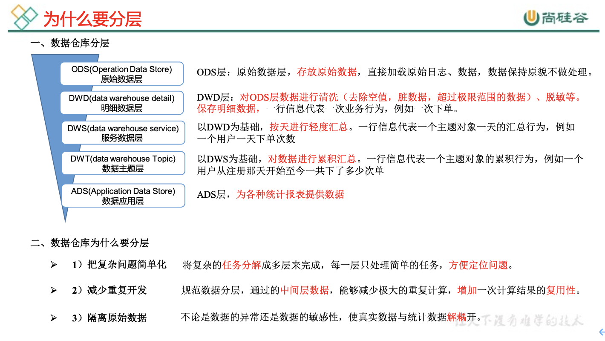
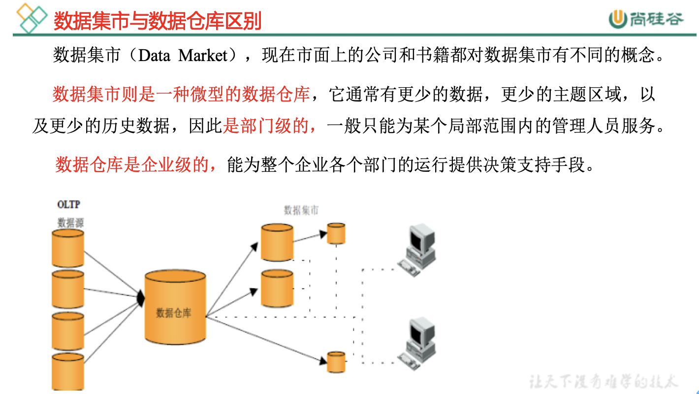
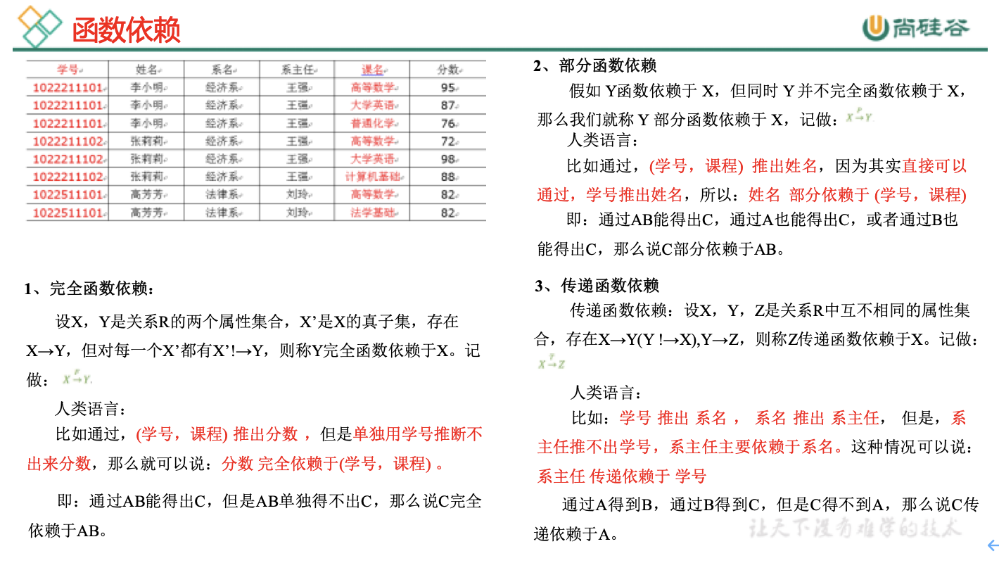
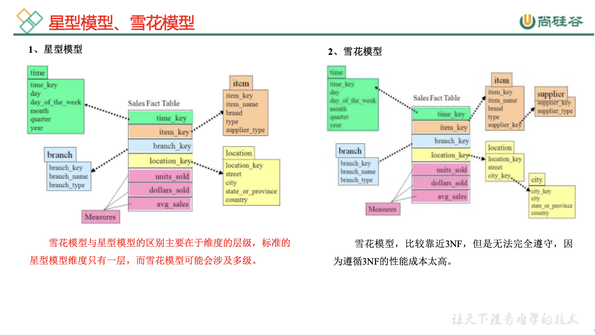
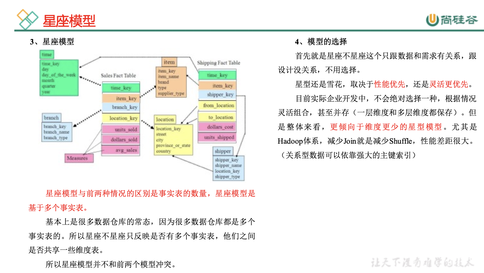
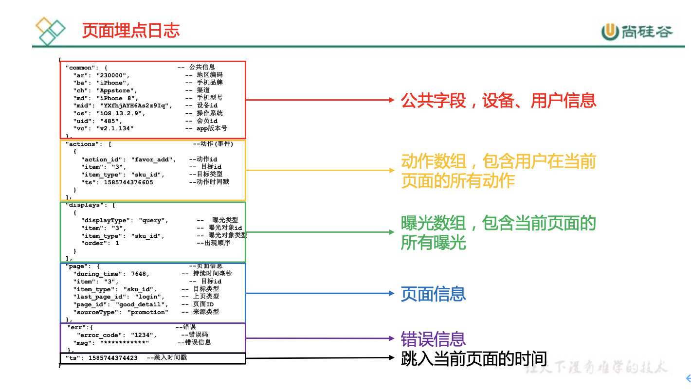
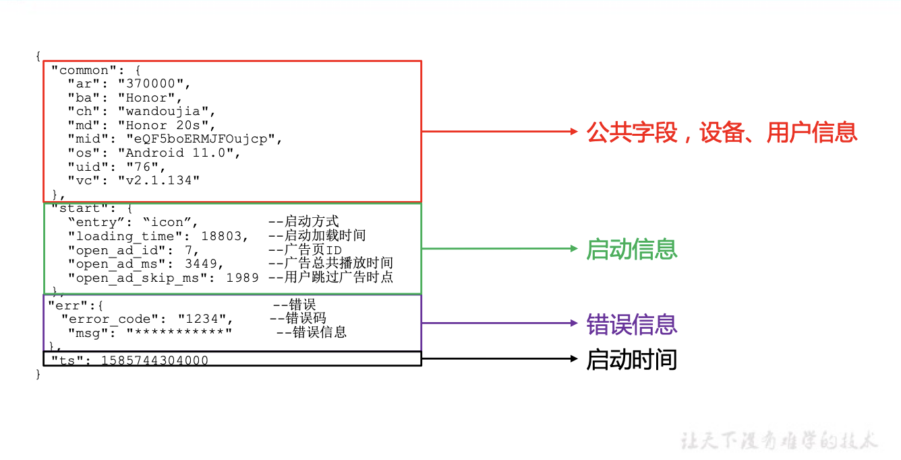

# 数仓理论

# 第1章 数仓分层

## 1.1 为什么要分层  

                                                                                                        

## 1.2 数据集市与数据仓库概念

## 1.3 数仓命名规范

### 1.3.1 表命名

Ø ODS层命名为ods_表名

Ø DWD层命名为dwd_dim/fact_表名

Ø DWS层命名为dws_表名  

Ø DWT层命名为dwt_表名

Ø ADS层命名为ads_表名

Ø 临时表命名为xxx_tmp

Ø 用户行为表，以log为后缀

### 1.3.2 脚本命名

Ø 数据源_to_目标_db/log.sh

Ø 用户行为脚本以log为后缀；业务数据脚本以db为后缀。

### 1.3.3 表字段类型

Ø 数量类型为bigint

Ø 金额类型为decimal(16, 2)，表示：16位有效数字，其中小数部分2位

Ø 字符串(名字，描述信息等)类型为string

Ø 主键外键类型为string

Ø 时间戳类型为bigint

## 2.1 范式理论

### 2.1.1 范式概念

1）定义

范式可以理解为设计一张数据表的表结构，符合的标准级别、规范和要求。

2）优点

采用范式，可以降低数据的冗余性。

为什么要降低数据冗余性？

（1）十几年前，磁盘很贵，为了减少磁盘存储。

（2）以前没有分布式系统，都是单机，只能增加磁盘，磁盘个数也是有限的

（3）一次修改，需要修改多个表，很难保证数据一致性

3）缺点

范式的缺点是获取数据时，需要通过Join拼接出最后的数据。

4）分类

目前业界范式有：第一范式(1NF)、第二范式(2NF)、第三范式(3NF)、巴斯-科德范式(BCNF)、第四范式(4NF)、第五范式(5NF)。 

### 2.1.2 函数依赖

### 2.1.3 三范式区分

## 2.2 关系建模与维度建模

当今的数据处理大致可以分成两大类：联机事务处ansaction processing）、联机分析处理OLAP（On-Line Analytical Processing）。OLTP是传统的关系型数据库的主要应用，主要是基本的、日常的事务处理，例如银行交易。OLAP是数据仓库系统的主要应用，支持复杂的分析操作，侧重决策支持，并且提供直观易懂的查询结果。二者的主要区别对比如下表所示。

| 对比属性 | OLTP                       | OLAP                       |
| -------- | -------------------------- | -------------------------- |
| 读特性   | 每次查询只返回少量记录     | 对大量记录进行汇总         |
| 写特性   | 随机、低延时写入用户的输入 | 批量导入                   |
| 使用场景 | 用户，Java EE项目          | 内部分析师，为决策提供支持 |
| 数据表征 | 最新数据状态               | 随时间变化的历史状态       |
| 数据规模 | GB                         | TB到PB                     |

### 2.2.1 关系建模

关系模型如图所示，严格遵循第三范式（3NF），从图中可以看出，较为松散、零碎，物理表数量多，而数据冗余程度低。由于数据分布于众多的表中，这些数据可以更为灵活地被应用，功能性较强。关系模型主要应用与OLTP系统中，为了保证数据的一致性以及避免冗余，所以大部分业务系统的表都是遵循第三范式的。

### 2.2.2 维度建模

图 维度模型示意图

维度模型如图所示，主要应用于OLAP系统中，通常以某一个事实表为中心进行表的组织，主要面向业务，特征是可能存在数据的冗余，但是能方便的得到数据。

关系模型虽然冗余少，但是在大规模数据，跨表分析统计查询过程中，会造成多表关联，这会大大降低执行效率。所以通常我们采用维度模型建模，把相关各种表整理成两种：事实表和维度表两种。

## 2.3 维度表和事实表（重点）

### 2.3.1 维度表

维度表：一般是对事实的描述信息。每一张维表对应现实世界中的一个对象或者概念。  例如：用户、商品、日期、地区等。

维表的特征：

Ø 维表的范围很宽（具有多个属性、列比较多）

Ø 跟事实表相比，行数相对较小：通常< 10万条

Ø 内容相对固定：编码表

时间维度表：

| 日期ID     | day of week | day of year | 季度 | 节假日 |
| ---------- | ----------- | ----------- | ---- | ------ |
| 2020-01-01 | 2           | 1           | 1    | 元旦   |
| 2020-01-02 | 3           | 2           | 1    | 无     |
| 2020-01-03 | 4           | 3           | 1    | 无     |
| 2020-01-04 | 5           | 4           | 1    | 无     |
| 2020-01-05 | 6           | 5           | 1    | 无     |

### 2.3.2 事实表

事实表中的每行数据代表一个业务事件（下单、支付、退款、评价等）。“事实”这个术语表示的是业务事件的度量值（可统计次数、个数、金额等），例如，2020年5月21日，宋宋老师在京东花了250块钱买了一瓶海狗人参丸。维度表：时间、用户、商品、商家。事实表：250块钱、一瓶

每一个事实表的行包括：具有可加性的数值型的度量值、与维表相连接的外键，通常具有两个和两个以上的外键。

事实表的特征：

Ø 非常的大

Ø 内容相对的窄：列数较少（主要是外键id和度量值）

Ø 经常发生变化，每天会新增加很多。

1）事务型事实表

以每个事务或事件为单位，例如一个销售订单记录，一笔支付记录等，作为事实表里的一行数据。一旦事务被提交，事实表数据被插入，数据就不再进行更改，其更新方式为增量更新。

2）周期型快照事实表

周期型快照事实表中不会保留所有数据，只保留固定时间间隔的数据，例如每天或者每月的销售额，或每月的账户余额等。

例如购物车，有加减商品，随时都有可能变化，但是我们更关心每天结束时这里面有多少商品，方便我们后期统计分析。

3）累积型快照事实表

累计快照事实表用于跟踪业务事实的变化。例如，数据仓库中可能需要累积或者存储订单从下订单开始，到订单商品被打包、运输、和签收的各个业务阶段的时间点数据来跟踪订单声明周期的进展情况。当这个业务过程进行时，事实表的记录也要不断更新。

| 订单id | 用户id | 下单时间 | 打包时间 | 发货时间 | 签收时间 | 订单金额 |
| ------ | ------ | -------- | -------- | -------- | -------- | -------- |
|        |        | 3-8      | 3-8      | 3-9      | 3-10     |          |

## 2.4 维度模型分类

在维度建模的基础上又分为三种模型：星型模型、雪花模型、星座模型。

## 2.5 数据仓库建模（绝对重点）

### 2.5.1 ODS层

1. HDFS用户行为数据
2. HDFS业务数据
3. 针对HDFS上的用户行为数据和业务数据，我们如何规划处理？

- 保持数据原貌不做任何修改，起到备份数据的作用。

- 数据采用压缩，减少磁盘存储空间（例如：原始数据100G，可以压缩到10G左右）

- 创建分区表，防止后续的全表扫描

### 2.5.2 DWD层

DWD层需构建维度模型，一般采用星型模型，呈现的状态一般为星座模型。

维度建模一般按照以下四个步骤：

选择业务过程→声明粒度→确认维度→确认事实

1. 选择业务过程

   在业务系统中，挑选我们感兴趣的业务线，比如下单业务，支付业务，退款业务，物流业务，一条业务线对应一张事实表。

   如果是中小公司，尽量把所有业务过程都选择。

2. 如果是大公司（1000多张表），选择和需求相关的业务线。声明粒度

   数据粒度指数据仓库的数据中保存数据的细化程度或综合程度的级别。

   声明粒度意味着精确定义事实表中的一行数据表示什么，应该尽可能选择最小粒度，以此来应各种各样的需求。

   典型的粒度声明如下：

   订单事实表中一行数据表示的是一个订单中的一个商品项。

   支付事实表中一行数据表示的是一个支付记录。

3. 确定维度

   维度的主要作用是描述业务是事实，主要表示的是“谁，何处，何时”等信息。

   确定维度的原则是：后续需求中是否要分析相关维度的指标。例如，需要统计，什么时间下的订单多，哪个地区下的订单多，哪个用户下的订单多。需要确定的维度就包括：时间维度、地区维度、用户维度。

4. 确定事实

此处的“事实”一词，指的是业务中的度量值（次数、个数、件数、金额，可以进行累加），例如订单金额、下单次数等。

在DWD层，以业务过程为建模驱动，基于每个具体业务过程的特点，构建最细粒度的明细层事实表。事实表可做适当的宽表化处理。

事实表和维度表的关联比较灵活，但是为了应对更复杂的业务需求，可以将能关联上的表尽量关联上。如何判断是否能够关联上呢？在业务表关系图中，只要两张表能通过中间表能够关联上，就说明能关联上。

|            | 时间 | 用户 | 地区 | 商品 | 优惠券 | 活动 | 编码 | 度量值    |
| ---------- | ---- | ---- | ---- | ---- | ------ | ---- | ---- | --------- |
| 订单       | √    | √    | √    |      |        | √    |      | 件数/金额 |
| 订单详情   | √    | √    | √    | √    |        |      |      | 件数/金额 |
| 支付       | √    | √    | √    |      |        |      |      | 金额      |
| 加购       | √    | √    |      | √    |        |      |      | 件数/金额 |
| 收藏       | √    | √    |      | √    |        |      |      | 个数      |
| 评价       | √    | √    |      | √    |        |      |      | 个数      |
| 退款       | √    | √    |      | √    |        |      |      | 件数/金额 |
| 优惠券领用 | √    | √    |      |      | √      |      |      | 个数      |

至此，数据仓库的维度建模已经完毕，DWD层是以业务过程为驱动。

DWS层、DWT层和ADS层都是以需求为驱动，和维度建模已经没有关系了。

DWS和DWT都是建宽表，按照主题去建表。主题相当于观察问题的角度。对应着维度表。

 

### 2.5.3 DWS层与DWT层

DWS层和DWT层统称宽表层，这两层的设计思想大致相同，通过以下案例进行阐述。

1）问题引出：两个需求，统计每个省份订单的个数、统计每个省份订单的总金额

2）处理办法：都是将省份表和订单表进行join，group by省份，然后计算。同样数据被计算了两次，实际上类似的场景还会更多。

​    那怎么设计能避免重复计算呢？

针对上述场景，可以设计一张地区宽表，其主键为地区ID，字段包含为：下单次数、下单金额、支付次数、支付金额等。上述所有指标都统一进行计算，并将结果保存在该宽表中，这样就能有效避免数据的重复计算。

3）总结：

- 需要建哪些宽表：以维度为基准。

- 宽表里面的字段：是站在不同维度的角度去看事实表，重点关注事实表聚合后的度量值。

- DWS和DWT层的区别：DWS层存放的所有主题对象当天的汇总行为，例如每个地区当天的下单次数，下单金额等，DWT层存放的是所有主题对象的累积行为，例如每个地区最近７天（１５天、３０天、６０天）的下单次数、下单金额等。

### 2.5.4 ADS层

​    对电商系统各大主题指标分别进行分析。

# 第3章 数仓搭建-ODS层

1. 保持数据原貌不做任何修改，起到备份数据的作用。
2. 数据采用LZO压缩，减少磁盘存储空间。100G数据可以压缩到10G以内。
3. 创建分区表，防止后续的全表扫描，在企业开发中大量使用分区表。
4. 创建外部表。在企业开发中，除了自己用的临时表，创建内部表外，绝大多数场景都是创建外部表。

# 第4章 数仓搭建-DWD层

1）对用户行为数据解析。

2）对核心数据进行判空过滤。

3）对业务数据采用**维度模型**重新建模。

## 4.1 DWD层（用户行为日志解析）

### 4.1.1 日志格式回顾

（1）页面埋点日志

                               

（2）启动日志

 