# 流批一体的实时数仓 arctic

## Background

随着大数据体系建设的日益完善，业务对数据的需求逐渐从体量化，系统化建设过度到精细化管理和实时性建设，尤其对数据中台已经充分落地的企业客户，业务部门，对数据中台提出的挑战不再是怎样形成方法论，而更加偏向于数据权限，安全，充分发挥和压榨数据的实时性价值这些方面，例如德邦对数据中台的要求是数据延迟在 5 - 15 分钟，云音乐算法部门对数据延迟的要求[[t1\]](#_msocom_1) [[t2\]](#_msocom_2) 在分钟内，券商的技术龙头华泰证券也在积极探索实时数仓和流批一体之路 ，这些企业和部门，在对数据实时性提出要求的同时，也会要求提供充分高的人效，足够低的成本，和数据中台的权限，安全，治理体系高度融合，能够适应未来云原生架构，这篇 proposal 定义了一个场景通用，存算分离，流批一体的实时数仓系统，功能覆盖了通过流计算实时数据摄取，通过批计算数据合并实现分钟级别延迟，通过 merge on read 实现更低级别的读延迟，通过自主分裂功能提供自动扩展，以及通过封装 lambda 架构为业务提供去 lambda 化的，高能效，低成本的实时数据中台。

文章也会简单和初步地说明 arctic 实时数仓的流批一体，湖仓一体和库仓一体的“三体”战略。

## Motivation

目前网易主推的实时数仓选型为 kafka + flink + kudu，kafka 作为流表的存储引擎和传输信道，flink 作为实时计算引擎，kudu 作为最终的数据存储引擎和 AP 引擎。在之前的 [实时数仓白皮书](https://docs.google.com/document/d/1b3S6M3Cy103xG_WEa0v5X7TzNJW9OGG9g1J2tR038sM/edit) 中我详细说明了现有方案存在的一些问题，这里再做个总结。

第一 kudu 作为支持 upsert 的列存引擎，是实时数仓的不二选型，但是在实践过程中，我们遇到了下面的问题：

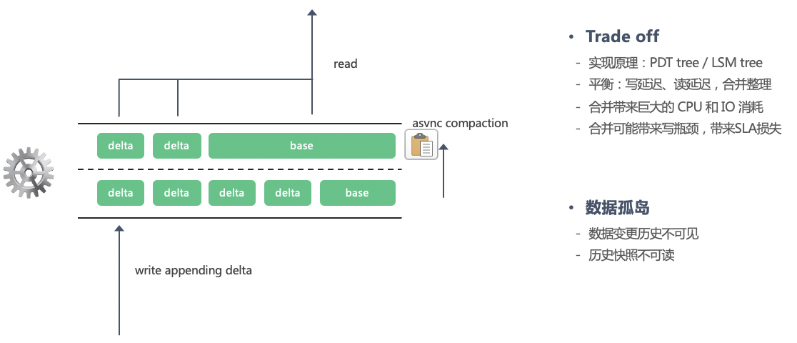

如上图所示，kudu 通过 append 方式写入 upsert，以支持高效和低延迟的写，再通过激进的 compaction 将 base 数据和 delta 数据合并，以支持低延迟的读，否则读过程需要合并一行数据的大量版本，性能上无法接受，kudu 的 PDT 结构本质上是通过 compaction 来平衡写延迟和读延迟，而 kudu 本身定位是 HTAP 系统，读写都需要提供毫秒级读延迟，随着写请求增多，compaction 会带来剧烈的 CPU 和 IO 消耗，表现在线上则是经常有营销活动，性能测试等不可控因素把 kudu 打爆，且因为激进 compaction 带来的写放大问题，带来的成本也急剧上升，而我们必须为一些不可控的因素为 kudu 留下充足的 buffer，就像我们对待数据库一样，再加上 kudu 做不到存算分离，而我们在部署 kudu 时，也无法利用 HDFS 的资源池，这里我想要强调的是高成本问题和 SLA 缓冲能力。最后一点，则是 kudu 在数仓体系中是作为数据孤岛存在，我们无法用 kudu 实现 ODS，DWD 以及 DWS 的实时串联，在实时数仓中，我们必须用 kafka 存储流式数据，最终的表现是流表和批表的不统一，为数据资产，数据质量，数据血缘等领域的批流融合带来了困难。

第二个问题是 kafka 作为流表选型是否合理，kafka 早期的官方定位是大数据 WAL，作为消息中间件，并不适宜保留过长时间数据，云音乐的一些 kafka topic 只设置了保存半天数据，虽然很多场景中我们可以从离线表中恢复数据，但这也给数据治理带了困难。

第三是 flink 在实时数仓中面临的挑战，如面向分层数仓架构下的 exactly-once 保障，小文件治理的需要，对 bucket ingestion 的支持，在实时摄取时更新分区键或主键时怎样保障数据一致性，我们认为，只有将计算引擎和存储引擎做高度适配，才能更好解决这些问题。

为了应对这些挑战，有了 arctic，arctic 是广褒的北极，灵感来自于目前我们看好的 iceberg，iceberg 定义了每张表，或者数据文件为冰山，而 arctic 要做的事情，是用整个北极洲的海洋将冰山串联在一起，海洋为计算，arctic 通过计算能力将 iceberg 运动起来，或将多个冰山合并为一个大岛，或将一个冰山分裂成更新小的山体，对应着 arctic 的自动合并和分裂的功能，arctic 有 governor，能够将整块地域高效治理起来。

在 arctic 之上，提出实时数仓的“三体”战略：

1. 流批一体：做到计算的流批一体，支持 flink，spark 在流批场景下的统一应用，flink 任务也可以用在批计算场景，spark 任务也可以转变为实时任务；做到存储的流批一体，流表和批表共用存储，使用一张表，既可以做批计算，也可以向下游实时推送变更消息，或者查询某个时段内的历史变更；做到[产品的流批一体](https://docs.qq.com/doc/DR3J6QkJ5WW9uR0Vp)，支持数据同步，数据资产，数据血缘，数据质量等模块的流批统一治理。

2. 湖仓一体：通过支持 upsert，做到分钟级别数据延迟，兼容 parquet，orc 等高性能的列存格式，将 95% 以上的数仓 AP 场景保留在数据湖中，尽量少地引入 kudu，clickhouse，druid 等数据孤岛

3. 库仓一体：通过 NDC 的数据库自动入湖功能，实现业务中台和数据中台在数据库上的权限解耦，依赖解耦，做到数据库 DDL 变更自动同步到数据中台的元数据中心，依赖无感知的数据入湖，业务使用数据库同步的 ODS 数据时，体验上与访问数据库相同，且在数据库的访问上做到流批一体：通过 flink 或 spark 既可以定义全量数据上的 SQL，也可以定义流式/增量数据上的 SQL。

## Goals

| 存算分离                                                     | 基于分布式文件系统构建存储层，所有与计算有关的同步和异步任务从存储层抽离，**对 flink，spark，presto  和 impala 等引擎保持开放** |
| ------------------------------------------------------------ | ------------------------------------------------------------ |
| 大体量实时[摄取](https://www.alooma.com/blog/what-is-data-ingestion#:~:text=Data ingestion is a process,%2C CSVs%2C or from streams.) | 支持大体量实时数据摄取，包括但不限于**数据库 CDC，日志，通过实时计算清洗，聚合和打宽后的数据** |
| upsert 与 MVCC                                               | 支持数据 upsert，通过 MVCC 技术解决读写冲突和数据一致性问题，为读服务提供 upsert 下的快照支持，**upsert 性能和成本跑赢开源产品** |
| 数据低延迟                                                   | 考虑到 OLAP 业务属性，分钟级别延迟应为实时数仓的主流需求，毫秒以及秒级延迟当使用数据库，缓存或 kudu 这类定位 HTAP 系统 |
| 文件治理                                                     | 小文件自动合并，避免  namenode 过载和碎片化带来的读延迟，在产品测提供多样化的监控指标和运维功能 |
| 自动伸缩                                                     | 随着业务和数据体量增大，相关的存储结构可以自动扩展，不会因为存量数据产生效率瓶颈或延迟增大，且伸缩过程无需人工干预，自动伸缩的目标要求系统提供类似 hbase 或 tikv 的  auto split 功能 |
| 流批一体                                                     | 批表和流表一体化管理，要求在一张表上提供流式和批式接口，基础设施的流批一体最终服务于产品侧的流批一体：[未来规划](https://docs.qq.com/doc/DR3J6QkJ5WW9uR0Vp) |
| 弹性 SLA                                                     | 在业务陡峰，如双 11 或其他营销活动，通过牺牲数据实时性保障服务可用性，不会像 kudu 一样被轻易打爆，要求系统有极强缓冲能力 |
| 易用依赖少                                                   | 从运维角度讲，希望目标系统部署运维简单，尽量少地引入第三方依赖，方便对外输出，如 mysql，hbase，redis，甚至是 kafka。 |

## Upsert solutions

支持 upsert，是 arctic 相比于业界主流数仓的核心优势，同时我们需要明确无论是 hive3.0 还是 iceberg 近期推出的 row delete 功能，以及功能已经相对完善的 delta，upsert 都不是一个新东西，arctic 与主流社群在 upsert 问题上不存在重叠或冲突，两者甚至可以做到完美互补：通常意义上的 upsert 是指根据泛化条件对已有数据集进行更新或插入，而 arctic 提供面向大体量数据摄取场景下的实时 upsert 能力，前者更加通用，可以覆盖所有业务场景，但是实时性不足，后者可以覆盖 99% 的场景，使用更低的成本，提供更强的吞吐和更低的时延。

为了更好说明 arctic 与各种社区在场景和思路上的差异，以及这些功能存在的价值，我们将数据湖的 upsert 方案演进分为三个阶段。

第一阶段：upsert based on mapreduce

典型代表是 2018 年开始数科为考拉提供的准实时同步 hive 功能，如下图所示：

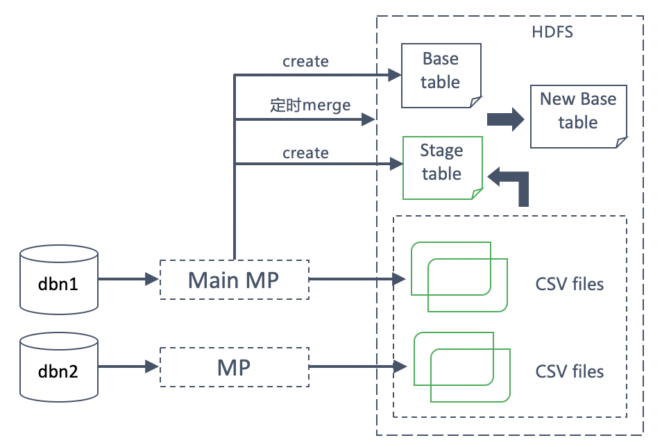

核心思路是通过 NDC 的数据同步将 DDB 或 mysql binlog 实时传输到 hive 增量表中，再定时调度一个 mapreduce 任务执行 base 表和 stage（增量）表的合并，stage 表本身也可以作为一个数仓表使用，表中除了业务字段外，还会记录数据操作类型，操作时间。

这个实现方案优势在于既实现了 upsert，也实现了基本流表功能，NDC 同步的增量表可以作为流表由下游消费，与 base 表和增量表统一管理的思路构成了流批一体的雏形，另外这套方案集成了杭研的运维平台，可以通过工单一键同步，实现了在线团队和数据团队的权限解耦。劣势也显而易见，NDC 合并使用的 mr 任务（或 spark任务）性能差，消耗多，所有数据都要经过两次读写和 shuffle。

这套方案 benchmark 使用考拉订单表，一亿行 base 表一千万 stage 表，三个物理节点可以用 10 分钟完成合并，但最终落地大部分任务配置小时级别合并，提供小时级别的实时性。

第二个阶段：based on effective pruning

hive3.0，deltalake，iceberg 在 upsert 的设计上基本思路一致，以 iceberg 为例，iceberg 将 update 转化为 delete + insert 两步操作，insert 是表中添加 insertion file，这是 iceberg 已经具备的功能，那么 upsert 欠缺的只有行级别的 delete 功能，在 iceberg 10月发布的 v0.9.1 还未发布这项功能，从设计文档到现在已经有一年多，目前由 netflix，cloudera 工程师主导，腾讯阿里参与，设计文档参考：[merge on read for iceberg](https://docs.google.com/document/d/1FMKh_SQ6xSUUmoCA8LerTkzIxDUN5JbStQp5Hzot4eo/edit#heading=h.p74qmh3a6ets)，[MERGE INTO 设计](https://docs.google.com/document/d/1W1niaD0X5jV7r5uIp380ZfTW8sL5fL2fy176aoaHCj8/edit)，这里有必要说明一下 merge on read 与 row delete 关系，merge on read 的含义使用 append 方式定义 row delete，并且在读时将 delete 文件与数据文件合并，形成正确的视图，merge on read 解释了 row delete 的高效性，因为在 delete 时没有发生文件 overwrite。如下图所示，每个操作构成了独立的快照，deletion file 落在不同的快照中：

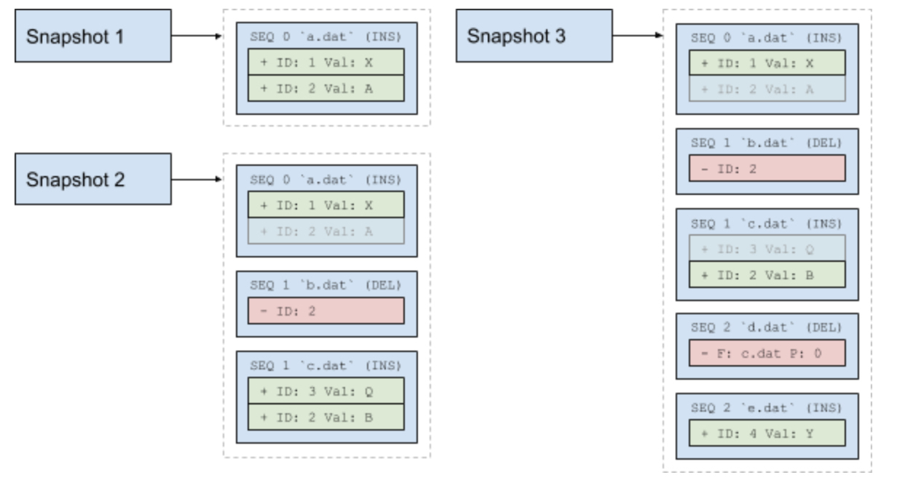

iceberg delete 功能又分为 positional delete 和 value delete，前者要求删除时找到要删除数据所在的文件和位置，在 deletion 文件中记录下数据位置以标记删除，后者只在 deletion 文件中记录要删除的条件，在 merge 时才去 scan 数据，iceberg upsert 高效性体现在 scan 数据时高效的剪枝（prune[[t3\]](#_msocom_3) ）能力。

Delta 提供面向复杂条件的 SQL 和 API，参考 [deltalake doc](https://docs.databricks.com/delta/delta-update.html)，deltalake 实现 upsert 原理是在 spark 中先 scan 数据找到更新或删除的数据所在文件，在操作所处的事务日志中标记文件被删除，并将更新后的文件落盘，在事务日志中记录新增文件，下面这张图很好地解释了 deltalake delete 过程：

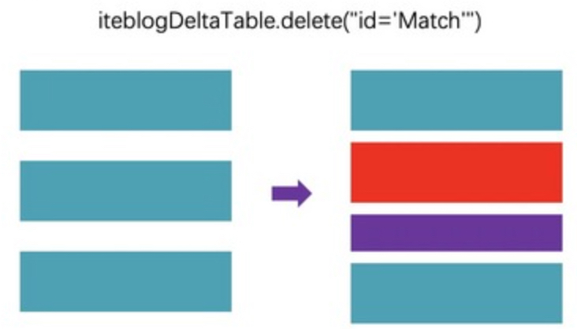

原图和讲解参考 [delta-lake-delete-implementation](https://developpaper.com/delta-lake-delete-implementation/)，红色部分为标记删除，紫色部分是 match 数据删除后的文件，该文件以 add 方式记录在这个操作所在的 transaction log 中。

相比 iceberg，delta 成熟度高很多，iceberg 的 MERGE INTO 功能还处于孵化阶段，离真正实现可能还很远，SQL功能更加遥不可及，而 delta lake 已经在 SQL 和 API 上同时支持了 merge 语法，比如通过下面的 SQL 可以实现两张表的合并：

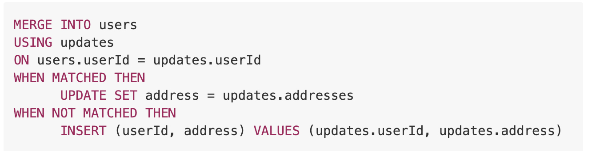

我们可以直接使用 delta 的 merge 语法实现增量表和全量表的合并，如果 NDC 支持同步 delta lake，可以直接用这套 merge 功能实现更加高效的合并，与传统 MR 任务相比，delta 的 merge SQL 性能优势体现在可以将较少的数据量广播到大表算子中。在增量表小，存量数据体量很大的情况下，可以带来可观的性能提升。值得一提的是，使用计算引擎实现没有 shuffle 的 merge 需要上层做很多事情，下图很好说明了这一点（[原文链接](https://databricks.com/blog/2019/03/19/efficient-upserts-into-data-lakes-databricks-delta.html)）：

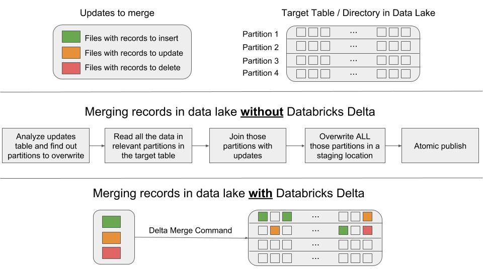

论成熟度，delta 远超 iceberg，但是 delta 作为 databricks 的商业化产品，开放度比 iceberg 低很多，对 flink 不友好，两者对大体量数据实时摄取支持都很弱，**在 upsert 功能上**没有流批一体，上层依然要自己实现增量表和全量表的分离，再通过 merge 的方式将增量数据 upsert 到全量数据中，而 merge 的性能尽管得到了大幅提升，依然会给数据带来延迟。

hive 3.0 和 deltalake 是高度类似，相比 hive2，hive 引入了 ACID，MVCC，事务等功能，在完成度上可以与 delta 对标，参考 [hive 3.0 介绍](https://www.slideshare.net/Hadoop_Summit/what-is-new-in-apache-hive-30)，然而 hive 3.0 的 upsert 同样对数据实时摄取，流批一体，数据延迟上有所不足。

三者在实现思路上的共性在于，都通过写增量来更新或删除数据，并且都有事务，MVCC，原生 merge 支持（iceberg还未实现），都足够通用，支持复杂条件。iceberg 比较纯粹，定位是 table format，对各种计算引擎更加开放，易于集成，delta 和 hive 3.0 更加成熟，但是生态更加封闭，使用成本较高。

三者的共性问题都在于数据实时摄取时，不能使用原生的 upsert 功能对表更新，否则 scan 数据带来的延迟会导致数据不断堆积，没有实时性保障（iceberg 的 value deletion 和 merge on read 可以保障实时性，在 roadmap 我们再讨论），而数据实时摄取，是我们在业务上面临的主要挑战，保守说可以覆盖 99% 以上的业务场景，剩下 1% 的场景集中于日志数据订正，欧盟隐私保护法（[GDPR](https://en.wikipedia.org/wiki/General_Data_Protection_Regulation)，国内不生效，欧洲国家强需求，也是 delta，hive3，iceberg 重点强调的业务场景）。为此我们也需要考虑，在实时摄取场景下，不需要对复杂条件的支持，在牺牲掉这个特性后，我们能否换来更低的延迟，更低的成本以及更高的性能，再加上流批一体，文件治理，自动伸缩三大目标，这些问题共同引导我们进入了 arctic upsert 方案。

## Arctic design

arctic 首先要解决的是面向主键的 upsert 问题

典型的 [数据摄取](https://www.quora.com/What-is-the-difference-between-Data-ingestion-and-ETL) 场景，如数据库 CDC，日志传输，数据清洗，打宽，聚合，这些过程的共性之处在于数据进入目标端时具备完整的结构，而这些增量摄取的数据与存量数据关联，需要判断数据唯一性的标准，这就是主键，我们说数据摄取可以覆盖 99% 的应用场景，原因在于无论是实时数仓换是离线数仓，我们总是要求数仓的数据与线上数据保持一致，而很少有对数仓数据做独立修改。

在上文中，我们讨论了 delta，iceberg，hive3.0 在实时摄取，流批一体，数据延迟上的不足，第三阶段的 arctic 是为大体量的实时数据摄取而生，无论是 upsert 场景还是 append 场景，批表和流表都共用一个表，向不同的场景提供流和批 API，与 iceberg 定位 table format 明显不同的是，arctic 在 iceberg 基础上，既定义了流批一体的 format，也提供了治理相关的服务，如文件合并，各类 metrics 展示，人工治理等，我们通过下图说明 arctic 的核心原理：

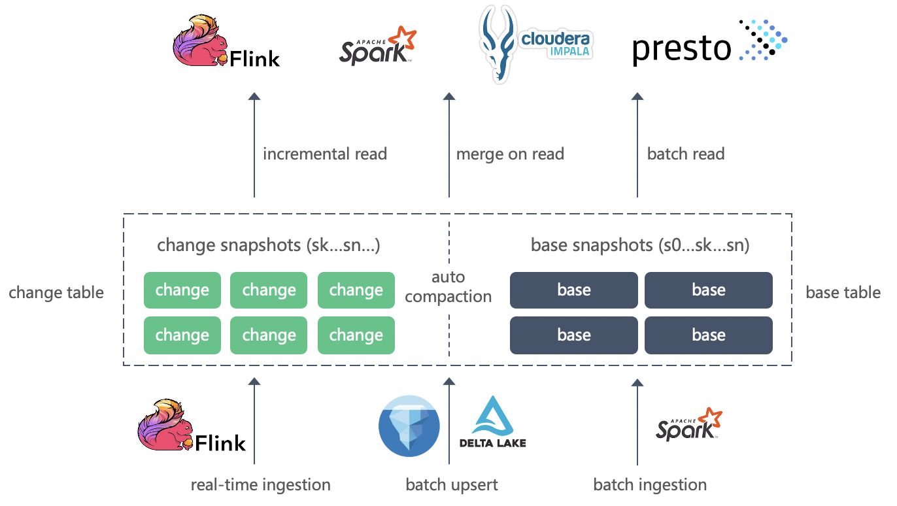

arctic 将表空间分为两层，上层为 change table，记录了表在多次提交（事务）中的变更历史，类似于 mysql binlog，数据通过 flink/spark streaming 实时摄取直接进入 change table，相比下层的 base table，change table 附加了 _action 和 _ts 列表示数据变更类型和进入时间戳，以订单表为例，base table 和 change table 的区别如下图所示：

*增加了类型，时间戳信息，图暂略*

change table 既是批表的变更历史，也是流批一体中的流表载体，下游通过增量消费 change table 可实现流表之间的串联，例如在离线数仓中，我们通过 workflow 定期订单表和一些维度表生成物流表，在实时数仓中，可以通过实时计算将订单表的 change table 实时关联维度表生成物流表，hudi 将这个过程定义为 [incremental pull](https://hudi.apache.org/docs/0.5.0-querying_data.html#incremental-pulling)，在这里 change table 和目前 kafka 作为流表使用的原理一致。

base table 是批表，存储存量数据，对应离线表，可以由离线任务消费，通常情况下由 arctic 治理服务将 change table 在一定时延内合并到 base table 以实现 upsert，少数情况下，也可以由传统的离线任务通过 insert overwrite 覆盖存量数据，例如对以天为单位的 partition 完整覆盖，实时摄取和离线覆盖两条链路相辅相成，构成了业界知名的 [lambda 架构](https://en.wikipedia.org/wiki/Lambda_architecture)，由于 arctic 的流批一体隐藏了 labmda 设计，对业务来说，可以实现一套去 lambda 的数仓系统。

除了流式读取和批量读取外，arctic 提供 merge on read 功能，以将 change table 最新变更实时展示在读取视图中，进一步改善通过 compaction 更新批表带来的延迟（delta 方式），例如我们将实时摄取任务设为 1 分钟提交一次，5 分钟合并一次，merge on read 带来的数据延迟是 1 分钟，compaction 带来的延迟是 5 分钟以上。

arctic 的设计围绕实时 ingestion 产生的 change table，以此实现 upsert，流批一体，lambda 架构，merge on read 等，而 delta, iceberg, hive3.0 解决的是面向条件的 upsert，后者通用，前者可以根据 change table 和 base table 优化以提供实时摄取，数据低延迟，高性能合并等特性，以数据库作为参照，arctic 的 upsert 相当于通过 redo log 恢复数据库，delta 等系统是通过 SQL 更新数据库。arctic 不限制 change table 和 base table 的存储引擎，意味着 arctic 可以与 delta，iceberg，hive3.0 做增量集成，以 iceberg 为例，可以同时对 change table 和 base table 做面向条件的 upsert，这样 arctic 也具备了 iceberg 的 upsert 功能，当然，为了更好的兼容，arctic 也可以与 hive 集成。

在性能上，arctic 通过文件索引支持更高性能的 merge，包括异步 compaction 和 merge on read，通过文件自动分裂实现体量的自伸缩。另外，arctic 是个天然存算分离的架构，数据摄取只消耗 DFS 的 IO，可以通过降级 compaction 和数据延迟达到缓冲和高 SLA 的目标。

在定位上，arctic 与 [hudi](https://hudi.apache.org/) 存在一定重叠，hudi 也是流批一体的数仓系统，提供 incremental pull，upsert，compaction，merge on read 等功能，我们主要考虑：

1. hudi 生态不开放，代码与 spark 绑死，支持 flink 相当于做一遍整体的项目重构，虽然社区有 PR，但是推进缓慢，落地风险不可控

2. hudi 依赖第三方索引来实现高性能摄取与合并，目前有 bloom index 和 hbase index，使用 spark 微批方式摄取，bloom index 在实时数据离散分布的情况下，可以造成被打穿的情况，[[t4\]](#_msocom_4) [[t5\]](#_msocom_5) 实时性打折扣，hbase 需要独立部署运维，给 ingestion 带来性能和可用性风险，且 hudi 的 key 到文件的索引不能变化，无法伸缩，对热点问题无解，arctic 的文件索引更加轻量，ingestion 事件驱动，不引入第三方依赖，且支持自动分裂，可以实现热点均衡

3. 业界对 hudi 的定位与 delta，iceberg 平级，我们对 arctic 定位在更上层，可以与 delta，iceberg 集成

4. hudi 的 API 和接口设计对目前的产品集成不友好

相比阿里实时数仓 hologres，holo 支持 servering 和毫秒级数据延迟，功能上等价于 hbase + kudu，然目前设计 arctic 的 merge on read 只支持分钟级别，但如果我们将消息队列也引入 merge on read，理论上可以实现毫秒级别的实时数仓，跟hologres的实时能力对标，arctic 比 hologres 多的是，可以通过 WAL（消息队列）或增量回放实现上下游的串联，实现实时任务的 workflow，通过串联和产品端创新，我们也可以做到类似 hologres 的 HSAP 效果，如下图所示：

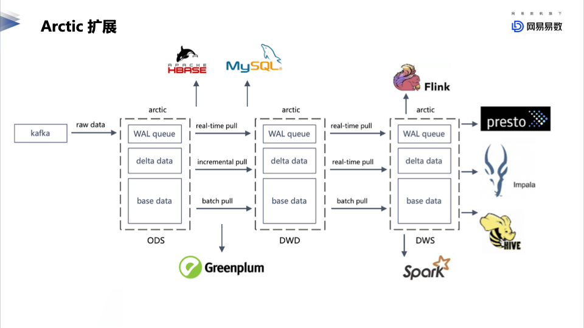

总结来说，arctic 是一个流批一体的存储范式，类似于分库分表是一种分布式数据库的范式一样，arctic 管理了存量表和流表（增量表）以及两者的版本映射关系，并且支持存量表和流表的 merge on read 和动态 compaction，存量表和流表又可以存储在 iceberg，deltalake，hive 等不同选型的数据湖中，arctic 的定位是在数据湖之上，产品之下，支持使用异构数据湖或kv实现实时数仓（用 kv 存储 changedata）

## concept of keys

在数据湖选型中，例如 hive，iceberg，partition key 决定数据的分布方式：相同的 partition 在一个文件目录下，换言之，不同 partition 的数据不能存储在一个文件中。哪些数据存储在一个文件，数据怎么排列，以及文件与目录的关系，这些我们统一称之为数据 layout。

除了 partition key 之外，arctic 还可以定义 primary key 和 sort key，为了保障 compaction 和 merge on read 的高性能，我们也同样要求根据 primary key 和 sort key 定义数据的 layout， 在 file index section 中，我们会知道主键决定了数据的分组，也就是通过主键映射到 arctic node 上，sort key 决定了 arctic node 内的数据分布和文件排列，而 arctic node，又是一个 partition 下的结构，每个 partition 都相当于一颗由许多 arctic node 构成的 arctic tree。

partition key，primary key，sort key 共同构成了 arctic 数据 layout 的三层结构。

### partition key

[[t6\]](#_msocom_6) [[t7\]](#_msocom_7) 需要注意的是，对有 upsert 需求的摄取场景，change table 和 base table 共用一套 key def，也就是说，如果一张表定义一小时为一个分区，那么这张表的 change table 和 base table 都会按小时进行分区，change(delta) table 和 base table 的 layout 如下图所示：

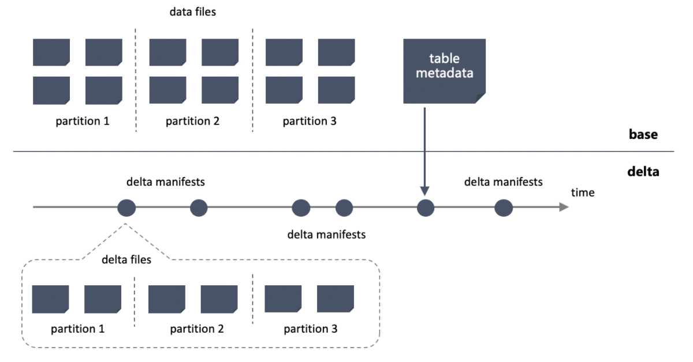

change table 每次提交会记录独立的 manifest 文件，所有的 change manifest 构成 change table 的元数据，下游可以通过 arctic 的 incremental read 接口读取 change manifest 以消费 change table，base table 也有 base manifest，对不同的存储引擎，base manifest 会不同，比如 hive 是用 hive metastore，iceberg 是用 iceberg manifest。最后，我们通过一个自定义的 arctic table metadata 记录了 base table 和 change table 之间的版本关系。

### Primary key

对有 upsert 需求的摄取场景，change table 与 base table 的通过字段连接关联，如果用 SQL 构建合并任务，会是一个在一组字段上 join 的内连接，为了保证 change 数据和 base 数据是多对一关联，关联的字段在 base 表中必须具备唯一性，这组字段在逻辑上构成了主键，在这篇 [proposal: dealing mutable data with primary key in iceberg](https://docs.google.com/document/d/1FlTTJTiCMKMCapJBE7iOaEm13QlkSQdSfIGSfm34tXA/edit#heading=h.sacoxkvxif0) 我论述了不同场景下主键作为 ingestion upsert 的充要条件。

arctic 要求为不同的存储引擎适配主键声明，例如 hive ddl 中有主键声明，arctic 可以直接拿来用，hive 的主键不会对数据做实际约束，由 spark 或 hive 任务写表时的逻辑保障，主键的定义只是方便查询优化，arctic 则会通过 compaction 和 merge on read 保障主键的唯一性约束。iceberg 类似，也会通过 API 和 DDL 的方式声明主键。

主键可以作为文件分组的依据，因为不同的主键必然指向不同数据，按主键哈希得到的文件分组，每组文件 merge 可以并发执行，相比传统 MR 效率有极大提升，分组本质是将 shuffle 提前到了 ingestion 过程，[proposal: merge and compaction for arctic](https://docs.qq.com/doc/DR3JNb3RYcW9xQkZW)这篇 proposal 中我论述了文件组可以带来的提升，通过下图可以对 scan 操作做简单量化：

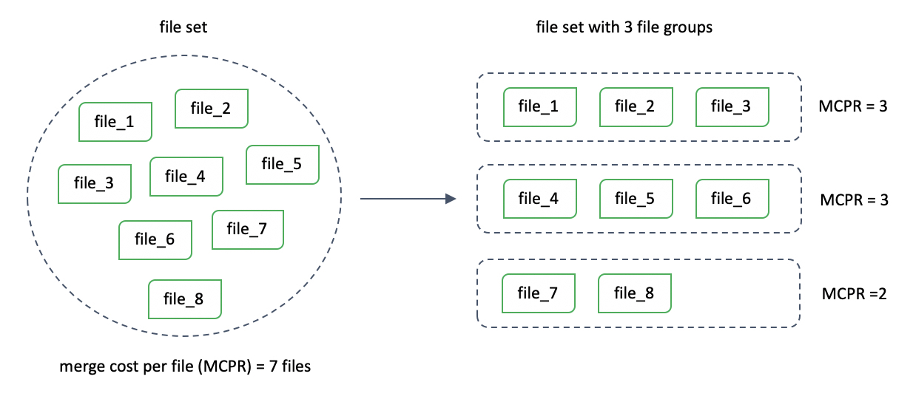文件分组依赖主键，过程可以用下面的公式定义：

group_id(row) = index(pk)

这里就引入了文件索引的需要，hudi 中也用到了 key（hoodie key不是全局唯一，而是partition 内唯一） 和文件索引，索引目前两种实现： bloom index 和 hbase index，hbase index 保存了 key 到 file 的映射关系。bloom index 使用批量提交的方式，遍历每批数据的 key 在不在各个文件中，有误判的概率，误判的情况下要把文件全部读入做二次判断。

### Sort key

arctic 要支持排序键，排序键，主键以及排序遵照下面的规则：

1. 不设置排序键，group 内文件之间按主键排序，文件内不排序

2. 设置排序键，group 内文件之间和文件内都按排序键排序

排序键的作用有两个，第一是通过文件之间的排序实现 ingestion，compaction 和 query 的剪枝，第二是通过文件内排序支持谓词下推，如 sort key + parquet，两者共同作用下，为排序键上的查询和连接提供高性能保障。

以德邦的运单表为例，德邦所有表单几乎都以运单 ID，创建时间作为主键，创建时间是个典型呈现 range 分布的字段，适合做排序键，且 ingestion 的数据在创建时间上呈热点分布（如 7 天以内），对 compaction prune 和按时间做分析的 AP 业务非常友好，时间字段在数仓中作排序键的场景较多，这是一个典型的排序键是主键或者主键一部分的 case，既能满足高效查询需求也能满足高效 compaction。

还有一种 case 是主键和排序键有不重叠的字段，比如订单表，主键为订单ID，表中有一个状态字段来标记订单状态，标记已完成的订单在业务侧永远不会被更新，从剪枝效率讲，使用状态做排序键会更有效率，排序键的根本目的是面向查询的冷热分离，在这个驱动下，主键和排序键发生不重叠的情况可能发生，在主键和排序键不重叠的情况下，change file 和 base file 的相交性判断会变得复杂，因为相交性既要考虑主键唯一性，按照主键 range 判断相交，也要考虑按排序键输出，按照排序键判断相交，两个相交集合的并集为一个相交文件组。相交性的判断会影响合并效率，这部分内容我们在 compaction 章节中详细讨论。

hive 对 sort key 的定义方法如所示，与主键一样，hive 的 sort key 没有实际约束，只是为查询优化提供依据，排序约束通过计算引擎生产数据时保障。

```
CREATE TABLE page_view(viewTime INT, userid BIGINT,
     page_url STRING, referrer_url STRING,
     ip STRING COMMENT 'IP Address of the User')
 COMMENT 'This is the page view table'
 PARTITIONED BY(dt STRING, country STRING)
 CLUSTERED BY(userid) SORTED BY(viewTime) INTO 32 BUCKETS

```

iceberg 也有 sort key 的 [API PR](https://github.com/apache/iceberg/pull/1373) 和 [实现 PR](https://github.com/apache/iceberg/pull/589)，API 已经合并，实现推进缓慢，iceberg 的 sort key 与 hive 一样由计算引擎来保障排序，不过 iceberg 的 sort key（又叫 sort order）支持动态 evolve，无论 hive 还是 iceberg 的 sort key，定位在上层的 arctic 都可以去兼容。

## File index

所有支持可持久化的存储系统，索引都可以分为文件内索引和文件索引，文件索引解决的是 key 到文件的检索，件内索引解决的是文件内按 key 检索，比如 mysql 选择独立表空间，每个表是一个或多个索引文件，件内索引结果是 B+ 树，如果在 mysql 之上架了 DDB，那么 DDB 的分区规则就是文件索引，比如 hbase 的点查，首先通过 master 得到 key 所在的 region，再在 region server 上检索，key 到 region 是件外索引，region 内再通过 bloom filter 和其他索引结构检索，是件内索引。

arctic 的定位是分钟级别延迟以及流批一体的实时数仓，点查和随机查询目前不是 arctic 要考虑的目标，这并不意味着 arctic 没有件内索引，如果使用 parquet 作为文件存储格式，则可以使用 parquet 内置的一些支持谓词下推的索引结构（当然这也不是为了点查而生）。

arctic 中文件索引的作用是将数据按主键打散到不同分组中，每组可并发执行 compaction，按主键的查询，join等，arctic 的文件索引采用两级结构，分别对应 hash 分组和 range 分组，在这里，**我们将 hash 分组的概念衍生为节点，一个哈希分组对应一个 arctic node，下文提到的分组概念，如无特别标注，都是特指哈希分组**。

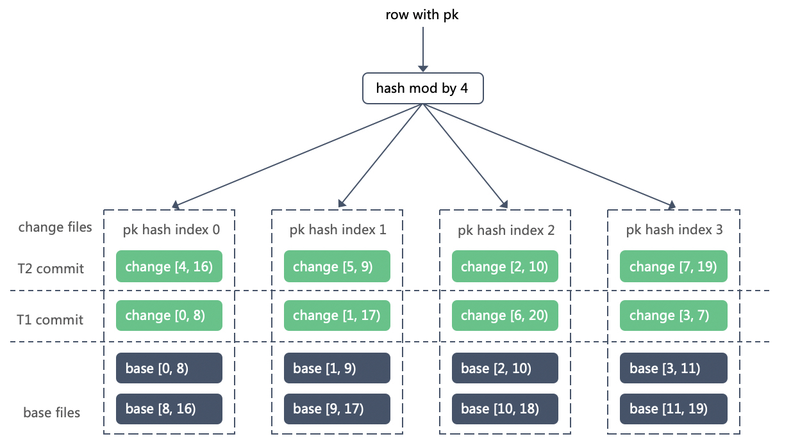

如上图所示，第一级哈希索引，哈希模 4，产生了 4 个 arctic node，每个 node 内的主键不相交，compaction 可以并发执行，在node 内，每个文件记录最小键和最大键，如果表设置了排序键，则记录排序键，没有则使用主键，我们用 [min_key, max_key) 标记一个文件的 key range，每个 node 内 base file range 不相交，change file 的 range 由摄取决定，可以相交，key range 是 arctic 第二级文件索引。

第一级 hash index 的作用体现在：

1. 分组节点数等同于 ingestion 和 compaction 的最小并发度，如果没有按主键分组，为了保障相同主键的更改顺序一致，理论上只能有一个并发执行 ingestion 和 compaction

2. 主键按哈希分组，与数仓表中的 bucket 作用等同，可以复用 hive 中 cluster by 和 iceberg 中 bucket partition 的概念，对按主键查询，join 带来性能上的收益。

第二级 range index 的作用体现在 ingestion，compaction 和 query 按 range 剪枝。

## Auto split

文件索引和自动分裂是 arctic 对比竞品的核心优势。要理解自动分裂，首先要明确 arctic 自动伸缩的目标：：

1. 在业务初期，体量有限，我们一般会选择较少的分组，以避免 change file 过于碎片化，随着业务体量的上升，在原有的分组下， 每次提交的 change file 会逐渐增大，当超出内存阈值后，由于要引入本地IO，外排等机制，compaction 性能急剧下降，这时候需要我们将分组扩展，扩展后第一可以让 compaction 使用更高并发，第二控制组内每次提交 change file 量在内存阈值内，以障 compaction，merge on read 效率以及数据延迟，在这里，控制分组规模以规避 change file 碎片化，以及提高分组和并发突破性能瓶颈，都是为了更高效的 ingestion，compaction 以及 query。

2. 在数仓表有 sort key 的情况下，业务期望通过 sort key 可以对 query 执行高效剪枝，随着单个文件的增大，在不引入文件碎片的前提下，有理由期望按 range 将文件分裂成多个文件，实现文件级别更快的剪枝。

3. 从文件治理角度讲，期望文件尽量与分布式块边缘对齐，减少文件碎片和元数据压力。

对第一个场景，需要我们在一级索引上按照哈希规则将文件分裂，我们称之为 hash split，第二个场景按照 range 分裂，为 range split，第三个场景可以使用 hash split 或 range split。

range split 方案容易理解：range split 的前提是有 sort key，文件内数据有序，可以直接按序输出原文件一半数据量到单独文件中，即可保障分裂后的文件依然满足 range index 约束。在没有 sort key 的前提下，range split 要引入排序代价，不是一个好选择，range split 的过程如下图所示：

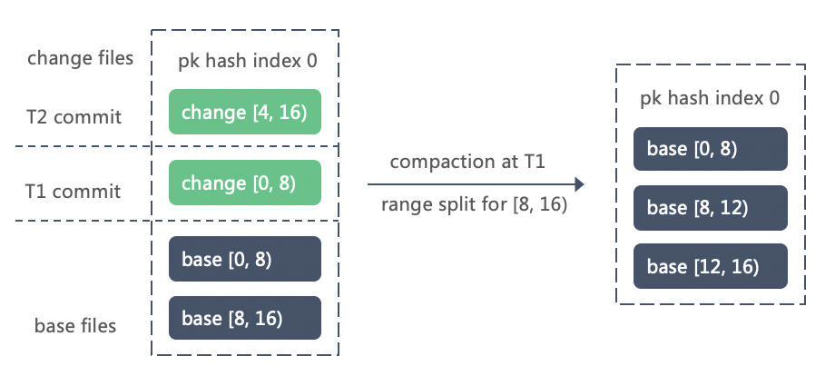

hash split 是将一个 arctic node 中的数据，重新打散到 2 个子节点中，将 index = 0 的节点分裂的过程如下图所示，分裂之后，哈希规则从 mod 4 变为了 mod 8，hash split 遵循一致性哈希的原则，当前节点的分裂不会影响其他节点数据：

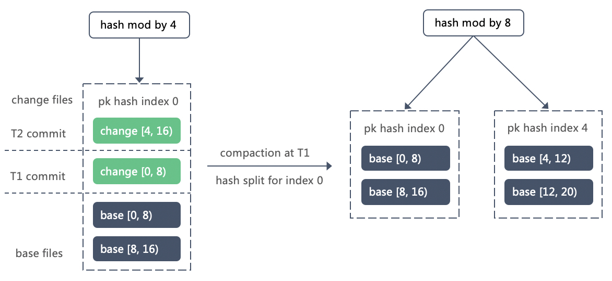

每个节点的 hash split，可以看做一个二叉树节点的向下派生，我们在初始的哈希分组之上补全父节点，则可以得到一个理论上可以派生到每个叶子节点为一个独立哈希值的二叉树。我们将这个二叉树称之为 arctic tree，每个 arctic node 都是独立分组。在[merge for arctic](https://docs.qq.com/doc/DR3JNb3RYcW9xQkZW) 这篇设计中，我更详细的描述了 arctic tree 的特性和原理。

在 2000 年 berkelay 发表的一篇 [论文](https://people.eecs.berkeley.edu/~culler/papers/dds.pdf) 中，通过位运算的方式对 arctic tree 和 hash split 做出了描述，如下图所示：

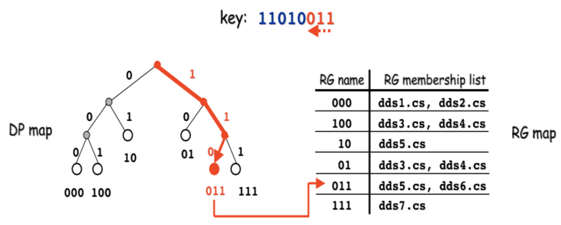

按照论文的思路，我们可以用（mask，index）的二元组来标记一行数据所在的哈希分组，或者说 arctic node，其中：index = hash(pk) & mask，在 arctic tree 中，直系亲属节点有相交关系，非直系无相交。

明白了怎样分裂，下面的问题是触发分裂的时机，目前我们主要考虑两点：

1. 实时摄取过程中，单节点内 change data 量骤增，根据是否有 sort key 触发 range split 或 hash split

2. 在 compaction plan 时，根据文件组数据量预估输出时是否需要 range split 或 hash split

在 ingestion 和 compaction section 中会分别讲到触发分裂的过程。

hudi 的文件索引不具备自动伸缩的功能。

## Ingestion

arctic 的数据分为实时摄取和批量摄取，实时摄取是使用 flink 或 spark streaming 任务将增量数据实时写入 change table，批量摄取则是用传统离线数仓的方案将数据写入 base table，这里还要区分表是否有主键，对无主键的表，upsert 都是 insert，没有 change table，arctic compaction 承担小文件合并的功能。

### none pk ingestion

对没有主键的表，实时摄取和批量摄取可以用社区已有的功能，比如 flink hive connector，spark hive sink，flink iceberg connector，spark iceberg sink。

但是社区没有小文件合并的功能，这块属于上层建筑的范畴，arctic 会遵照通用的架构模式解决小文件合并问题，小文件合并遵循三个原则：

1. 异步执行，并通过事务功能执行存量文件 overwrite，保障 ACID

2. 主动触发，compaction service 提供 http 接口，可以由 rea-time ingestion 的 commit 算子主动触发合并，主动触发意味着更强的实时性，更及时的 metrics。

3. 被动触发，compaction service 监控表体量变化，需要的时候被动触发小文件合并

### real-time ingestion

这里我们只考虑有主键的场景。

实时摄取是使用实时计算引擎将线上的日志数据，数据库增量数据实时导入表中，形成流表，又称动态表，实时摄取是向 change table append 数据的过程。

由基于主键的 hash index 特性可知，非直系亲属的 arctic node 在数据上不相交，在使用计算引擎做并发摄取时，我们可以利用 arctic 的这一特性，让不同的 subtask 在不相交的 node 上执行摄取，保障数据一致性。

假设我们现在有表，在 arctic tree 上的分布如下图所示（虚线部分表示没数据）：

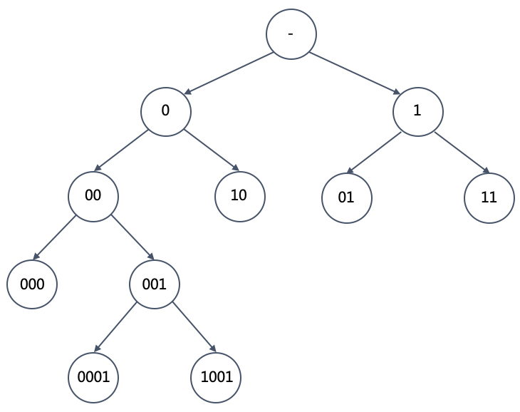

在 ingestion plan 时，为了确保数据一致，除了每个 subtask 摄取的 node 不能构成直系亲属关系，还必须要求所有 subtask node 累加起来，通过向上或向下回溯可以覆盖树中的完整一层，以保障没有 node 的数据被遗漏。

如上中的 layout，假设我们用 4 个并发的 flink 任务执行摄取，首先可以直观地想到将 4 个 subtask 映射到第三层的 4 个节点 00，10，01，11 上，这四个节点是同层的兄弟节点，且累加在一起覆盖了 arctic tree 中的第三层，没有数据遗漏。flink 摄取过程如下图所示：

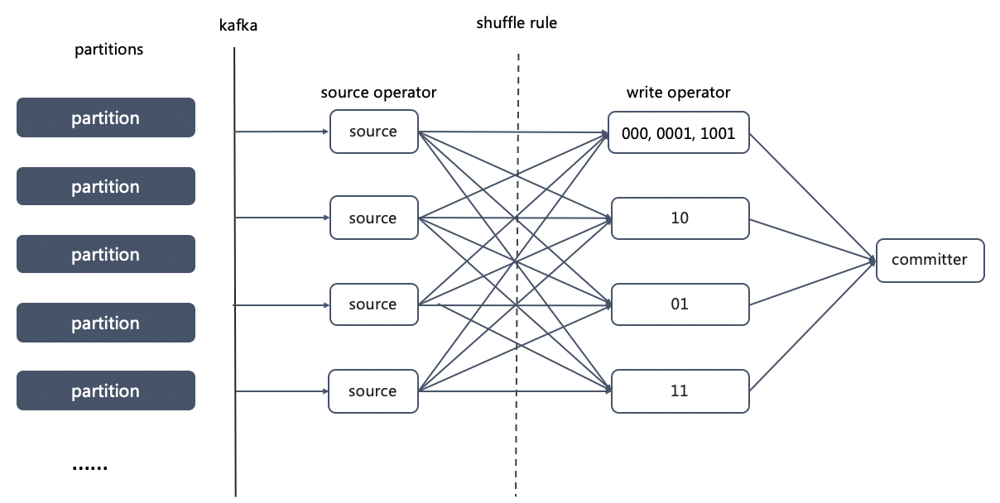

需要说明的是，在 arctic 的 writer 算子选择一个 node 执行 ingestion，不仅负责这个节点内的数据摄取，还要负责这个节点下所有子节点的摄取任务，所以严格来说，每个 subtask 执行的是一个或多个节点的 subtree ingestion。

arctic 的 flink sink 先通过 shuffle 算子，按照主键将数据打散到负责不同 subtree ingestion 的 writer 算子中，各个 writer 算子在执行 checpoint 之前当前事务要提交的文件下发给单并发的 commiter 算子，由 commiter 算子通过两阶段协议保障提交的原子性。

ingestion plan 首先要解决的是节点的分配问题，原则上建议业务设置并发选择 2 的指数，这样可以直接将 arctic tree 对应某层上的各个节点指派给单一 subtask，这样带来的后果是并发越低，数据约容易不均衡，在 [merge design for arctic](https://docs.qq.com/doc/DR3JNb3RYcW9xQkZW)我们讨论了一种有权重的分配计划，短期内我们可以设置 ingestion plan 的最小层数，这样一个 subtask 会负责多个 subtree 的 ingestion，以此让流量在并发之间均衡。

第二要考虑的问题，是在 ingestion 过程中的自主分裂，在通常情况下，每个 subtask writer 会在各个 arctic node 内持续写文件，在 checkpoint 时触发文件切换，但是当单次事务中进入 node 的数据量过大，则应该触发 change file 的自动分裂，以实现自动伸缩的目标。

change file 的分裂，作用是将单个 compaction 的 subtask 所需要遍历的 change data 控制在一定阈值内，因为一个文件组的 change data 过大，需要引入外排或磁盘交换，为此 change data 的分裂一般以 hash split 为主，当表中设置了 sort key，且 ingestion 过程 key 呈明确的增长分布，则可以考虑 range split，range split 只需要在 change file 增大到一定程度主动切换即可，hash split 需要由 subtask 异步执行或交由 minor compaction 来完成。

分裂本质上是碎片化与 merge 效率之间的 trade off，分裂过多，文件碎片化严重，query 和 compaction 效率下降，在数据量剧增，单个 node 内 change data 过大，会给 compaction 性能和数据延迟带来巨大损失。因此该伸该缩，原则上应该有一套代价模型和对应的参数体系来考量。

### batch ingestion

batch ingestion 是使用批计算的方式生成或覆盖表中的 base data，由于 arctic 具有自己的文件索引机制， batch ingestion 的过程需要遵照这套框架，并且在数据落地后生成相应索引信息。

具体来说，我们需要分别实现 spark arctic writer，hive arctic sink，presto arctic sink 以及 impala sink，在这些算子中，通过 shuffle 将数据按照主键打散到相应 arctic node 中，并记录元数据。如下图所示：

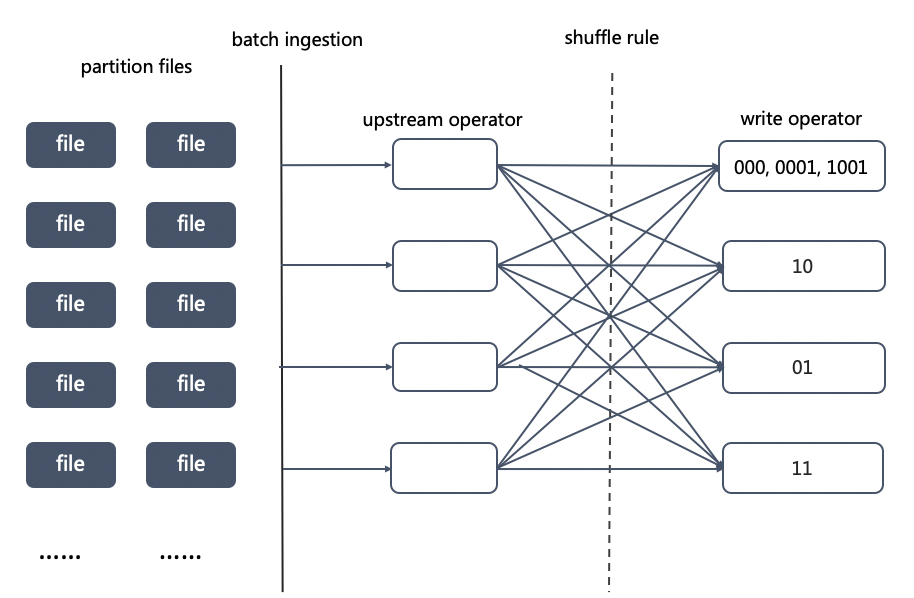

与 real-time ingestion 类似，batch ingestion plan 也需要考虑节点和 subtask 之间的分配问题，在这里我们可以粗暴地将 batch subtask 映射到 arctic tree 中的一层上，再通过一些 metrics 决定每个 subtask 是否向子节点细分。

batch ingestion 另外需要考虑两个问题：

1. 与 compaction 的写冲突问题，因为 compaction 是由 arctic 治理服务异步调度的任务，可能出现 batch ingestion 和 compaction 同时在执行的情况，我们要求 ingestion 的优先级高于 compaction，在 ingestion 过程中，compaction 写入数据无效，要做到这一点可以使用乐观并发控制，在 compaction 写入的数据提交时检查在 compaction 开始后是否有 batch ingestion 执行，有的话放弃提交，这里涉及的另一个问题是由 batch ingestion 加的宏观表锁何时释放，尤其在 batch ingestion 无疾而终的时候。

2. batch ingestion 必须制定对应的 change data 版本，在 batch ingestion 完成后，系统需要知道当前的 base table 后续跟哪些 change data 合并，因此需要为其标记 change 版本，这个版本对应数据的时间信息，原则上允许回调，compaction 会保证幂等。

### upsert on keys

考虑实时摄取下的一种场景：

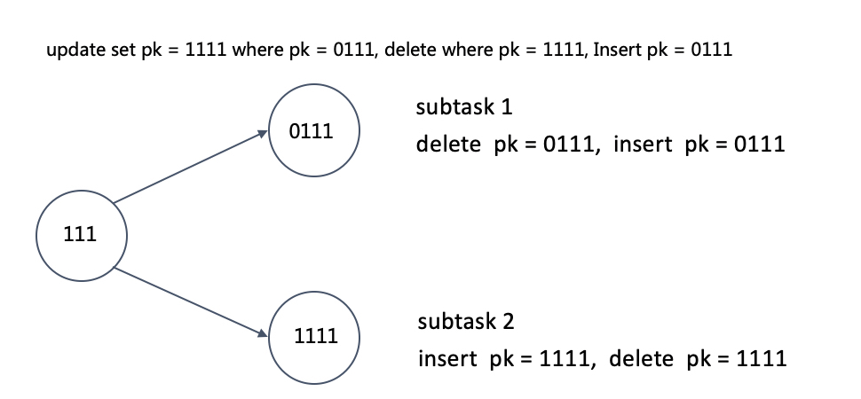

我们将一行数据的主键从 0111 更新到 1111，因为 011 和 111 存储在两个不同文件中，需要先删除 0111，再插入 1111，而 0111 和 1111 的 ingestion 由两个 subtask 分别执行，这种情况下，为了保障数据一致性，需要由 subtask 1 执行 0111 的删除，由 subtask 2 执行 1111 的插入，否则与后续同主键的操作可能发生顺序冲突。

在这种主键被更新的场景，我们必须在 sink shuffle 之前将 update 拆分为 delete + insert 操作，并且两个操作根据主键 shuffle 到各自的 subtask 中执行。以此类推，partition key 作为影响 layout 的第一要素，在 partition key 被更新的情况下也需要拆分为 delete 和 insert。

主键更新的问题向前可以追溯到 kafka 的分区问题，问了提升数据摄取的速度，数据库的增量数据可能使用主键做 topic 的 partition 字段，这种情况下，update 拆分操作也需要在 kafka 的生产端执行，试想，如果 update 操作使用后像主键作为 partition key，无法保障前像删除操作和另一个 partition 上的前像主键数据操作具有一致性，反之如果以前像主键作为 partition key，则无法保障后像插入操作和另一个 partition 上的后像主键数据操作一致。

在 [write conflicts in upsert situation](https://docs.google.com/document/d/17wO3b0WEW1oC2EIFnIAfTidMYsAwC7IxHf9SQKI3dO0/edit) 这篇 proposal 中我详细讨论了上述的问题。简要来说，无论是 kafka，kudu，arctic，还是其他支持 upsert 的目标端，任何影响数据 layout 的 upsert 都需要在进入系统之前拆分为 delete + insert。

## Compaction

compaction 目前为止有三项作用：

1. 小文件合并，尤其是实时摄取产生的小文件

2. upsert 合并，以分钟级别的周期调度 compaction，以实现 base table 分钟级延迟

3. 执行 compaction 过后，更新表的 metrics 信息，用于后续的治理服务

其中，小文件治理是 compaction 最核心目标，对分钟级数据延迟，compaction 并不是唯一路径，通过 merge on read 也可以实现，但是 merge on read 无法解决小文件问题，小文件积压后最终会让 merge on read 性能剧烈降低。

在 base 文件与块设备充分对齐的情况下，可以通过 merge on read 提供更低的数据延迟，通过分钟或小时级别的 minor compaction 解决 change file 碎片问题，通过小时或天级的 major compaction 收敛 change file 和 base file 的合并量。

### major compaction

major compaction 目标是将特定版本的 change data 合并到 base file 中，合并后要保障主键和排序键的约束，major compaction 可以当做系统内置的 batch ingestion 看待，但是它的优先级比 batch ingestion 低，并且通过一些内置的剪枝策略，major compaction 相比 batch ingestion 在效率上预期高很多，对没有开启 merge on read 的 arctic 表，通过分钟级别的 major compaction 保障数据的实时性。

major compaction 的高效性得益于两点：

1. 数据按照主键 shuffle 到不同 arctic node 中，没有直系亲属关系的 arctic node 内的 major compaction 可以并发执行，相比传统的 MR 任务，省去了 shuffle 开销

2. base file 之间按 primary key 或 sort key 排序，可以提供高效剪枝，尤其对有时间字段作为排序键的场景

相比 delta，iceberg 这类面向条件的 upsert 功能，arctic 通过文件索引将 change data 和 base data 关联在一起，减少了可观的 delta data scan 和数据广播的开销，以 delta 为例，在提供按某个条件更新的功能时，delta 可以将更新条件广播到每个 subtask 中，但是对数据摄取场景，则需要将每行数据变更进行广播，而 arctic 通过文件索引，让存量数据只需要与关联索引上的增量数据合并，实现更高效的 upsert

major compaction 的第一步是 compaction plan，核心流程为：

1. 根据代价模型，确定 compaction 输出节点，与 ingestion 的映射节点相似，compaction 输出节点要求不相交，通过上下追溯可以映射到一层上的所有节点，保证无数据遗漏

2. 在输出节点上，根据相交关系确定文件组，一个文件组内的文件数据上具有相交性，需要在一个 subtask 中执行，假设我们获取到了 m 个文件组

3. 评估 m 个文件组的 major compaction 开销，在业务要求的时延，和资源允许的范畴内，指定 compaction 的并发度为 n，将 m 个文件组按照代价模型打散到 n 个 subtask 中

假设通过 compaction plan，我们通过相交性得到下面一个文件组：

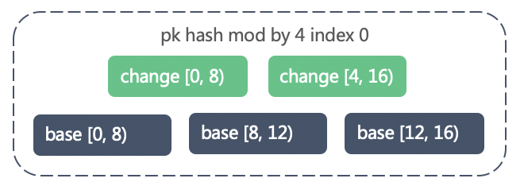

根据有没有 sort key，会有 sort merge 和 hash merge 两种 merge 方案。

### sort merge

在有 sort key 的前提下，base file 之间以及 file 内都已按 sort key 排序，那么 sort merge 的过程就变得清晰：

1. subtask 将文件组内所有 change data 读到本地并去重（内存放不下，则要置换本地盘）

2. 因为 change data 遵循的是先来后到，这里要先将 change data 按 sort key 排序

3. 按 sort key 顺序流式读取 base file，与排序后的 change data 做二路归并排序输出，当输出文件大小超过一定阈值后，切分新文件，从而在实现 range split

需要注意的是，sort key 和主键可能不重合，不能通过排序做去重，这里建议用哈希去重。

sort merge 保证了每次 merge 之前，base data 已经有序，这样避免了 merge 过程中最大的开销，假设 change data 量为 n，base data 量为 m，sort merge 算法复杂度是 O(nlogn + m + n)，若 change data 的量内存过载，还要引入置换开销。

sort merge 适用于有 sort key 的场景，不可控的代价主要在 change data 的量，如果 change 量过大，则第二步的排序代价可能很高，这也是自动分裂所有优化的问题。

### hash merge

在没有 sort key 的约束下，hash merge 的规则更为直接：在本地建立 change data map，与 base data 按 key 合并，但这里要考虑两个问题：

1. 要保障输出的文件按主键范围排序

2. 对 change data 中新插入的数据，要有反遍历的过程

为了满足以上两个条件，我们将 change data 按主键分段去重和排序：

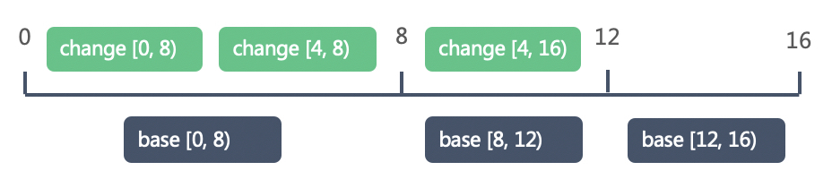

如上图所示，对 change file 和 base file 的每个 min_pk 和 max_pk，我们记为一个 segement 的边界，这些点将文件组内的数据分成了多个 segement，为了保障文件之间的有序性，我们无需对每行数据排序，只需要保障 segement 有序输出即可，这样可以提供比 sort merge 更高的性能。这样 hash merge 的流程为：

1. 根据文件组内所有文件的 min_pk 和 max_pk 初始化 segement

2. subtask 将文件组内所有 change data 读到各个 segement 中并去重

3. 按主键顺序流式读取 base file，在相应的 change segement 中寻找 upsert 或 delete 数据覆盖并输出，输出后的 change data 立即从 change segement 删除，在一个 base file 完成输出后，再将相应 change segement 中的遗留数据输出

4. 根据 base file 和 change segement 数据量预估，输出的文件是否需要做 hash split，例如一个 segement 内的 base file 加 change file 的数据量超过一定阈值，考虑在输出的时候直接向子节点输出。

hash merge 不会做每行数据的排序，因此不适用于有 sork key 的表，但是能提供更高性能的 merge，假设 change data 量为 n，base data 量为 m，通过自动分裂我们可以控制文件组内的文件数量为近常量，则 hash merge 算法复杂度是 O(m + n)，

### merge on read

compaction 是由系统异步调度 merge 任务并输出，merge on read 则是在引擎读取数据时将 base data 和 change data merge 产生最新视图，两者复用 merge 流程。

merge on read 的复杂度体现在适配不同的计算引擎上，spark，flink，impala 以及 presto 这些主流的计算引擎，都要去适配他们的 source 接口，并且在每个计算引擎的 query plan 中加入 change data 和 base data 的合并逻辑。

### minor compaction

对默认开启 merge on read 的 arctic 表来说，minor compaction 由系统根据当前 change file 的碎片化程度自动调度，在不考虑 change 归档和自定义 merge 规则（如生成拉链表）的情况下，可以在 monor compaction 中将相同主键的数据直接合并。

minor compaction 目的是降低文件碎片化程度，提升 merge（compaction 以及 merge on read ）性能，不要求输出的数据满足主键约束，所以 minor compaction 可以没有内存置换的问题，compaction subtask 能读多少，合并多少。

------


算法的要求要分钟内了


收到，已更正


剪枝（prone)应该是prune?下面还有两个应该也是


什么是打穿？


bloom filter 判断一个key在多个文件内，需要把文件全部读进来才能判断到底在不在文件内


这里的partition和hive的partition有关系吗？


一个东西