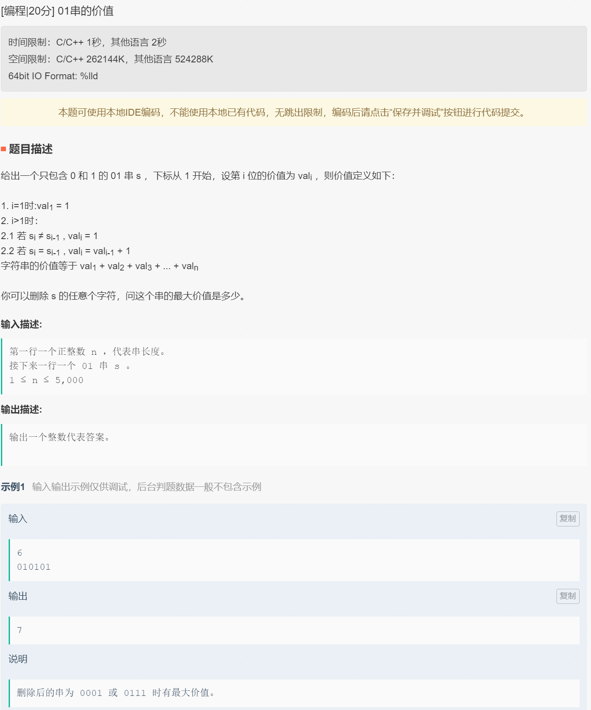

# 阿里


```java
import java.util.*;

public class Main{
  static HashMap<Integer, ArrayList<Integer>> mp, edge;
  static int n, m;


  static int[] sg;
  public static int getsg(int x){
    if (sg[x] != -1) return sg[x];
    if (x == n) return sg[x] = 0;
    int ok = 0;
    if (edge.containsKey(x)){
      for (int i : edge.get(x)){
        int ans = getsg(i);
        if (ans == 0) ok = 1;
      }
    }
    return sg[x] = ok;
  }


  public static void main(String[] args) {
    Scanner sc = new Scanner(System.in);
    int t = sc.nextInt();
    while (t-- > 0)
    {
      n = sc.nextInt();
      m = sc.nextInt();
      edge = new HashMap<Integer, ArrayList<Integer>>();
      sg = new int[(int)(1e5) + 10];
      for (int i = 1; i <= n; i++) sg[i] = -1;
      for (int i = 1; i <= m; i++)
      {
        int a = sc.nextInt(), b = sc.nextInt();
        if (edge.containsKey(a))
        {
          edge.get(a).add(b);
        }
        else
        {
          ArrayList<Integer> list = new ArrayList<Integer>();
          list.add(b);
          edge.put(a, list);
        }
      }
      String s = sc.next();
      int ans = getsg(1);
      if (ans == 1)
      {
        if ("Bob".equals(s)) System.out.println("Alice");
        else System.out.println("Bob");
      }
      else System.out.println(s);

          /*if ((d[1] - d[n]) % 2 == 0) System.out.println(s);
          else if ("Alice".equals(s)) System.out.println("Bob");
          else System.out.println("Alice");*/
    }

  }
}
```

# 美团


```java
import java.util.Scanner;

public class Main1 {
  public static void main(String[] args) {
    Scanner sc = new Scanner(System.in);
    int[] pre = new int[100];
    int[] suf = new int[100];
    int[] last = new int[100];

    String a = sc.nextLine();
    int q = sc.nextInt();
    char[] s = a.toCharArray();
    int n = s.length;
    for (int i = 1; i < n; i++) {
      int op = s[i] - 'a';
      if(last[op]==0){
        pre[i] = last[op];
        suf[last[op]] = i;
      }
      last[op] = i;
    }
    while(q-->0){
      int op = sc.nextInt();
      if(op==2){
        int pos = sc.nextInt();
        if(pre[pos]==0&&suf[pos]==0) System.out.println(-1);
        else{
          int mi = Integer.MIN_VALUE;
          if(pre[pos]>0)mi=Math.min(mi,pos-pre[pos]);
          if(suf[pos]>0)mi=Math.min(mi,suf[pos]-pos);
          System.out.println(mi);
        }
      }else{
        n+=1;
        char op2 = (char) sc.nextInt();
        int val =op2-'a';
        if(last[val]>0){
          suf[last[val]]=n;
          pre[n] =last[val];
        }
        last[val] = n;
      }
    }
  }
}
```


```java
import java.util.Scanner;

public class Main4 {
  public static void main(String[] args) {
    Scanner sc= new Scanner(System.in);
    int n = sc.nextInt();
    int[] zz = new int[n+1];
    for (int i = 1; i < zz.length; i++) {
      zz[i] = sc.nextInt();
    }
    int m = sc.nextInt();
    int[][] a = new int[m][3];
    for (int i = 0; i < m; i++) {
      for (int j = 0; j < 3; j++) {
        a[i][j] = sc.nextInt();
      }
    }
    for (int i = 0; i < m; i++) {
      if(a[i][0]==1){
        long z = 0L;
        for(int k=a[i][1];k<=a[i][2];k++){
          z+=zz[k];
        }
        System.out.println(z);
      }else if(a[i][0]==2){
        long c = 0L;
        for(int k=a[i][1];k<=a[i][2];k++){
          c+=zz[k];
        }
        long q = 0;
        for(int k=a[i][1];k<=a[i][2];k++){
          q+=(c-zz[k])*(c-zz[k]);
        }
        System.out.println(q);
      }else if(a[i][0]==3){
        int b = 0;
        for(int k=a[i][1];k<=a[i][2];k++){
          b=Math.max(zz[k],b);
        }
        System.out.println(b);
      }
    }
  }
}
```


```java
import java.util.Scanner;

public class Main5 {
  public static void main(String[] args) {
    Scanner sc= new Scanner(System.in);
    int n = sc.nextInt();
    int[] nums = new int[n+1];
    for (int i = 1; i < nums.length; i++) {
      nums[i] = sc.nextInt();
    }
    int m = sc.nextInt();
    int[][] qus = new int[m][3];
    for (int i = 0; i < m; i++) {
      for (int j = 0; j < 3; j++) {
        qus[i][j] = sc.nextInt();
      }
    }
    for (int i = 0; i < m; i++) {
      if(qus[i][0]==1){
        long sum = 0L;
        for(int k=qus[i][1];k<=qus[i][2];k++){
          sum+=nums[k];
        }
        System.out.println(sum);
      }else if(qus[i][0]==2){
        long sum1 = 0L;
        for(int k=qus[i][1];k<=qus[i][2];k++){
          sum1+=nums[k];
        }
        long res = 0L;
        for(int k=qus[i][1];k<=qus[i][2];k++){
          res+=(sum1-nums[k])*(sum1-nums[k]);
        }
        System.out.println(res);
      }else if(qus[i][0]==3){
        long max = 0L;
        for(int k=qus[i][1];k<=qus[i][2];k++){
          max+=Math.max(nums[k],max);
        }
        System.out.println(3);
      }
    }
  }
}
```

# 京东

```java
import java.util.ArrayList;
import java.util.Arrays;
import java.util.List;
import java.util.Scanner;

class Main{
  public static void main(String[] args) {
    Scanner sc  = new Scanner(System.in);
    int n = sc.nextInt();
    int[] nums = new int[n];
    for (int i = 0; i < n; i++) {
      nums[i] = sc.nextInt();
    }
    Arrays.sort(nums);
    ArrayList<Integer> permuteList = new ArrayList<>();
    ArrayList<ArrayList<Integer>> permutes = new ArrayList<>();
    boolean[] hasVisit = new boolean[nums.length];
    backtracking(permuteList,permutes,hasVisit,nums);

    System.out.println(permutes.size());
    for (int i = 0; i < permutes.size(); i++) {
      StringBuffer sb = new StringBuffer();
      for( int a:permutes.get(i)){
        sb.append(a);
      }
      System.out.println(sb.toString());
    }
  }

  private static void backtracking(ArrayList<Integer> permuteList, ArrayList<ArrayList<Integer>> permutes, boolean[] visited, int[] nums) {
    if(permuteList.size()==nums.length){
      permutes.add(new ArrayList<>(permuteList));
      return;
    }
    for (int i = 0; i < visited.length; i++) {
      if(i!=0&&nums[i]==nums[i-1]&&!visited[i-1]){
        continue;
      }
      if(visited[i])continue;
      visited[i] = true;
      permuteList.add(nums[i]);
      backtracking(permuteList,permutes,visited,nums);
      permuteList.remove(permuteList.size()-1);
      visited[i] = false;
    }
  }


}
```

# 小米

# 华为


```java
import java.util.*;
// We have imported the necessary tool classes.
// If you need to import additional packages or classes, please import here.


public class Main {
  static int n;
  static int[] A, B;
  static int mi = (int)1e9;

  public static void dfs(int pos, int op, int a, int b) {
    if (pos > n) return;
    //System.out.println(pos + " " + op + " " + a + " " + b);

    if (pos == n)
    {
      if (mi > a + b) mi = a + b;
      return;
    }
    if (op == 1)
    {
      // use
      int zf1 = Math.min(a, A[pos + 1]);
      int res1 = Math.min(a - zf1, B[pos + 1]);
      res1 = Math.min(res1 + b , A[pos + 1]);
      //System.out.println(A[pos] + " " + B[pos + 1]);
      //System.out.println(zf1 + " " + res1);
      dfs(pos + 1, 1, zf1, res1);

      //nouse
      dfs(pos + 1, 0, a, b);


    }
    else{
      // use
      int zf1 = Math.min(a, A[pos + 1]);
      int res1 = Math.min(a - zf1, B[pos + 1]);
      res1 = Math.min(res1 + b, A[pos + 1]);
      dfs(pos + 1, 1, zf1, res1);

    }


  }


  public static void main(String[] args) {
    // please define the JAVA input here. For example: Scanner s = new Scanner(System.in);
    // please finish the function body here.
    // please define the JAVA output here. For example: System.out.println(s.nextInt());


    Scanner sc = new Scanner(System.in);
    n = sc.nextInt();
    A = new int[n + 1]; B = new int[n + 2];
    for (int i = 1; i <= n; i++)
    {
      String s = sc.next();
      String[] t = s.split(",");
      int x = Integer.parseInt(t[0]), y = Integer.parseInt(t[1]);
      A[i] = x;
      B[i] = y;
    }
    int val = sc.nextInt();
    dfs(0, 1, val, 0);
    System.out.println(mi);
      /*
    int mi = (int)1e9;
    if (n == 1)
    {
        n = 2;
        a[2] = a[1];
        b[2] = b[1];
    }

    for (int i = 1; i <= n; i++)
    {
      for (int j = i + 1; j <= n; j++)
      {
        int x = val, y = 0;
        int zf1 = Math.min(x, a[i]), res1 = Math.min(x - zf1, b[i]);
        int zf2 = Math.min(zf1, a[j]), res2 = Math.min(zf1 - zf2, b[j]);
        int zf3 = Math.min(res1, a[i]);
        int res3 = Math.min(zf3 + res2, a[j]);
        mi = Math.min(mi, res3 + zf2);
          //if (res3 + zf2 == 15) System.out.println(i + " " + j);
      }
    }
    System.out.println(mi);
   */
  }
}
/*
2
50,60 30,25
120
 */
```


```java
import java.util.*;
// We have imported the necessary tool classes.
// If you need to import additional packages or classes, please import here.

class Node{
  public String s;
  public int son;
  public Node(String s, int son) {
    this.s = s;
    this.son = son;
  }
}

public class ali {
  static HashMap<String, ArrayList<Node>> mp;

  static ArrayList<String> ans;
  public static void dfs(String u) {
    if (mp.containsKey(u)) {
      for (Node s : mp.get(u)) {
        int cho = s.son;
        if (cho == 1) ans.add(s.s);
        dfs(s.s);
      }
    }
  }

  public static void main(String[] args) {
    // please define the JAVA input here. For example: Scanner s = new Scanner(System.in);
    // please finish the function body here.
    // please define the JAVA output here. For example: System.out.println(s.nextInt());
    Scanner sc = new Scanner(System.in);
    int n = sc.nextInt();
    mp = new HashMap<String, ArrayList<Node>>();
    ans = new ArrayList<String>();
    String x = sc.nextLine();
    for (int i = 1; i <= n; i++)
    {
      String line = sc.nextLine();
      String[] s = line.split("\\s+");
      //System.out.println(line);
      //System.out.println(s[0] + " " + s[1] + " " + s[2]);

            if ("subClassOf".equals(s[1]))
            {
                if (mp.containsKey(s[2])) {
                    mp.get(s[2]).add(new Node(s[0], 0));
                } else {
                    ArrayList<Node> list = new ArrayList<Node>();
                    list.add(new Node(s[0], 0));
                    mp.put(s[2], list);
                }

            }
            else
            {
                if (mp.containsKey(s[2])) {
                    mp.get(s[2]).add(new Node(s[0], 1));
                } else {
                    ArrayList<Node> list = new ArrayList<Node>();
                    list.add(new Node(s[0], 1));
                    mp.put(s[2], list);
                }
            }

    }
    String s = sc.next();
    dfs(s);

    if (ans.size() == 0) System.out.println("empty");
    else
    {
      Collections.sort(ans);
      for (int i = 0; i < ans.size(); i++) {
        if (i > 0) System.out.print(" ");
        System.out.print(ans.get(i));
      }
    }

  }
}
/*
3
student subClassOf person
Tom instanceOf student
Marry instanceOf person
person
 */
```

# 腾讯


```java
import java.util.*;

/*
 * public class ListNode {
 *   int val;
 *   ListNode next = null;
 *   public ListNode(int val) {
 *     this.val = val;
 *   }
 * }
 */
public class Solution {
    /**
     * 代码中的类名、方法名、参数名已经指定，请勿修改，直接返回方法规定的值即可
     * 
     * @param a ListNode类一维数组 指向这些数链的开头
     * @return ListNode类
     */
    public ListNode solve (ListNode[] a) {
        int n = a.length;
        ListNode ans = new ListNode(0);
        ListNode pre = ans;
        while(true){
            boolean flag = false;
            for (int i = 0; i < n; i++)
            {
                if (a[i] != null) {
                    pre.next = a[i];
                    a[i] = a[i].next;
                    pre = pre.next;
                    flag = true;
                }
            }
            if (flag == false) break;
        }
        return ans.next;
    }
}
```


```java
// 本题为考试多行输入输出规范示例，无需提交，不计分。
import java.util.*;

public class Main {
    public static void main(String[] args) {
        Scanner sc = new Scanner(System.in);
        int n = sc.nextInt();
        int[] a = new int[n + 1], b = new int[n + 1];
        for (int i = 1; i <= n; i++)
            b[i] = sc.nextInt();
        for (int i = 1; i <= n; i++)
            a[i] = sc.nextInt();
        
        for (int i = 1; i <= n; i++)
        {
            int cnt = 0, val = a[i];
            for (int j = 1; j * j <= val; j++)
            {
                if (val % j != 0) continue;
                if (j * j == val) cnt += 1;
                else cnt += 2;
            }
            a[i] = cnt;
        }
        for (int i = 1; i <= n; i++)
        {
            int cnt = 0, val = b[i];
            for (int j = 1; j * j <= val; j++)
            {
                if (val % j != 0) continue;
                if (j * j == val) cnt += 1;
                else cnt += 2;
            }
            b[i] = cnt;
        }
        
        Arrays.sort(a, 1, n + 1);
        Arrays.sort(b, 1, n + 1);
        
        int pos = 0;
        for (int i = 1; i <= n; i++)
        {
            if (b[i] > a[1])
            {
                pos = i;
                break;
            }
        }
        int cnt = 0, wz = 1;
        for (int i = pos; i <= n; i++)
        {
            if (b[i] > a[wz])
            {
                wz++;
                cnt++;
            }
        }
        System.out.println(cnt);
        
        
        /*
        int i = 1, j = 1, cnt = 0;
        while (i <= n && j <= n)
        {
            while (j <= n && b[j] <= a[i]) j++;
            if (j <= n)
            {
                cnt++;
                j++;
            }
        }
        System.out.print(0);
        */
    } 
}
```



```java
// 本题为考试多行输入输出规范示例，无需提交，不计分。
import java.util.*;

public class Main {
    public static void main(String[] args) {
        Scanner sc = new Scanner(System.in);
        int n = sc.nextInt();
        String s = sc.next();
        int[] a = new int[n + 1];
        for (int i = 1; i <= n; i++)
            a[i] = s.charAt(i - 1) - '0';
        
        
        int[][] pre = new int[2][n + 5], suf = new int[2][n + 5];
        for (int i = 1; i <= n; i++)
        {
            pre[0][i] += pre[0][i - 1];
            pre[1][i] += pre[1][i - 1];
            pre[a[i]][i] += 1;
        }
        for (int i = n; i >= 1; i--)
        {
            suf[0][i] += suf[0][i + 1];
            suf[1][i] += suf[1][i + 1];
            suf[a[i]][i] += 1;
        }
        
        long[] dp = new long[n + 1];
        for (int i = 1; i <= n; i++)
        {
            long ans = 0;
            for (int j = 1; j <= i; j++)
            {
                long cnt = pre[0][i] - pre[0][j - 1];
                ans = Math.max(ans, dp[j - 1] + cnt * (cnt + 1) / 2);
                cnt = pre[1][i] - pre[1][j - 1];
                ans = Math.max(ans, dp[j - 1] + cnt * (cnt + 1) / 2);
            }
            dp[i] = ans;
        }
        System.out.println(dp[n]);
        
    } 
}
```


```java
// 本题为考试多行输入输出规范示例，无需提交，不计分。
import java.util.*;

public class Main {
    static long n, l, r;
    static long[] a = new long[100], val = new long[100];
    static int pos = 0;
    static long[] pow = new long[100];
    
    public static long dfs(int depth, long wz)
    {
        
        long left = pow[pos - depth] - 1, right = left;
        if (wz == left + 1) return val[depth];
        if (wz <= left) return dfs(depth + 1, wz);
        return dfs(depth + 1, wz - left - 1);
    }
    
    public static void main(String[] args) {
        Scanner sc = new Scanner(System.in);
        n = sc.nextLong();
        l = sc.nextLong();
        r = sc.nextLong();
        
        pow[0] = 1L;
        for (int i = 1; i <= 60; i++)
            pow[i] = pow[i - 1] * 2;
        
        while (n > 0)
        {
            val[++pos] = n % 2L;
            n /= 2L;
        }
        /*
        for (int i = 1; i <= pos; i++)
            val[i] = a[pos + 1 - i];
        */
        long ans = 0L;
        for (long i = l; i <= r; i++)
        {
            //System.out.println("wz: " + i);
            ans += dfs(1, i);
        }
        System.out.println(ans);
       
        
        
    } 
}
```


```java
// 本题为考试多行输入输出规范示例，无需提交，不计分。
import java.util.*;

public class Main {
    
    public static void main(String[] args) {
        Scanner sc = new Scanner(System.in);
        int n = sc.nextInt();
        int[] a = new int[n + 1];
        for (int i = 1; i <= n; i++)
            a[i] = sc.nextInt();
        
        int[][] mi = new int[n + 1][n + 1];
        for (int i = 1; i <= n; i++)
        {
            int pre = a[i];
            for (int j = i; j <= n; j++)
            {
                pre = Math.min(pre, a[j]);
                mi[i][j] = pre;
            }
        }
        
        int cnt = 0;
        for (int i =1 ; i <= n; i++)
        {
            for (int j = i + 1; j <= n; j++)
            {
                int ma = Math.max(a[i], a[j]);
                if (j == i + 1) cnt++;
                else if (ma <= mi[i + 1][j - 1]) cnt++;
            }
        }
        System.out.println(cnt);
        
        
       
        
        
    } 
}
```


# 字节
