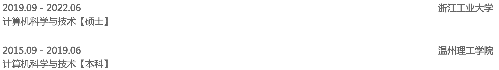
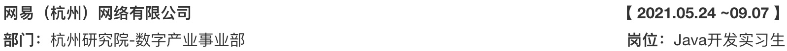

##  教育背景

- 通过了 CET6 英语等级考试
- Online Multiple Object Tracking Using Joint Detection and Embedding Network【多目标跟踪方向sci二区顶刊在投】

##  技能简介

1. 掌握Java语法
2. 掌握各种常用集合类【List、Set、Map等】
3. 掌握Java并发编程知识【Java内存模型、线程池、volatile、锁机制和其它并发工具类等】
4. 掌握JVM原理【运行时内存区域、类加载机制、垃圾收集器等】
5. 掌握常见设计模式【单例模式、工厂模式、代理模式等】
6. 掌握基本的数据结构和算法
7. 掌握基本的计算机网络知识【TCP、HTTP等】
8. 掌握基本的操作系统知识
9. 了解Nginx、Kafka等中间件的基本用法
10. 了解Redis的用法【基本数据类型、持久化机制、缓存雪崩、缓存穿透、缓存击穿等】
11. 了解MySQL数据库【事务、索引、SQL编写等】
12. 了解Hadoop、Spark、Hive、Hudi等大数据生态体系组件

##  实习经历

1. 参与组内Hudi和Arctic的性能测试
2. 参与组内自主研发数据湖框架Arctic的Compaction模块的问题定位与分析
3. 参加组内数据湖产品上线，负责数据同步和数据入湖模块开发

- **具体实现功能**：
  - 同步任务启动和停止以及定时刷新任务状态信息
  - 获取和更新同步任务配置信息
  - 获取任务列表
  - 实时获取数据同步流量、延迟等变更信息
  - Hive原生读取自动对Hive表和MySQL表数据字段映射
  - 用户设置数据库源中所有表和表内字段获取
  - 完善元数据的校验
- **同步功能模块上线：**
  - 前后端联调
  - 配合质量保障组完善后端代码
  - 配合云音乐环境部署和上线

##  项目经历

- **项目介绍：**在复杂多变的环境中实现对行人的多目标跟踪，本方法通过基于Yolov5的联合检测和跟踪的框架解决了检测与外貌特征编码任务的集成问题，实现对行人的鲁邦且高效的跟踪
- **负责内容：**主要负责跟踪架构的选定，对网络进行训练微调，代码的设计开发以及算法的鲁棒性检测与关联的提升
- **项目难点：**数据集本身针对现实中的各种复杂场景，但是存在训练样本不足的情况，通过对数据集的裁剪、翻转等数据扩充手段，保证网络进行深度学习的训练量，从而实现网络的鲁棒训练。多目标跟踪在密集场景下易受行人遮挡的影响，本方法通过卡尔曼滤波预测已跟踪目标的在下一帧位置以及提取行人身份判别特征来实现跟踪，并在性能上多方面优化
- **个人收获：**该比赛由导师领导，我参与了比赛的整个流程，锻炼了自己发现问题、解决问题能力的同时，培养了较好的文档总结能力

##  个人评价

- 在读研期间，对课题的研究过程中很好的锻炼了发现问题、解决问题的能力
- 在不断的学习过程中培养了自我驱动能力
- 通过周报总结和进展汇报，拥有了较好的沟通意识和团队交流能力
